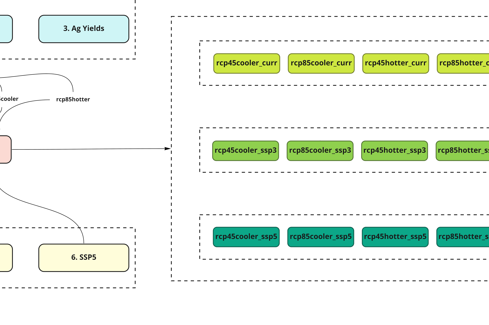

_zenodo badge to go here_

# khan-etal_2021_JournalTBD

**Coevolution of future water, energy and land systems across the United States in response to national and global socioeconomic, climate, and energy policy drivers.**

Zarrar Khan1\*, Paul Wolfram1, Gokul Iyer1, Jennie Rice2, Chris Vernon2

1  Joint Global Change Research Institute (JGCRI), Pacific Northwest National Laboratory (PNNL), 5825 University Research Ct, College Park, MD 20740

2  Pacific Northwest National Laboratory (PNNL), 902 Battelle Blvd, Richland, WA 99354

\* corresponding author:  zarrar.khan@pnnl.gov

## Abstract
This study examines the coevolution of multiple sectors including water, energy and land in response to socioeconomic, policy, and climate drivers across the United States in a global context using the Global Change Analysis Model - USA (GCAM-USA). Consistent with the Shared Socioeconomic Pathways - Representative Concentration Pathways (SSP-RCP) scenario framework, we combine different socioeconomic pathways with both moderate and more severe climate projections developed from the Coupled Model Intercomparison Project Phase 6 (CMIP6) archive. Our study contributes to the literature by focusing on subnational (state and basin level) economy-energy-water-land interactions and dynamics within the U.S linked to the rest of the world through trade in international commodity markets. Conditions outside of the U.S. dynamically affect sub-national conditions within the U.S. and vice versa. 

## Journal reference
CITATION to be added.

## Code reference

* GCAM_v54_usaim3: Human, I.M. (2021, April 14). Project/repo:v0.1.0 (Version v0.1.0). Zenodo. http://doi.org/some-doi-number/zenodo.7777777

## Work flows

 
Figure 1: Summary of experiment workflows

This experiment can be divided into 7 different sub-workflows as shown in Figure 1:

* Workflow 1: Climate impacts on Runoff
* Workflow 2: Climate impacts on Heating and Colling Degree Hours (HDH CDH)
* Workflow 3: Climate impacts on Agricultural Yields
* Workflow 4: Socioeconomic projections for a reference (Shared socioeconomic pathway (SSP) 2)
* Workflow 5: Socioeconomic projections for SSP3
* Workflow 6: Socioeconomic projections for SSP5
* Workflow 7: Running the Global Change Analysis Model (GCAM) to produce the final outputs

Each workflow is described in more detail in the following sections.

### Work flow 1: Climate impacts on Runoff

 
Figure 2: Workflow 1: Climate impacts on Runoff

Workflow 1 can be divided into three parts: 

i. US Basins:
ii. Global Basins: 
iii. Combining US and Global Basins:

| Step | Description| Scripts|
| --- | --- | --- |
| WRF Data | The WRF model was used to produced raw inputs at hourly, 12km x 12km resolution. For runoff impacts the temperature (deg C), minimum temperature (deg C), wind speed (m/s), relative humidity (%), GLW (W/m2) and SWDOWN (W/m2) were used. Projections were made for RCP 4.5 and 8.5 with a hot and cool variant for each.| NERSC: /global/cfs/cdirs/m2702/gsharing|
|wrf_to_xanthos|wrf_to_xanthos_preprocess | |
|wrf_to_xanthos| wrf_to_xanthos_process| |
|wrf_to_xanthos| wrf_to_xanthos_process| |

### Work flow 2

Figure 3 Workflow 2: Climate Impacts: HDDCDD

Table 2 Workflow 2 Scripts

### Work flow 3

Figure 4 Workflow 3: Climate Impacts: Ag Yields

Table 3 Workflow 3 Scripts

### Work flow 4

Figure 5 Workflow 4: Socioeconomic Drivers: Reference (SSP2)

Table 4 Workflow 4 Scripts

### Work flow 5

Figure 6 Workflow 5: Socioeconomic Drivers: Reference (SSP3)

Table 5 Workflow 5 Scripts

### Work flow 6

Figure 7 Workflow 6: Socioeconomic Drivers: Reference (SSP5)

Table 6 Workflow 6 Scripts

### Work flow 7

## Input Data

- WRF
- Population
- GCAM

## Output Data

## Reproduce my experiment
Fill in detailed info here or link to other documentation that is a thorough walkthrough of how to use what is in this repository to reproduce your experiment.

1. Install the software components required to conduct the experiement from [Contributing modeling software](#contributing-modeling-software)
2. Download and install the supporting input data required to conduct the experiement from [Input data](#input-data)
3. Run the following scripts in the `workflow` directory to re-create this experiment:

| Script Name | Description | How to Run |
| --- | --- | --- |
| `step_one.py` | Script to run the first part of my experiment | `python3 step_one.py -f /path/to/inputdata/file_one.csv` |
| `step_two.py` | Script to run the last part of my experiment | `python3 step_two.py -o /path/to/my/outputdir` |

4. Download and unzip the output data from my experiment [Output data](#output-data)
5. Run the following scripts in the `workflow` directory to compare my outputs to those from the publication

| Script Name | Description | How to Run |
| --- | --- | --- |
| `compare.py` | Script to compare my outputs to the original | `python3 compare.py --orig /path/to/original/data.csv --new /path/to/new/data.csv` |

## Reproduce my figures
Use the scripts found in the `figures` directory to reproduce the figures used in this publication.

| Script Name | Description | How to Run |
| --- | --- | --- |
| `generate_figures.py` | Script to generate my figures | `python3 generate_figures.py -i /path/to/inputs -o /path/to/outuptdir` |
