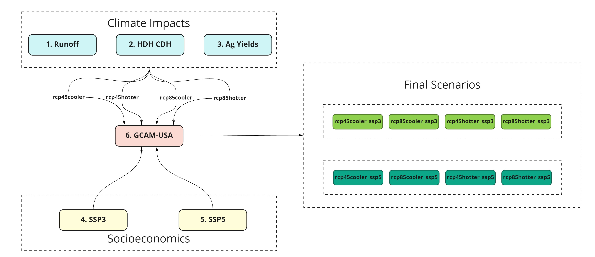
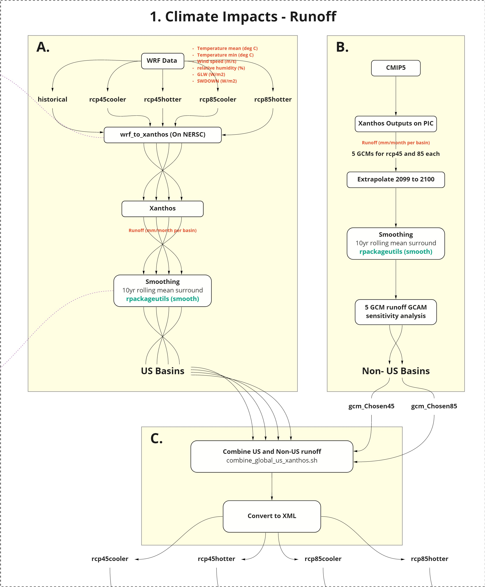
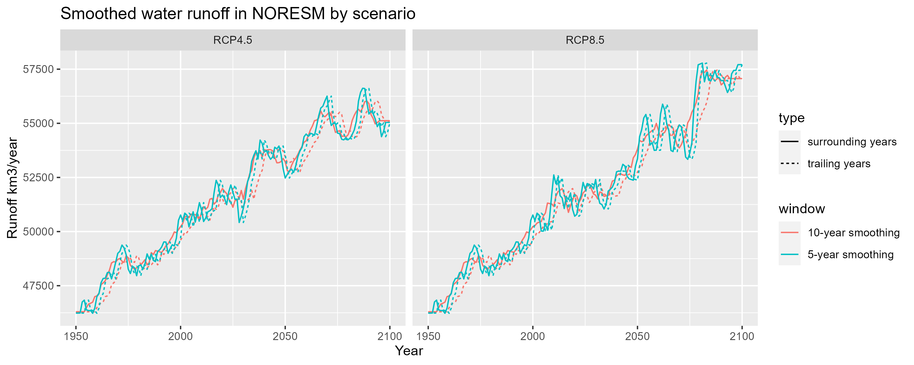
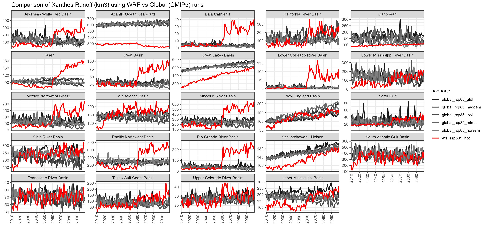

<!-------------------------->
<!-------------------------->
# Citation
<!-------------------------->
<!-------------------------->
<p align="center"></p>

Khan, Z., Wolfram, P., Iyer, G., Rice, J., Vernon, C., 2022. Coevolution of future water, energy and land systems across the United States in response to national and global socioeconomic, climate, and energy policy drivers. (In progress) Journal_TBD, DOI: XXXX

<!-------------------------->
<!-------------------------->
# Models Used
<!-------------------------->
<!-------------------------->
<p align="center"></p>

```{r, results = 'show', eval=TRUE, echo=FALSE, warning=FALSE, error = FALSE, message = FALSE}
library(kableExtra)
data.frame(
    Model     = c("WRF",
                  "GCAM",
                  "Xanthos",
                  "Helios",
                  "GGCMI",
                  "rpackageutils",
                  "im3components",
                  "gcamextractor"),
    Version = c("-",
                "gcam v5.3 (branch gcam-usa-im3)",
                "xanthos v2.4.1",
                "helios v1.0.0",
                "ggcmi v1.0.0",
                "rpackageutils v1.0.0",
                "im3components v1.0.0",
                "gcamextractor"),
    Description = c("Climate simulation model",
                    "Global Change Analysis Model. Human-earth systems dynamic model.",
                    "Water runoff emulator at 0.5 degree grids and monthly timesteps.",
                    "Gridded Heating and cooling degree day calculator at multiple spatial and temporal resolution.",
                    "Emulators to model agricultural yield impacts in response to climate",
                    "Utility functions to process, aggregate and reformat data.",
                    "Functions to process data between different IM3 models.",
                    "Model to extract and process data from GCAM output databases."),
    Language = c("-",
                  "C++/R",
                  "Python",
                  "R",
                  "?",
                  "R",
                  "R/Python",
                  "R"),
    Link = c("https://www.mmm.ucar.edu/weather-research-and-forecasting-model",
             "https://stash.pnnl.gov/projects/JGCRI/repos/gcam-core/browse?at=refs%2Fheads%2Fzk%2Ffeature%2Fgcam-usa-im3",
            "https://github.com/JGCRI/xanthos",
            "Helios",
            "GGCMI",
            "https://github.com/JGCRI/rpackageutils",
            "https://github.com/IMMM-SFA/im3components",
            "https://github.com/JGCRI/gcamextractor")
    ) %>% 
  kbl() %>%
  kable_styling(bootstrap_options = c("striped", "hover", "condensed", "responsive"))

```


<!-------------------------->
<!-------------------------->
# Data
<!-------------------------->
<!-------------------------->
<p align="center"></p>

```{r, results = 'show', eval=TRUE, echo=FALSE, warning=FALSE, error = FALSE, message = FALSE}
library(kableExtra)
data.frame(
    Data     = c("WRF Outputs",
                 "Xanthos Outputs",
                 "Helios Outputs",
                 "GGCMI Outputs",
                 "Population US States",
                 "Population Gridded",
                 "GCAM Outputs"),
     Source = c("WRF runs",
                "Xanthos runs (Workflow 1)",
                "Helios runs (Workflow 2)",
                "GGCMI runs (Workflow 3)",
                "xxx",
                "xxx",
                "GCAM runs (Workflow 7)"),
    `Used by` = c("Xanthos, Helios, GGCMI",
                  "GCAM",
                  "GCAM",
                  "GCAM",
                  "GCAM",
                  "GCAM",
                  "-"),
    Location = c("(NERSC) /global/cfs/cdirs/m2702/gsharing",
                 "zenodo link",
                  "zenodo link",
                  "zenodo link",
                  "zenodo link",
                  "zenodo link",
                  "zenodo link")
    ) %>% 
  kbl() %>%
  kable_styling(bootstrap_options = c("striped", "hover", "condensed", "responsive"))

```


<!-------------------------->
<!-------------------------->
# Workflows Summary
<!-------------------------->
<!-------------------------->
<p align="center"></p>


```{r, echo=FALSE, out.width="100%", fig.align='center', fig.cap="**Summary of experiment workflows.**"}

```


<!-------------------------->
<!-------------------------->
# Workflow 1 - Climate Impacts Runoff
<!-------------------------->
<!-------------------------->
<p align="center"></p>


<br>

```{r, echo=FALSE, out.width="80%", fig.align='center', fig.cap="**Workflow 1: Climate Impacts Runoff.**"}

```

<br>

Workflow 1 can be divided into three parts: 

* A. Climate Impacts Runoff US Basins
* B. Climate Impacts Runoff Global Basins
* C. Climate Impacts Runoff Combine US and Global


## 1A Runoff US Basins

### **Table: Workflow 1A - Climate Impacts Runoff US Basins**

```{r, results = 'show', eval=TRUE, echo=FALSE, warning=FALSE, error = FALSE, message = FALSE}
library(pander)
mytable = data.frame(
    Step     = c("WRF Outputs Raw", 
                 "wrf_to_xanthos",
                 "xanthos"),
    Description = c("* RCP 4.5, 8.5, hot and cool\
                    \n * hourly, 1979_01 to 2099_12\
                    \n * 12km x 12km resolution\
                    \n * Temperature (deg C)\
                    \n * Minimum temperature (deg C)\
                    \n * Wind speed (m/s)\
                    \n * Relative humidity (%)\
                    \n * GLW (W/m2)\
                    \n * SWDOWN (W/m2)",
                    "* wrf_to_xanthos_preprocess_historical.sh\ 
                    \n* wrf_to_xanthos_preprocess_ssp585_hot_near.sh\
                    \n* wrf_to_xanthos_preprocess_ssp585_hot_far.sh\
                    \n* wrf_to_xanthos_process_historical.sh\
                    \n* wrf_to_xanthos_process_ssp585_hot_near.sh\
                    \n* wrf_to_xanthos_process_ssp585_hot_far.sh\
                    \n* wrf_to_xanthos_combine_historical_ssp585_hot_near_far.sh", "wrf_to_xanthos_combine_historical_ssp585_hot_near_far_us_global_xanthos.sh"),
    Location     = c("(NERSC) /global/cfs/cdirs/m2702/gsharing",
                     "* (NERSC) /global/cfs/cdirs/m2702/gcamusa/wrf_to_xanthos\
                     \n* (Repo) https://github.com/IMMM-SFA/khan-etal_2022_im3gcamusa/scripts",
                     "* (NERSC) /global/cfs/cdirs/m2702/gcamusa/wrf_to_xanthos\
                     \n* (NERSC) /global/cfs/cdirs/m2702/gcamusa/wrf_to_xanthos/xanthos_files/example/output\
                     \n*  (Repo) https://github.com/IMMM-SFA/khan-etal_2022_im3gcamusa/scripts")
    )

pander::pander(mytable, keep.line.breaks = TRUE, style = 'grid', justify = 'left', split.tables=Inf)
```

Workflow 1A results in WRF outputs being processed and run through Xanthos to produce runoff in mm per month for US Basins to be combined with Non-US Basins runoff results from Workflow 1B. 


## 1B Runoff Global Basins

### **Table: Workflow 1B - Climate Impacts Runoff Global Basins**

```{r, results = 'show', eval=TRUE, echo=FALSE, warning=FALSE, error = FALSE, message = FALSE}
library(pander)
mytable = data.frame(
    Step     = c("CMIP5 Outputs Raw", 
                 "Xanthos Outputs on PIC",
                 "Xanthos GCM Sensitivity Analysis"),
    Description = c("* RCP 4.5, 8.5, hot and cool\
                    \n * hourly, 1979_01 to 2099_12\
                    \n * 12km x 12km resolution\
                    \n * Temperature (deg C)\
                    \n * Minimum temperature (deg C)\
                    \n * Wind speed (m/s)\
                    \n * Relative humidity (%)\
                    \n * GLW (W/m2)\
                    \n * SWDOWN (W/m2)",
                    "* wrf_to_xanthos_preprocess_historical.sh\ 
                    \n* wrf_to_xanthos_preprocess_ssp585_hot_near.sh\
                    \n* wrf_to_xanthos_preprocess_ssp585_hot_far.sh\
                    \n* wrf_to_xanthos_process_historical.sh\
                    \n* wrf_to_xanthos_process_ssp585_hot_near.sh\
                    \n* wrf_to_xanthos_process_ssp585_hot_far.sh\
                    \n* wrf_to_xanthos_combine_historical_ssp585_hot_near_far.sh", "wrf_to_xanthos_combine_historical_ssp585_hot_near_far_us_global_xanthos.sh"),
    Location     = c("(NERSC) /global/cfs/cdirs/m2702/gsharing",
                     "* (NERSC) /global/cfs/cdirs/m2702/gcamusa/wrf_to_xanthos\
                     \n* (Repo) https://github.com/IMMM-SFA/khan-etal_2022_im3gcamusa/scripts",
                     "* (NERSC) /global/cfs/cdirs/m2702/gcamusa/wrf_to_xanthos/xanthos_files/example/output")
    )

pander::pander(mytable, keep.line.breaks = TRUE, style = 'grid', justify = 'left', split.tables=Inf)
```


Some diagnostics from workflow 1b:

```{r, echo=FALSE, out.width="100%", fig.align='center', fig.cap="**Comparison of water runoff across five global climate models (GCMs).**"}
knitr::include_graphics("vignetteFigs/water_runoff_facet_model.png")
```

```{r, echo=FALSE, out.width="100%", fig.align='center', fig.cap="**Comparison of smoothed runoff data from the NORESM model **"}

```


## 1C Runoff Combine US and Global

### **Table: Workflow 1C - Climate Impacts Runoff Combine US and Global**

```{r, results = 'show', eval=TRUE, echo=FALSE, warning=FALSE, error = FALSE, message = FALSE}
library(pander)
mytable = data.frame(
    Step     = c("Workflow 1A Outputs",
                 "Workflow 1B Outputs",
                 "Combine US and Non-US runoff",
                 "Extrapolate 2099 to 2100",
                 "Smoothing",
                 "Convert to XML"),
    Description = c("Runoff mm per month for US Basins.",
                 "Runoff mm per month for Non-US Basins.",
                 "* xanthos_process_us_global_ssp585hotter_gcmChosen.sh\ 
                    \n* xanthos_combine_us_global_ssp585hotter_gcmChosen.R",
                 "* xanthos_extrapolate_2099to2100_ssp585hotter_gcmChosen.R",
                 "* xanthos_smooth5trail_2099to2100_ssp585hotter_gcmChosen.R",
                 "* xanthos_convert2xml_ssp585hotter_gcmChosen.R"),
    Location     = c("* /pic/projects/im3/gcamusa/climateimpacts/runoff/outputs_workflow1a\
                     \n* Copied from (NERSC) /global/cfs/cdirs/m2702/gcamusa/wrf_to_xanthos/xanthos_files/example/output",
                 "* /pic/projects/im3/gcamusa/climateimpacts/runoff/outputs_workflow1b\
                     \n* Copied from (PIC) /pic/projects/im3/gcamusa/climateimpacts/raw_global_runoff_files",
                 "/pic/projects/im3/gcamusa/climateimpacts/runoff",
                 "/pic/projects/im3/gcamusa/climateimpacts/runoff",
                 "/pic/projects/im3/gcamusa/climateimpacts/runoff",
                 "/pic/projects/im3/gcamusa/climateimpacts/runoff")
    )

pander::pander(mytable, keep.line.breaks = TRUE, style = 'grid', justify = 'left', split.tables=Inf)
```

Some diagnostics from workflow 1c. 

```{r, echo=FALSE, out.width="100%", fig.align='center', fig.cap="**Comparison of Global vs WRF Xanthos Runoff for U.S. Basins**"}

```


# Workflow 2
# Workflow 3
# Workflow 4
# Workflow 5
# Workflow 6

# Workflow 7


### **Table: Workflow 7 - Final GCAM-USA Runs**

```{r, results = 'show', eval=TRUE, echo=FALSE, warning=FALSE, error = FALSE, message = FALSE}
library(pander)
mytable = data.frame(
    Step     = c("Workflow 1A Outputs",
                 "Workflow 1B Outputs",
                 "Combine US and Non-US runoff",
                 "Extrapolate 2099 to 2100",
                 "Smoothing",
                 "Convert to XML"),
    Description = c("Runoff mm per month for US Basins.",
                 "Runoff mm per month for Non-US Basins.",
                 "* xanthos_process_us_global_ssp585hotter_gcmChosen.sh\ 
                    \n* xanthos_combine_us_global_ssp585hotter_gcmChosen.R",
                 "* xanthos_extrapolate_2099to2100_ssp585hotter_gcmChosen.R",
                 "* xanthos_smooth5trail_2099to2100_ssp585hotter_gcmChosen.R",
                 "* xanthos_convert2xml_ssp585hotter_gcmChosen.R"),
    Location     = c("* /pic/projects/im3/gcamusa/climateimpacts/runoff/outputs_workflow1a\
                     \n* Copied from (NERSC) /global/cfs/cdirs/m2702/gcamusa/wrf_to_xanthos/xanthos_files/example/output",
                 "* /pic/projects/im3/gcamusa/climateimpacts/runoff/outputs_workflow1b\
                     \n* Copied from (PIC) /pic/projects/im3/gcamusa/climateimpacts/raw_global_runoff_files",
                 "/pic/projects/im3/gcamusa/climateimpacts/runoff",
                 "/pic/projects/im3/gcamusa/climateimpacts/runoff",
                 "/pic/projects/im3/gcamusa/climateimpacts/runoff",
                 "/pic/projects/im3/gcamusa/climateimpacts/runoff")
    )

pander::pander(mytable, keep.line.breaks = TRUE, style = 'grid', justify = 'left', split.tables=Inf)
```

### **Table: Workflow 7b - Intermediate GCAM-USA Run Riagnostics**

```{r, results = 'show', eval=TRUE, echo=FALSE, warning=FALSE, error = FALSE, message = FALSE}
library(pander)
mytable = data.frame(
    Step     = c("ssp235_noclimate",
                 "ssp235_climateRunoff_rcp85hotter",
                 "ssp235_hddcdd_rcp85hotter",
                 "ssp235_agyields_rcp85hotter",
                 "ssp235_rcp85hotter"),
    Description = c("ssp235_noclimate",
                 "ssp235_climateRunoff_rcp85hotter",
                 "ssp235_hddcdd_rcp85hotter",
                 "ssp235_agyields_rcp85hotter",
                 "ssp235_rcp85hotter"),
    Location     = c("ssp235_noclimate",
                 "ssp235_climateRunoff_rcp85hotter",
                 "ssp235_hddcdd_rcp85hotter",
                 "ssp235_agyields_rcp85hotter",
                 "ssp235_rcp85hotter")
    )

pander::pander(mytable, keep.line.breaks = TRUE, style = 'grid', justify = 'left', split.tables=Inf)
```
