```{r child = 'header.rmd'}
```

<!-------------------------->
<!-------------------------->
# Workflows Summary
<!-------------------------->
<!-------------------------->
<p align="center"></p>

<br>

```{r, echo=FALSE, out.width="100%", fig.align='center', fig.cap="**Summary of experiment workflows.**"}
knitr::include_graphics("images/im3_gcamusa_workflow_summary.jpg")
```

<br>

<!-------------------------->
<!-------------------------->
# Workflow 1 - Runoff
<!-------------------------->
<!-------------------------->
<p align="center"></p>


<br>

```{r, echo=FALSE, out.width="80%", fig.align='center', fig.cap="**Workflow 1: Climate Impacts Runoff.**"}
knitr::include_graphics("images/im3_gcamusa_workflow_1_climate_impacts_runoff.jpg")
```

<br>


## Workflow 1A US Basins {.tabset}

<br>

### Table Workflow 1A

<br>

Workflow 1A results in WRF outputs being processed and run through Xanthos to produce runoff in mm per month for US Basins to be combined with Non-US Basins runoff results from Workflow 1B. 

<br>

```{r, results = 'show', eval=TRUE, echo=FALSE, warning=FALSE, error = FALSE, message = FALSE}
library(pander)
mytable = data.frame(
  Step     = c("WRF Outputs Raw", 
               "wrf_to_xanthos",
               "xanthos"),
  Description = c("* RCP 4.5, 8.5, hot and cool\
                    \n * hourly, 1979_01 to 2099_12\
                    \n * 12km x 12km resolution\
                    \n * Temperature (K)\
                    \n * Minimum temperature (K)\
                    \n * Wind speed (m/s)\
                    \n * Relative humidity (%)\
                    \n * GLW (W/m2)\
                    \n * SWDOWN (W/m2)",
                  "* wrf_to_xanthos_preprocess_historical.sh\ 
                    \n* wrf_to_xanthos_preprocess_ssp585_hot_near.sh\
                    \n* wrf_to_xanthos_preprocess_ssp585_hot_far.sh\
                    \n* wrf_to_xanthos_process_historical.sh\
                    \n* wrf_to_xanthos_process_ssp585_hot_near.sh\
                    \n* wrf_to_xanthos_process_ssp585_hot_far.sh\
                    \n* wrf_to_xanthos_combine_historical_ssp585_hot_near_far.sh", "wrf_to_xanthos_combine_historical_ssp585_hot_near_far_us_global_xanthos.sh"),
  Location     = c("(NERSC) /global/cfs/cdirs/m2702/gsharing",
                   "* (NERSC) /global/cfs/cdirs/m2702/gcamusa/wrf_to_xanthos\
                     \n* (Repo) https://github.com/IMMM-SFA/khan-etal_2022_im3gcamusa/scripts",
                   "* (NERSC) /global/cfs/cdirs/m2702/gcamusa/wrf_to_xanthos\
                     \n* (NERSC) /global/cfs/cdirs/m2702/gcamusa/wrf_to_xanthos/xanthos_files/example/output\
                     \n*  (Repo) https://github.com/IMMM-SFA/khan-etal_2022_im3gcamusa/scripts")
)

pander::pander(mytable, keep.line.breaks = TRUE, style = 'grid', justify = 'left', split.tables=Inf)
```

<br>

## Workflow 1B Global Basins {.tabset}

<br>

### Table Workflow 1B

<br>

```{r, results = 'show', eval=TRUE, echo=FALSE, warning=FALSE, error = FALSE, message = FALSE}
library(pander)
mytable = data.frame(
  Step     = c("CMIP5 Outputs Raw", 
               "Xanthos Outputs on PIC",
               "Xanthos GCAM GCM Sensitivity Analysis",
               "Xanthos GCAM smoothing Sensitivity Analysis"),
  Description = c("* RCP 4.5, 8.5\
                    \n * annualy, 1950 to 2099\
                    \n * 235 river basins\
                    \n * Basin runoff (km3/year)",
                  "runoff_global_xanthos_to_gcam.sh",
                  "gcamDiagnostics_runoff_GCMs_5trail_delta.sh",
                  "gcamDiagnostics_runoff_NORESM_smooth_delta.sh"
  ),
  Location     = c("*(PIC) /pic/projects/im3/gcamusa/climateimpacts/raw_global_runoff_files",
                   "*(Repo) https://github.com/IMMM-SFA/khan-etal_2022_im3gcamusa/scripts",
                   "*(PIC) /pic/projects/im3/gcamusa/diagnostics\
                     \n * /pic/projects/im3/gcamusa/diagnostics/outputs_runoff_GCMs_5trail_delta",
                   "*(PIC) /pic/projects/im3/gcamusa/diagnostics\
                     \n * /pic/projects/im3/gcamusa/diagnostics/outputs_runoff_NORESM_smooth_delta")
)

pander::pander(mytable, keep.line.breaks = TRUE, style = 'grid', justify = 'left', split.tables=Inf)
```


### Runoff Diagnostics {.tabset .tabset-pills}

#### Compare GCMs

<br>

```{r, echo=FALSE, out.width="100%", fig.align='center', fig.cap="**Comparison of water runoff across five global climate models (GCMs).**"}
knitr::include_graphics("images/water_runoff_facet_model.png")
```

#### Compare Smoothing

<br>

```{r, echo=FALSE, out.width="100%", fig.align='center', fig.cap="**Comparison of smoothed runoff data from the NORESM model **"}
knitr::include_graphics("images/water_runoff_facet_scenario.png")
```

#### Compare Deltas

<br>

```{r, echo=FALSE, out.width="100%", fig.align='center', fig.cap="**Comparison of baseline data, smoothed runoff data,  and 'delta' applied to smoothed data **"}
knitr::include_graphics("images/water_runoff_GCM_8p5_raw_10ysurr_delta2015_clip.png")
```

### GCAM Outputs GCMs {.tabset .tabset-pills}

#### Summary

<br>

```{r, echo=FALSE, out.width="150%", fig.align='center', fig.cap="**Comparison of GCAM outputs global runoff for 5 GCMS **"}
knitr::include_graphics("images/chart_param_all_summary_runoff_GCMs_5trail_delta.png")
```

<br>

#### Socioeconomics

<br>

```{r, echo=FALSE, out.width="100%", fig.align='center', fig.cap="**Comparison of GCAM socioeconomic outputs for 5 GCMS **"}
knitr::include_graphics("images/chart_param_socioecon_runoff_GCMs_5trail_delta.png")
```

<br>

```{r, echo=FALSE, out.width="100%", fig.align='center', fig.cap="**Comparison of GCAM socioeconomic outputs for 5 GCMS % Diff**"}
knitr::include_graphics("images/chart_param_diff_percent_socioecon_runoff_GCMs_5trail_delta.png")
```

<br>

#### Water

<br>

```{r, echo=FALSE, out.width="200%", fig.align='center', fig.cap="**Comparison of GCAM water outputs for 5 GCMS **"}
knitr::include_graphics("images/chart_class_diff_absolute_water_runoff_GCMs_5trail_delta.png")
```

<br>

```{r, echo=FALSE, out.width="200%", fig.align='center', fig.cap="**Comparison of GCAM water outputs for 5 GCMS % Diff**"}
knitr::include_graphics("images/chart_class_diff_percent_water_runoff_GCMs_5trail_delta.png")
```

<br>

#### Energy

<br>

```{r, echo=FALSE, out.width="200%", fig.align='center', fig.cap="**Comparison of GCAM electricity outputs for 5 GCMS **"}
knitr::include_graphics("images/chart_class_diff_absolute_energy_runoff_GCMs_5trail_delta.png")
```


<br>

```{r, echo=FALSE, out.width="200%", fig.align='center', fig.cap="**Comparison of GCAM electricity outputs for 5 GCMS % Diff**"}
knitr::include_graphics("images/chart_class_diff_percent_energy_runoff_GCMs_5trail_delta.png")
```

<br>

#### Electricity

<br>

```{r, echo=FALSE, out.width="200%", fig.align='center', fig.cap="**Comparison of GCAM electricity outputs for 5 GCMS **"}
knitr::include_graphics("images/chart_class_diff_absolute_electricity_runoff_GCMs_5trail_delta.png")
```

<br>

```{r, echo=FALSE, out.width="200%", fig.align='center', fig.cap="**Comparison of GCAM electricity outputs for 5 GCMS % Diff**"}
knitr::include_graphics("images/chart_class_diff_percent_electricity_runoff_GCMs_5trail_delta.png")
```

<br>

#### AGLU

<br>

```{r, echo=FALSE, out.width="200%", fig.align='center', fig.cap="**Comparison of GCAM AGLU outputs for 5 GCMS **"}
knitr::include_graphics("images/chart_class_diff_absolute_aglu_runoff_GCMs_5trail_delta.png")
```

<br>

```{r, echo=FALSE, out.width="200%", fig.align='center', fig.cap="**Comparison of GCAM AGLU outputs for 5 GCMS % Diff**"}
knitr::include_graphics("images/chart_class_diff_percent_aglu_runoff_GCMs_5trail_delta.png")
```

<br>

#### Emissions

<br>

```{r, echo=FALSE, out.width="100%", fig.align='center', fig.cap="**Comparison of GCAM emissions outputs for 5 GCMS **"}
knitr::include_graphics("images/compareCO2GlobalCumRCP_GCMs_5trail_delta.png")
```

<br>

```{r, echo=FALSE, out.width="100%", fig.align='center', fig.cap="**Comparison of GCAM emissions outputs for 5 GCMS **"}
knitr::include_graphics("images/compareCO2USA_GCMs_5trail_delta.png")
```

<br>

```{r, echo=FALSE, out.width="100%", fig.align='center', fig.cap="**Comparison of GCAM emissions outputs for 5 GCMS **"}
knitr::include_graphics("images/compareNonCO2global_GCMs_5trail_delta.png")
```

<br>

```{r, echo=FALSE, out.width="100%", fig.align='center', fig.cap="**Comparison of GCAM emissions outputs for 5 GCMS **"}
knitr::include_graphics("images/compareNonCO2USA_GCMs_5trail_delta.png")
```


### GCAM Outputs Smoothing {.tabset .tabset-pills}

#### Summary

<br>

```{r, echo=FALSE, out.width="150%", fig.align='center', fig.cap="**Comparison of GCAM outputs global runoff for 5 GCMS **"}
knitr::include_graphics("images/chart_param_all_summary_runoff_NORESM_smooth_delta.png")
```

<br>

#### Socioeconomics

<br>

```{r, echo=FALSE, out.width="100%", fig.align='center', fig.cap="**Comparison of GCAM socioeconomic outputs for Smoothing **"}
knitr::include_graphics("images/chart_param_socioecon_runoff_NORESM_smooth_delta.png")
```

<br>

```{r, echo=FALSE, out.width="100%", fig.align='center', fig.cap="**Comparison of GCAM socioeconomic outputs for Smoothing % Diff**"}
knitr::include_graphics("images/chart_param_diff_percent_socioecon_runoff_NORESM_smooth_delta.png")
```

<br>

#### Water

<br>

```{r, echo=FALSE, out.width="200%", fig.align='center', fig.cap="**Comparison of GCAM water outputs for Smoothing **"}
knitr::include_graphics("images/chart_class_diff_absolute_water_runoff_NORESM_smooth_delta.png")
```

<br>

```{r, echo=FALSE, out.width="200%", fig.align='center', fig.cap="**Comparison of GCAM water outputs for Smoothing % Diff **"}
knitr::include_graphics("images/chart_class_diff_percent_water_runoff_NORESM_smooth_delta.png")
```

<br>

#### Energy

<br>

```{r, echo=FALSE, out.width="200%", fig.align='center', fig.cap="**Comparison of GCAM electricity outputs for Smoothing **"}
knitr::include_graphics("images/chart_class_diff_absolute_energy_runoff_NORESM_smooth_delta.png")
```

<br>

```{r, echo=FALSE, out.width="200%", fig.align='center', fig.cap="**Comparison of GCAM electricity outputs for Smoothing % Diff **"}
knitr::include_graphics("images/chart_class_diff_percent_energy_runoff_NORESM_smooth_delta.png")
```

<br>

#### Electricity

<br>

```{r, echo=FALSE, out.width="200%", fig.align='center', fig.cap="**Comparison of GCAM electricity outputs for Smoothing **"}
knitr::include_graphics("images/chart_class_diff_absolute_energy_runoff_NORESM_smooth_delta.png")
```

<br>

```{r, echo=FALSE, out.width="200%", fig.align='center', fig.cap="**Comparison of GCAM electricity outputs for Smoothing % Diff**"}
knitr::include_graphics("images/chart_class_diff_percent_energy_runoff_NORESM_smooth_delta.png")
```

<br>

#### AGLU

<br>

```{r, echo=FALSE, out.width="200%", fig.align='center', fig.cap="**Comparison of GCAM AGLU outputs for Smoothing **"}
knitr::include_graphics("images/chart_class_diff_absolute_aglu_runoff_NORESM_smooth_delta.png")
```

<br>

```{r, echo=FALSE, out.width="200%", fig.align='center', fig.cap="**Comparison of GCAM AGLU outputs for Smoothing % Diff **"}
knitr::include_graphics("images/chart_class_diff_percent_aglu_runoff_NORESM_smooth_delta.png")
```

<br>

#### Emissions

<br>

```{r, echo=FALSE, out.width="100%", fig.align='center', fig.cap="**Comparison of GCAM emissions outputs for 5 GCMS **"}
knitr::include_graphics("images/compareCO2GlobalCumRCP_smooth_delta.png")
```

<br>

```{r, echo=FALSE, out.width="100%", fig.align='center', fig.cap="**Comparison of GCAM emissions outputs for 5 GCMS **"}
knitr::include_graphics("images/compareCO2USA_smooth_delta.png")
```

<br>

```{r, echo=FALSE, out.width="100%", fig.align='center', fig.cap="**Comparison of GCAM emissions outputs for 5 GCMS **"}
knitr::include_graphics("images/compareNonCO2global_smooth_delta.png")
```

<br>

```{r, echo=FALSE, out.width="100%", fig.align='center', fig.cap="**Comparison of GCAM emissions outputs for 5 GCMS **"}
knitr::include_graphics("images/compareNonCO2USA_smooth_delta.png")
```


<br>

## Workflow 1C US and Global {.tabset}

<br>

### Table Workflow 1C

<br>

```{r, results = 'show', eval=TRUE, echo=FALSE, warning=FALSE, error = FALSE, message = FALSE}
library(pander)
mytable = data.frame(
  Step     = c("Workflow 1A Outputs",
               "Workflow 1B Outputs",
               "Combine US and Non-US runoff",
               "Extrapolate 2099 to 2100",
               "Smoothing",
               "Convert to XML",
               "Run GCAM scenario rcp85hotter_ssp35_runoff"),
  Description = c("Runoff mm per month for US Basins.",
                  "Runoff mm per month for Non-US Basins.",
                  "* xanthos_process_us_global_ssp585hotter_gcmChosen.sh\ 
                    \n* xanthos_combine_us_global_ssp585hotter_gcmChosen.R",
                  "* xanthos_extrapolate_2099to2100_ssp585hotter_gcmChosen.R",
                  "* xanthos_smooth5trail_2099to2100_ssp585hotter_gcmChosen.R",
                  "* xanthos_convert2xml_ssp585hotter_gcmChosen.R",
                  "* Run GCAM using rcp85hotter_ssp35_runoff."),
  Location     = c("* /pic/projects/im3/gcamusa/climateimpacts/runoff/outputs_workflow1a\
                     \n* Copied from (NERSC) /global/cfs/cdirs/m2702/gcamusa/wrf_to_xanthos/xanthos_files/example/output",
                   "* /pic/projects/im3/gcamusa/climateimpacts/raw_global_runoff_files",
                   "* /pic/projects/im3/gcamusa/climateimpacts/runoff",
                   "* /pic/projects/im3/gcamusa/climateimpacts/runoff",
                   "* /pic/projects/im3/gcamusa/climateimpacts/runoff",
                   "* /pic/projects/im3/gcamusa/climateimpacts/runoff",
                   "* /pic/projects/im3/gcamusa/gcam-usa-im3/exe\
                 \n * gcam_parallel_im3.sh\
                 \n * configuration_rcp85hotter_ssp35_runoff.xml")
)

pander::pander(mytable, keep.line.breaks = TRUE, style = 'grid', justify = 'left', split.tables=Inf)
```

### Runoff Diagnostics {.tabset .tabset-pills}

#### Global vs WRF

<br>

```{r, echo=FALSE, out.width="100%", fig.align='center', fig.cap="**Comparison of Global vs WRF Xanthos Runoff for U.S. Basins**"}
knitr::include_graphics("images/wrf_xanthos_compare_us_default.png")
```

<br>

#### Smoothing

<br>

```{r, echo=FALSE, out.width="100%", fig.align='center', fig.cap="**Smoothing diagnostics for selected US Basins for rcp85hotter_ssp5**"}
knitr::include_graphics("images/Basin_runoff_km3peryear_comb_ssp585_rcp85_noresm_1979_2100_window5trail_1.png")
```

<br>

#### Deltas

<br>

```{r, echo=FALSE, out.width="100%", fig.align='center', fig.cap="**Delta processing diagnostics for selected US Basins for rcp85hotter_ssp5**"}
knitr::include_graphics("images/Basin_runoff_km3peryear_comb_ssp585_rcp85_noresm_1979_2100_window5trail_delta2015_1.png")
```


<br>

#### Maps of water runoff in the US 

<br>

```{r, echo=FALSE, out.width="100%", fig.align='center', fig.cap="**Comparison of global water runoff in 2100 (km3) under RCP8.5 hotter and RCP8.5 cooler**"}
knitr::include_graphics("images/map_param_2100_KMEANS.png")
```


```{r, echo=FALSE, out.width="100%", fig.align='center', fig.cap="**Absolute difference of global water runoff in 2100 (km3) under RCP8.5 hotter and RCP8.5 cooler**"}
knitr::include_graphics("images/map_param_2100_KMEANS_DiffAbs.png")
```

```{r, echo=FALSE, out.width="100%", fig.align='center', fig.cap="**Relative difference of global water runoff in 2100 (km3) under RCP8.5 hotter and RCP8.5 cooler**"}
knitr::include_graphics("images/map_param_2100_KMEANS_DiffPrcnt.png")
```


### GCAM rcp85hotter_ssp3_runoff {.tabset .tabset-pills}

#### Summary

<br>

```{r, echo=FALSE, out.width="150%", fig.align='center', fig.cap="**Comparison of GCAM outputs global runoff for 5 GCMS **"}
knitr::include_graphics("images/chart_param_all_summary_im3_runoff.png")
```
<!--updated on 4/12/2022-->


#### Socioeconomics

<br>

```{r, echo=FALSE, out.width="100%", fig.align='center', fig.cap="**Comparison of GCAM socioeconomic outputs**"}
knitr::include_graphics("images/chart_param_socioecon_im3_runoff.png")
```
<!--updated on 4/12/2022-->


<br>

```{r, echo=FALSE, out.width="100%", fig.align='center', fig.cap="**Comparison of GCAM socioeconomic outputs % Diff**"}
knitr::include_graphics("images/chart_param_diff_percent_socioecon_im3_runoff.png")
```

<br>

#### Water

<br>

```{r, echo=FALSE, out.width="200%", fig.align='center', fig.cap="**Comparison of GCAM water outputs**"}
knitr::include_graphics("images/chart_class_diff_absolute_water_im3_runoff.png")
```

<br>

```{r, echo=FALSE, out.width="200%", fig.align='center', fig.cap="**Comparison of GCAM water outputs % Diff **"}
knitr::include_graphics("images/chart_class_diff_percent_water_im3_runoff.png")
```

<br>

#### Energy

<br>

```{r, echo=FALSE, out.width="200%", fig.align='center', fig.cap="**Comparison of GCAM electricity outputs**"}
knitr::include_graphics("images/chart_class_diff_absolute_energy_im3_runoff.png")
```

<br>

```{r, echo=FALSE, out.width="200%", fig.align='center', fig.cap="**Comparison of GCAM electricity outputs % Diff**"}
knitr::include_graphics("images/chart_class_diff_percent_energy_im3_runoff.png")
```

<br>

#### Electricity

<br>

```{r, echo=FALSE, out.width="200%", fig.align='center', fig.cap="**Comparison of GCAM electricity outputs**"}
knitr::include_graphics("images/chart_class_diff_absolute_electricity_im3_runoff.png")
```

<br>

```{r, echo=FALSE, out.width="200%", fig.align='center', fig.cap="**Comparison of GCAM electricity outputs % Diff**"}
knitr::include_graphics("images/chart_class_diff_percent_electricity_im3_runoff.png")
```

<br>

#### AGLU

<br>

```{r, echo=FALSE, out.width="200%", fig.align='center', fig.cap="**Comparison of GCAM AGLU outputs for 5 GCMS **"}
knitr::include_graphics("images/chart_class_diff_absolute_aglu_im3_runoff.png")
```

<br>

<div class="img_large">
```{r, echo=FALSE, out.width="200%", fig.align='center', fig.cap="**Comparison of GCAM AGLU outputs**"}
knitr::include_graphics("images/chart_class_diff_percent_aglu_im3_runoff.png")
```
</div>

<br>

#### Emissions

<br>

```{r, echo=FALSE, out.width="100%", fig.align='center', fig.cap="**Cumulative global carbon emission pathways under different combinations of SSP3/SSP5 and RCP4.5/RCP8.5 **"}
knitr::include_graphics("images/compareCO2GlobalCumRCP_im3_runoff_ssp3_rcp85gdp.png")
```
<!-- updated on 4/12/22 -->

<br>

```{r, echo=FALSE, out.width="100%", fig.align='center', fig.cap="**Annual US carbon emissions under different combinations of SSP3/SSP5 and RCP4.5/RCP8.5 **"}
knitr::include_graphics("images/compareCO2USA_im3_runoff.png")
```

<br>

```{r, echo=FALSE, out.width="100%", fig.align='center', fig.cap="**Annual global non-CO~2~ emissions under different combinations of SSP3/SSP5 and RCP4.5/RCP8.5 **"}
knitr::include_graphics("images/compareNonCO2global_im3_runoff.png")
```

<br>


```{r, echo=FALSE, out.width="100%", fig.align='center', fig.cap="**Annual US non-CO~2~ emissions under different combinations of SSP3/SSP5 and RCP4.5/RCP8.5 **"}
knitr::include_graphics("images/compareNonCO2USA_im3_runoff.png")
```


<!-------------------------->
<!-------------------------->
# Workflow 2 - HDDCDD
<!-------------------------->
<!-------------------------->
<p align="center"></p>

<br>

```{r, echo=FALSE, out.width="100%", fig.align='center', fig.cap="**Workflow 2: Climate impacts on heating and cooling degrees.**"}
knitr::include_graphics("images/im3_gcamusa_workflow_2_climate_impacts_hdcd.jpg")
```

<br>

## Workflow 2A US States {.tabset}

<br>

Workflow 2A results in WRF outputs being processed and run through `helios` to produce total heating and cooling degree-hours at day and night segment for each month for commercial and residential buildings.


<br>

### Table Workflow 2A

<br>

```{r, results = 'show', eval=TRUE, echo=FALSE, warning=FALSE, error = FALSE, message = FALSE}
library(pander)
mytable = data.frame(
  Step     = c("WRF Outputs Raw", 
               "HDCD",
               "Create HDCD XML",
               "Run GCAM",
               "HDCD Sensitivity Analysis"),
  Description = c("* RCP 4.5, 8.5, hot and cool\
                    \n * hourly, 2019_01 to 2099_12\
                    \n * 12km x 12km resolution\
                    \n * Temperature (K)\
                    \n * Minimum temperature (K)\
                    \n * Wind speed (m/s)\
                    \n * Relative humidity (%)\
                    \n * GLW (W/m2)\
                    \n * SWDOWN (W/m2)",
                  
                  "* parallel_subprocess_rcp85cooler_ssp3.sh\
                    \n* parallel_subprocess_rcp85cooler_ssp5.sh\
                    \n* parallel_subprocess_rcp85hotter_ssp3.sh\
                    \n* parallel_subprocess_rcp85hotter_ssp5.sh",
                  
                  "* combine_hddcdd_scenarios.sh",
                  
                  "* configuration_rcp85cooler_ssp3_rcp85gdp_hdcd.xml\
                    \n * configuration_rcp85hotter_ssp3_rcp85gdp_hdcd.xml\
                    \n * configuration_rcp85cooler_ssp5_hdcd.xml\
                    \n * configuration_rcp85hotter_ssp5_hdcd.xml\
                    \n * gcam_parallel_im3.sh",
                  
                  "* gcamDiagnostics_im3_hdcd_ssp3.sh\
                    \n * gcamDiagnostics_im3_hdcd_ssp5.sh"),
  Location     = c("(NERSC) /global/cfs/cdirs/m2702/gsharing",
                   "(NERSC) /global/cfs/cdirs/m2702/gcamusa/hddcdd",
                   "(NERSC) /global/cfs/cdirs/m2702/gcamusa/hddcdd",
                   "(PIC) /pic/projects/im3/gcamusa/gcam-usa-im3/exe",
                   "(PIC) /pic/projects/im3/gcamusa/diagnostics")
)

pander::pander(mytable, keep.line.breaks = TRUE, style = 'grid', justify = 'left', split.tables=Inf)
```

<br>

### Raw Data

<br>

```{r, echo=FALSE, out.width="100%", fig.align='center', fig.cap="**WRF hourly temperature (Dec 24 - 31) in 2020, 2030, ..., 2090, and 2099 for each grid within selected states.**"}
knitr::include_graphics("images/wrf_raw_data_10states.png")
```

<br>

### Monthly HDCD Diagnostic {.tabset .tabset-pills}


#### RCP8.5 Cooler - SSP3

<br>

```{r, echo=FALSE, out.width="100%", fig.align='center', fig.cap="**Monthly heating and cooling degree-days calculated from helios versus NOAA 2021 Observations (dashed black lines).**"}
knitr::include_graphics("images/ncdf_allyears_vs_noaa_2021_rcp85cooler_ssp3.png")
```

<br>

#### RCP8.5 Cooler - SSP5

<br>

```{r, echo=FALSE, out.width="100%", fig.align='center', fig.cap="**Monthly heating and cooling degree-days calculated from helios versus NOAA 2021 Observations (dashed black lines).**"}
knitr::include_graphics("images/ncdf_allyears_vs_noaa_2021_rcp85cooler_ssp5.png")
```

<br>

#### RCP8.5 Hotter - SSP3

<br>

```{r, echo=FALSE, out.width="100%", fig.align='center', fig.cap="**Monthly heating and cooling degree-days calculated from helios versus NOAA 2021 Observations (dashed black lines).**"}
knitr::include_graphics("images/ncdf_allyears_vs_noaa_2021_rcp85hotter_ssp3.png")
```

<br>

#### RCP8.5 Hotter - SSP5

<br>

```{r, echo=FALSE, out.width="100%", fig.align='center', fig.cap="**Monthly heating and cooling degree-days calculated from helios versus NOAA 2021 Observations (dashed black lines).**"}
knitr::include_graphics("images/ncdf_allyears_vs_noaa_2021_rcp85hotter_ssp5.png")
```

<br>

#### RCP4.5 Cooler - SSP3

<br>

```{r, echo=FALSE, out.width="100%", fig.align='center', fig.cap="**Monthly heating and cooling degree-days calculated from helios versus NOAA 2021 Observations (dashed black lines).**"}
knitr::include_graphics("images/ncdf_allyears_vs_noaa_2021_rcp45cooler_ssp3.png")
```

<br>

#### RCP4.5 Cooler - SSP5

<br>

```{r, echo=FALSE, out.width="100%", fig.align='center', fig.cap="**Monthly heating and cooling degree-days calculated from helios versus NOAA 2021 Observations (dashed black lines).**"}
knitr::include_graphics("images/ncdf_allyears_vs_noaa_2021_rcp45cooler_ssp5.png")
```

<br>

#### RCP4.5 Hotter - SSP3

<br>

```{r, echo=FALSE, out.width="100%", fig.align='center', fig.cap="**Monthly heating and cooling degree-days calculated from helios versus NOAA 2021 Observations (dashed black lines).**"}
knitr::include_graphics("images/ncdf_allyears_vs_noaa_2021_rcp45hotter_ssp3.png")
```

<br>

#### RCP4.5 Hotter - SSP5

<br>

```{r, echo=FALSE, out.width="100%", fig.align='center', fig.cap="**Monthly heating and cooling degree-days calculated from helios versus NOAA 2021 Observations (dashed black lines).**"}
knitr::include_graphics("images/ncdf_allyears_vs_noaa_2021_rcp45hotter_ssp5.png")
```

<br>

### Segment HDCD Diagnostic {.tabset .tabset-pills}


#### RCP8.5 Cooler - SSP3

<br>

```{r, echo=FALSE, out.width="100%", fig.align='center', fig.cap="**Heating and cooling degree-hours by GCAM-USA segments from 2020 - 2100 at 5-year interval.**"}
knitr::include_graphics("images/hdcd_diagnostic_allYears_gradient_freeScale_rcp85cooler_ssp3.png")
```

<br>

#### RCP8.5 Cooler - SSP5

<br>

```{r, echo=FALSE, out.width="100%", fig.align='center', fig.cap="**Heating and cooling degree-hours by GCAM-USA segments from 2020 - 2100 at 5-year interval.**"}
knitr::include_graphics("images/hdcd_diagnostic_allYears_gradient_freeScale_rcp85cooler_ssp5.png")
```

<br>

#### RCP8.5 Hotter - SSP3

<br>

```{r, echo=FALSE, out.width="100%", fig.align='center', fig.cap="**Heating and cooling degree-hours by GCAM-USA segments from 2020 - 2100 at 5-year interval.**"}
knitr::include_graphics("images/hdcd_diagnostic_allYears_gradient_freeScale_rcp85hotter_ssp3.png")
```

<br>

#### RCP8.5 Hotter - SSP5

<br>

```{r, echo=FALSE, out.width="100%", fig.align='center', fig.cap="**Heating and cooling degree-hours by GCAM-USA segments from 2020 - 2100 at 5-year interval.**"}
knitr::include_graphics("images/hdcd_diagnostic_allYears_gradient_freeScale_rcp85hotter_ssp5.png")
```

<br>

#### RCP4.5 Cooler - SSP3

<br>

```{r, echo=FALSE, out.width="100%", fig.align='center', fig.cap="**Heating and cooling degree-hours by GCAM-USA segments from 2020 - 2100 at 5-year interval.**"}
knitr::include_graphics("images/hdcd_diagnostic_allYears_gradient_freeScale_rcp45cooler_ssp3.png")
```

<br>

#### RCP4.5 Cooler - SSP5

<br>

```{r, echo=FALSE, out.width="100%", fig.align='center', fig.cap="**Heating and cooling degree-hours by GCAM-USA segments from 2020 - 2100 at 5-year interval.**"}
knitr::include_graphics("images/hdcd_diagnostic_allYears_gradient_freeScale_rcp45cooler_ssp5.png")
```

<br>

#### RCP4.5 Hotter - SSP3

<br>

```{r, echo=FALSE, out.width="100%", fig.align='center', fig.cap="**Heating and cooling degree-hours by GCAM-USA segments from 2020 - 2100 at 5-year interval.**"}
knitr::include_graphics("images/hdcd_diagnostic_allYears_gradient_freeScale_rcp45hotter_ssp3.png")
```

<br>

#### RCP4.5 Hotter - SSP5

<br>

```{r, echo=FALSE, out.width="100%", fig.align='center', fig.cap="**Heating and cooling degree-hours by GCAM-USA segments from 2020 - 2100 at 5-year interval.**"}
knitr::include_graphics("images/hdcd_diagnostic_allYears_gradient_freeScale_rcp45hotter_ssp5.png")
```

<br>

### GCAM SSP3 {.tabset .tabset-pills}

#### Summary

<br>

```{r, echo=FALSE, out.width="100%", fig.align='center', fig.cap="**Comparison of GCAM outputs under 3 scenarios: (1) reference SSP3, (2) SSP3 with RCP8.5 Hotter, and (3) SSP3 with RCP8.5 Cooler.**"}
knitr::include_graphics("images/chart_param_all_summary_im3_hdcd_ssp3.png")
```

<br>

#### Water

<br>

```{r, echo=FALSE, out.width="100%", fig.align='center', fig.cap="**Comparison of GCAM water outputs (absolute difference).**"}
knitr::include_graphics("images/chart_class_diff_absolute_water_im3_hdcd_ssp3.png")
```

<br>


```{r, echo=FALSE, out.width="100%", fig.align='center', fig.cap="**Comparison of GCAM water outputs (percent difference).**"}
knitr::include_graphics("images/chart_class_diff_percent_water_im3_hdcd_ssp3.png")
```

<br>

#### Energy

<br>

```{r, echo=FALSE, out.width="100%", fig.align='center', fig.cap="**Comparison of GCAM energy outputs (absolute difference).**"}
knitr::include_graphics("images/chart_class_diff_absolute_energy_im3_hdcd_ssp3.png")
```

<br>


```{r, echo=FALSE, out.width="100%", fig.align='center', fig.cap="**Comparison of GCAM energy outputs (percent difference).**"}
knitr::include_graphics("images/chart_class_diff_percent_energy_im3_hdcd_ssp3.png")
```

<br>

#### Electricity

<br>

```{r, echo=FALSE, out.width="100%", fig.align='center', fig.cap="**Comparison of GCAM electricity outputs (absolute difference).**"}
knitr::include_graphics("images/chart_class_diff_absolute_electricity_im3_hdcd_ssp3.png")
```

<br>


```{r, echo=FALSE, out.width="100%", fig.align='center', fig.cap="**Comparison of GCAM electricity outputs (percent difference).**"}
knitr::include_graphics("images/chart_class_diff_percent_electricity_im3_hdcd_ssp3.png")
```

<br>

#### AGLU

<br>

```{r, echo=FALSE, out.width="100%", fig.align='center', fig.cap="**Comparison of GCAM AGLU outputs (absolute difference).**"}
knitr::include_graphics("images/chart_class_diff_absolute_aglu_im3_hdcd_ssp3.png")
```

<br>


```{r, echo=FALSE, out.width="100%", fig.align='center', fig.cap="**Comparison of GCAM AGLU outputs (percent difference).**"}
knitr::include_graphics("images/chart_class_diff_percent_aglu_im3_hdcd_ssp3.png")
```

<br>


### GCAM SSP5 {.tabset .tabset-pills}

#### Summary

<br>

```{r, echo=FALSE, out.width="100%", fig.align='center', fig.cap="**Comparison of GCAM outputs under 3 scenarios: (1) reference SSP5, (2) SSP5 with RCP8.5 Hotter, and (3) SSP5 with RCP8.5 Cooler.**"}
knitr::include_graphics("images/chart_param_all_summary_im3_hdcd_ssp5.png")
```

<br>

#### Water

<br>

```{r, echo=FALSE, out.width="100%", fig.align='center', fig.cap="**Comparison of GCAM water outputs (absolute difference).**"}
knitr::include_graphics("images/chart_class_diff_absolute_water_im3_hdcd_ssp5.png")
```

<br>


```{r, echo=FALSE, out.width="100%", fig.align='center', fig.cap="**Comparison of GCAM water outputs (percent difference).**"}
knitr::include_graphics("images/chart_class_diff_percent_water_im3_hdcd_ssp5.png")
```

<br>

#### Energy

<br>

```{r, echo=FALSE, out.width="100%", fig.align='center', fig.cap="**Comparison of GCAM energy outputs (absolute difference).**"}
knitr::include_graphics("images/chart_class_diff_absolute_energy_im3_hdcd_ssp5.png")
```

<br>


```{r, echo=FALSE, out.width="100%", fig.align='center', fig.cap="**Comparison of GCAM energy outputs (percent difference).**"}
knitr::include_graphics("images/chart_class_diff_percent_energy_im3_hdcd_ssp5.png")
```

<br>

#### Electricity

<br>

```{r, echo=FALSE, out.width="100%", fig.align='center', fig.cap="**Comparison of GCAM electricity outputs (absolute difference).**"}
knitr::include_graphics("images/chart_class_diff_absolute_electricity_im3_hdcd_ssp5.png")
```

<br>


```{r, echo=FALSE, out.width="100%", fig.align='center', fig.cap="**Comparison of GCAM electricity outputs (percent difference).**"}
knitr::include_graphics("images/chart_class_diff_percent_electricity_im3_hdcd_ssp5.png")
```

<br>

#### AGLU

<br>

```{r, echo=FALSE, out.width="100%", fig.align='center', fig.cap="**Comparison of GCAM AGLU outputs (absolute difference).**"}
knitr::include_graphics("images/chart_class_diff_absolute_aglu_im3_hdcd_ssp5.png")
```

<br>


```{r, echo=FALSE, out.width="100%", fig.align='center', fig.cap="**Comparison of GCAM AGLU outputs (percent difference).**"}
knitr::include_graphics("images/chart_class_diff_percent_aglu_im3_hdcd_ssp5.png")
```

<br>


<!-------------------------->
<!-------------------------->
# Workflow 3 - Ag Yields
<!-------------------------->
<!-------------------------->
<p align="center"></p>

<br>

```{r, echo=FALSE, out.width="100%", fig.align='center', fig.cap="**Workflow 3: Climate impacts on ag yields.**"}
knitr::include_graphics("images/im3_gcamusa_workflow_3_climate_impacts_agyields.jpg")
```

<br>

## Workflow 3A US - Key Insights

<br>

Workflow 3A results in WRF outputs being processed and run through `osiris` to produce agricultural production change time series by crop and GCAM basin, for each climate and socioeconomic scenarios.

Some preliminary trends we have observed:

-   AgProdByCrop shows an increase from reference to cool and hot, especially for corn. However, we see the opposite trend in land use by crop. It goes down for crops.
-   Water consumption and water withdrawal go down. Can these trends be explained by increasing crop yields which requires less land and water?
-   Although rainfed ag yields for corn are high in some basins compared to irrigated, such as California and Pacific NW, this appears to be a relative measure of the trend and not necessarily the magnitude of crop production (possibly due to area of rfd vs irr not being considered here). For example, corn production actually drops in the California basin (based on ag production by tech query). The largest increase in corn production is in the Upper Mississippi Basin, which is also consistent with the aglu map.

<br>

## Workflow 3B US and Global {.tabset}

<br>

### Table Workflow 3

<br>

```{r, results = 'show', eval=TRUE, echo=FALSE, warning=FALSE, error = FALSE, message = FALSE}
library(pander)
mytable = data.frame(
  Step     = c("WRF Outputs Raw", 
               "Extract key variables into separate ncdf file",
               "Transfer files to PIC using globus",
               "Run Osiris",
               "Run GCAM",
               "Run diagnostics"),
  Description = c("* RCP 4.5, 8.5 (hotter and cooler)\
                    \n * 3-hourly, 2020_01 to 2099_12\
                    \n * 12km x 12km resolution\
                    \n * Near Surface Air Temperature, T2 (K)\
                    \n * Accumulated precipitation from the Convective, RAINC (mm)\
                    \n * Accumulated precipitation from the Shallow Convective, RAINSH (mm)\
                    \n * Accumulated precipitation from the Microphysics, RAINNC (mm)",
                  "Since we get an error when trying to run Osiris on NERSC, we transfer the files to PIC and run Osiris there. We extract the relavant variables to reduce the file size.",
                  "Log in to globus (need to make an account first), select and activate endpoints, and transfer files",
                  "* osiris.sh\
                    \n * osiris.R",
                  "* configuration_rcp85cooler_ssp3_rcp85gdp_agyields.xml\
                    \n * configuration_rcp85hotter_ssp3_rcp85gdp_agyields.xml\
                    \n * configuration_rcp85cooler_ssp5_agyields.xml\
                    \n * configuration_rcp85hotter_ssp5_agyields.xml\
                    \n * configuration_rcp45cooler_ssp3_rcp85gdp_agyields.xml\
                    \n * configuration_rcp45hotter_ssp3_rcp85gdp_agyields.xml\
                    \n * configuration_rcp45cooler_ssp5_agyields.xml\
                    \n * configuration_rcp45hotter_ssp5_agyields.xml\
                    \n * gcam_parallel_im3.sh",
                  "* gcamDiagnostics_im3_agyields_ssp3_rcp45.sh\
                    \n * gcamDiagnostics_im3_agyields_ssp3_rcp85gdp.sh\
                    \n * gcamDiagnostics_im3_agyields_ssp3_summary.sh\
                    \n * gcamDiagnostics_im3_agyields_ssp5_rcp45.sh\
                    \n * gcamDiagnostics_im3_agyields_ssp5_rcp85.sh\
                    \n * gcamDiagnostics_im3_agyields_ssp5_summary.sh"),
  Location     = c("(NERSC) /global/cfs/cdirs/m2702/gsharing",
                   "(NERSC) /global/cfs/cdirs/m2702/gcamusa/osiris/wrf_extract.sh",
                   "(PIC) /pic/projects/im3/WRF_data",
                   "(PIC) /pic/projects/im3/gcamusa/climateimpacts/osiris",
                   "(PIC) /pic/projects/im3/gcamusa/gcam-usa-im3/exe",
                   "(PIC) /pic/projects/im3/gcamusa/diagnostics")
)

pander::pander(mytable, keep.line.breaks = TRUE, style = 'grid', justify = 'left', split.tables=Inf)
```

### Agyield Diagnostics {.tabset .tabset-pills}

#### AgProdChange {.tabset}

<br>

##### Corn {.tabset}

<br>

###### RCP4.5 IRR

<br>

```{r, echo=FALSE, out.width="100%", fig.align='center', fig.cap="**AgProdChange for RCP4.5 IRR Corn**"}
knitr::include_graphics("images/agprodchange_Corn_IRR_rcp4p5.png")
```

<br>

###### RCP4.5 RFD

<br>

```{r, echo=FALSE, out.width="100%", fig.align='center', fig.cap="**AgProdChange for RCP4.5 RFD Corn**"}
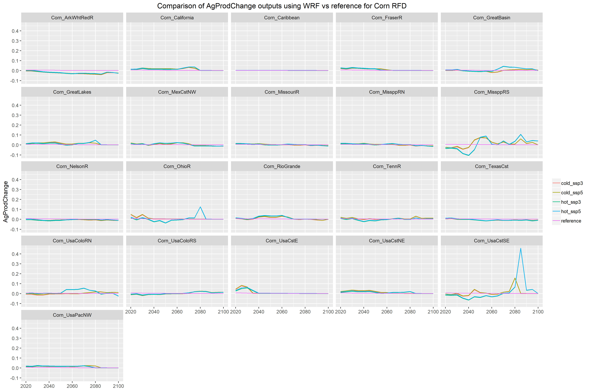
```

<br>

###### RCP8.5 IRR

<br>

```{r, echo=FALSE, out.width="100%", fig.align='center', fig.cap="**AgProdChange for RCP8.5 IRR Corn**"}
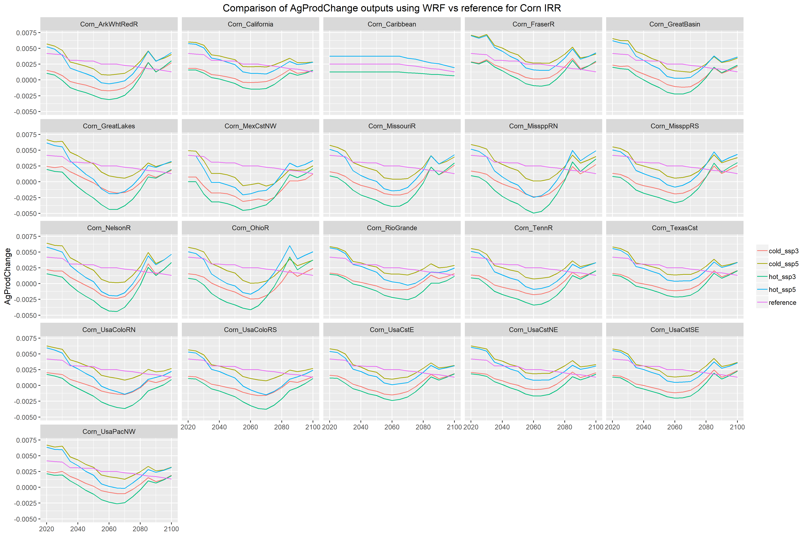
```

<br>

###### RCP8.5 RFD

<br>

```{r, echo=FALSE, out.width="100%", fig.align='center', fig.cap="**AgProdChange for RCP8.5 RFD Corn**"}
knitr::include_graphics("images/agprodchange_Corn_RFD_rcp8p5.png")
```

<br>

##### Rice {.tabset}

<br>

###### RCP4.5 IRR

<br>

```{r, echo=FALSE, out.width="100%", fig.align='center', fig.cap="**AgProdChange for RCP4.5 IRR Rice**"}
knitr::include_graphics("images/agprodchange_Rice_IRR_rcp4p5.png")
```

<br>

###### RCP4.5 RFD

<br>

```{r, echo=FALSE, out.width="100%", fig.align='center', fig.cap="**AgProdChange for RCP4.5 RFD Rice**"}
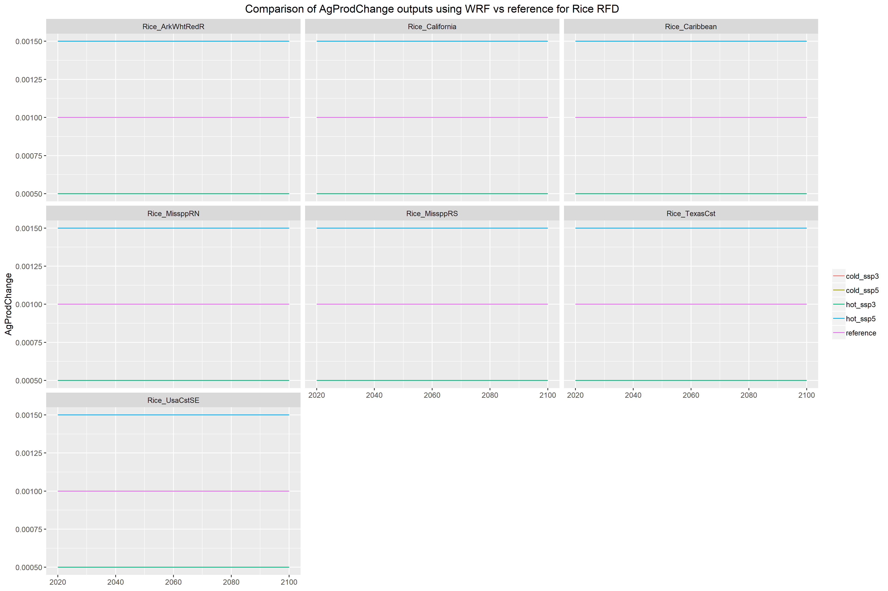
```

<br>

###### RCP8.5 IRR

<br>

```{r, echo=FALSE, out.width="100%", fig.align='center', fig.cap="**AgProdChange for RCP8.5 IRR Rice**"}
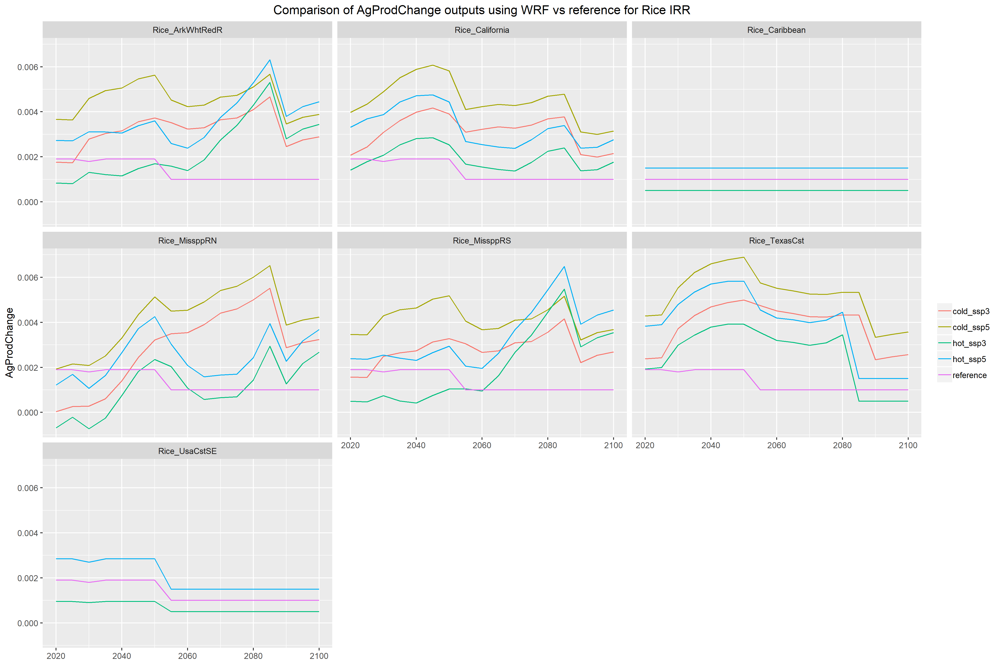
```

<br>

###### RCP8.5 RFD

<br>

```{r, echo=FALSE, out.width="100%", fig.align='center', fig.cap="**AgProdChange for RCP8.5 RFD Rice**"}
knitr::include_graphics("images/agprodchange_Rice_RFD_rcp8p5.png")
```

<br>

##### Wheat {.tabset}

<br>

###### RCP4.5 IRR

<br>

```{r, echo=FALSE, out.width="100%", fig.align='center', fig.cap="**AgProdChange for RCP4.5 IRR Wheat**"}
knitr::include_graphics("images/agprodchange_Wheat_IRR_rcp4p5.png")
```

<br>

###### RCP4.5 RFD

<br>

```{r, echo=FALSE, out.width="100%", fig.align='center', fig.cap="**AgProdChange for RCP4.5 RFD Wheat**"}
knitr::include_graphics("images/agprodchange_Wheat_RFD_rcp4p5.png")
```

<br>

###### RCP8.5 IRR

<br>

```{r, echo=FALSE, out.width="100%", fig.align='center', fig.cap="**AgProdChange for RCP8.5 IRR Wheat**"}
knitr::include_graphics("images/agprodchange_Wheat_IRR_rcp8p5.png")
```

<br>

###### RCP8.5 RFD

<br>

```{r, echo=FALSE, out.width="100%", fig.align='center', fig.cap="**AgProdChange for RCP8.5 RFD Wheat**"}
knitr::include_graphics("images/agprodchange_Wheat_RFD_rcp8p5.png")
```

<br>

##### Oil Crop {.tabset}

<br>

###### RCP4.5 IRR

<br>

```{r, echo=FALSE, out.width="100%", fig.align='center', fig.cap="**AgProdChange for RCP4.5 IRR Oil Crop**"}
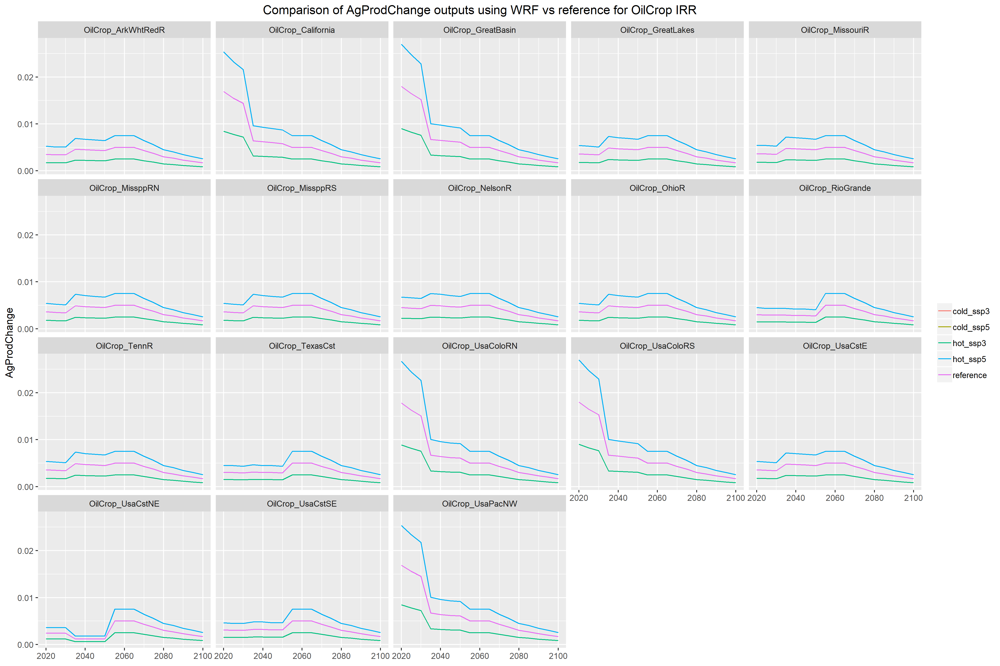
```

<br>

###### RCP4.5 RFD

<br>

```{r, echo=FALSE, out.width="100%", fig.align='center', fig.cap="**AgProdChange for RCP4.5 RFD Oil Crop**"}
knitr::include_graphics("images/agprodchange_OilCrop_RFD_rcp4p5.png")
```

<br>

###### RCP8.5 IRR

<br>

```{r, echo=FALSE, out.width="100%", fig.align='center', fig.cap="**AgProdChange for RCP8.5 IRR Oil Crop**"}
knitr::include_graphics("images/agprodchange_OilCrop_IRR_rcp8p5.png")
```

<br>

###### RCP8.5 RFD

<br>

```{r, echo=FALSE, out.width="100%", fig.align='center', fig.cap="**AgProdChange for RCP8.5 RFD Oil Crop**"}
knitr::include_graphics("images/agprodchange_OilCrop_RFD_rcp8p5.png")
```

<br>


#### Agyield {.tabset}

<br>

##### Corn {.tabset}

<br>

###### RCP4.5 IRR

<br>

```{r, echo=FALSE, out.width="100%", fig.align='center', fig.cap="**Agyield for RCP4.5 IRR Corn**"}
knitr::include_graphics("images/agyield_Corn_IRR_rcp4p5.png")
```

<br>

###### RCP4.5 RFD

<br>

```{r, echo=FALSE, out.width="100%", fig.align='center', fig.cap="**Agyield for RCP4.5 RFD Corn**"}
knitr::include_graphics("images/agyield_Corn_RFD_rcp4p5.png")
```

<br>

###### RCP8.5 IRR

<br>

```{r, echo=FALSE, out.width="100%", fig.align='center', fig.cap="**Agyield for RCP8.5 IRR Corn**"}
knitr::include_graphics("images/agyield_Corn_IRR_rcp8p5.png")
```

<br>

###### RCP8.5 RFD

<br>

```{r, echo=FALSE, out.width="100%", fig.align='center', fig.cap="**Agyield for RCP8.5 RFD Corn**"}
knitr::include_graphics("images/agyield_Corn_RFD_rcp8p5.png")
```

<br>

##### Rice {.tabset}

<br>

###### RCP4.5 IRR

<br>

```{r, echo=FALSE, out.width="100%", fig.align='center', fig.cap="**Agyield for RCP4.5 IRR Rice**"}
knitr::include_graphics("images/agyield_Rice_IRR_rcp4p5.png")
```

<br>

###### RCP4.5 RFD

<br>

```{r, echo=FALSE, out.width="100%", fig.align='center', fig.cap="**Agyield for RCP4.5 RFD Rice**"}
knitr::include_graphics("images/agyield_Rice_RFD_rcp4p5.png")
```

<br>

###### RCP8.5 IRR

<br>

```{r, echo=FALSE, out.width="100%", fig.align='center', fig.cap="**Agyield for RCP8.5 IRR Rice**"}
knitr::include_graphics("images/agyield_Rice_IRR_rcp8p5.png")
```

<br>

###### RCP8.5 RFD

<br>

```{r, echo=FALSE, out.width="100%", fig.align='center', fig.cap="**Agyield for RCP8.5 RFD Rice**"}
knitr::include_graphics("images/agyield_Rice_RFD_rcp8p5.png")
```

<br>

##### Wheat {.tabset}

<br>

###### RCP4.5 IRR

<br>

```{r, echo=FALSE, out.width="100%", fig.align='center', fig.cap="**Agyield for RCP4.5 IRR Wheat**"}
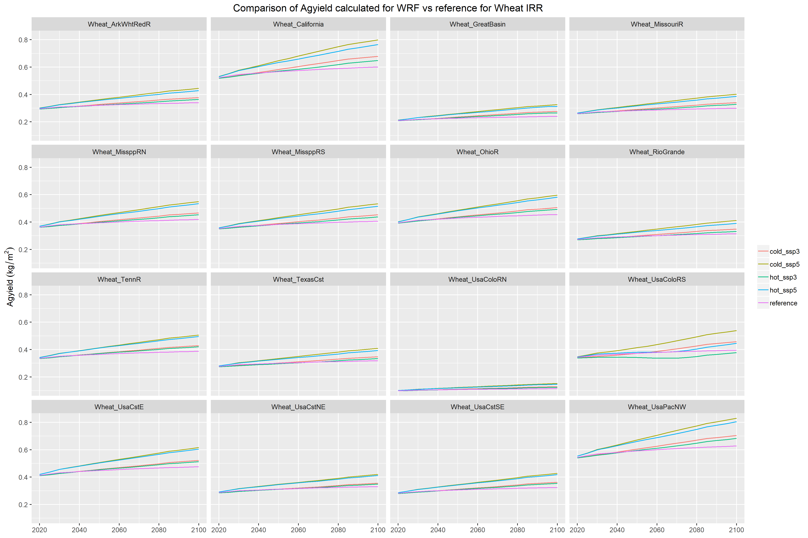
```

<br>

###### RCP4.5 RFD

<br>

```{r, echo=FALSE, out.width="100%", fig.align='center', fig.cap="**Agyield for RCP4.5 RFD Wheat**"}
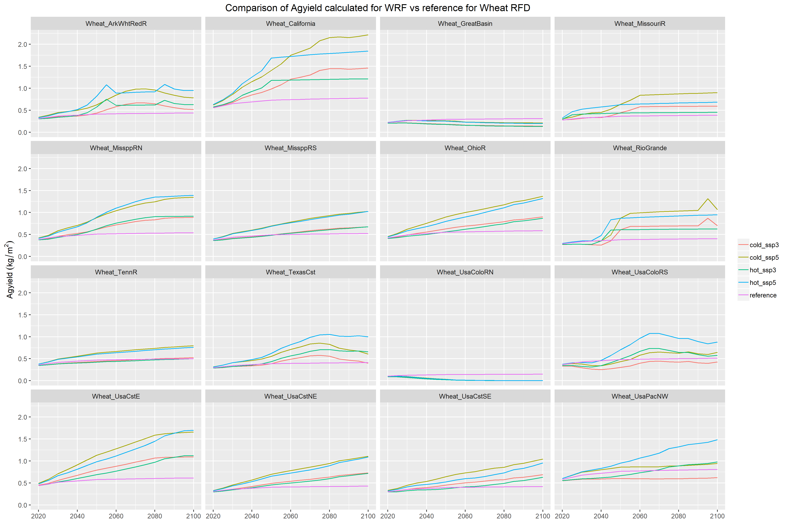
```

<br>

###### RCP8.5 IRR

<br>

```{r, echo=FALSE, out.width="100%", fig.align='center', fig.cap="**Agyield for RCP8.5 IRR Wheat**"}
knitr::include_graphics("images/agyield_Wheat_IRR_rcp8p5.png")
```

<br>

###### RCP8.5 RFD

<br>

```{r, echo=FALSE, out.width="100%", fig.align='center', fig.cap="**Agyield for RCP8.5 RFD Wheat**"}
knitr::include_graphics("images/agyield_Wheat_RFD_rcp8p5.png")
```

<br>

##### Oil Crop {.tabset}

<br>

###### RCP4.5 IRR

<br>

```{r, echo=FALSE, out.width="100%", fig.align='center', fig.cap="**Agyield for RCP4.5 IRR Oil Crop**"}
knitr::include_graphics("images/agyield_OilCrop_IRR_rcp4p5.png")
```

<br>

###### RCP4.5 RFD

<br>

```{r, echo=FALSE, out.width="100%", fig.align='center', fig.cap="**Agyield for RCP4.5 RFD Oil Crop**"}
knitr::include_graphics("images/agyield_OilCrop_RFD_rcp4p5.png")
```

<br>

###### RCP8.5 IRR

<br>

```{r, echo=FALSE, out.width="100%", fig.align='center', fig.cap="**Agyield for RCP8.5 IRR Oil Crop**"}
knitr::include_graphics("images/agyield_OilCrop_IRR_rcp8p5.png")
```

<br>

###### RCP8.5 RFD

<br>

```{r, echo=FALSE, out.width="100%", fig.align='center', fig.cap="**Agyield for RCP8.5 RFD Oil Crop**"}
knitr::include_graphics("images/agyield_OilCrop_RFD_rcp8p5.png")
```

### GCAM SSP3 {.tabset .tabset-pills}

#### Summary

<br>

```{r, echo=FALSE, out.width="150%", fig.align='center', fig.cap="**Comparison of GCAM outputs global runoff for 5 GCMS **"}
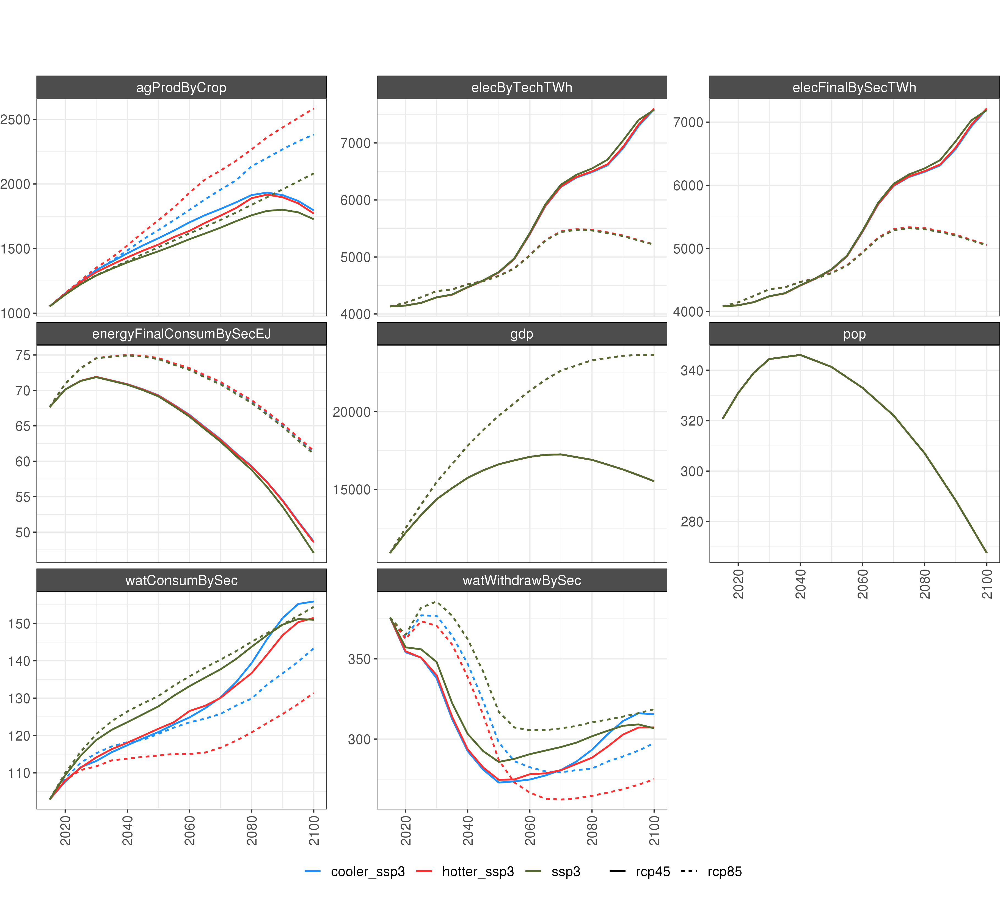
```
<!--updated on 4/12/2022-->


#### Socioeconomics

<br>

```{r, echo=FALSE, out.width="100%", fig.align='center', fig.cap="**Comparison of GCAM socioeconomic outputs**"}
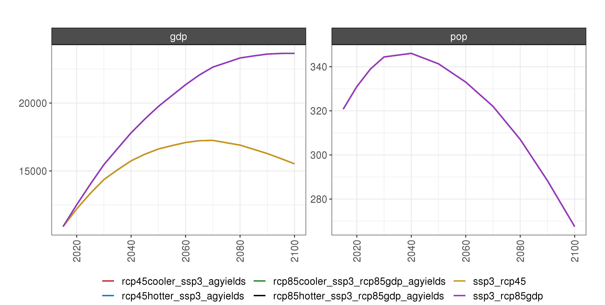
```
<!--updated on 4/12/2022-->


<br>

```{r, echo=FALSE, out.width="100%", fig.align='center', fig.cap="**Comparison of GCAM socioeconomic outputs % Diff**"}
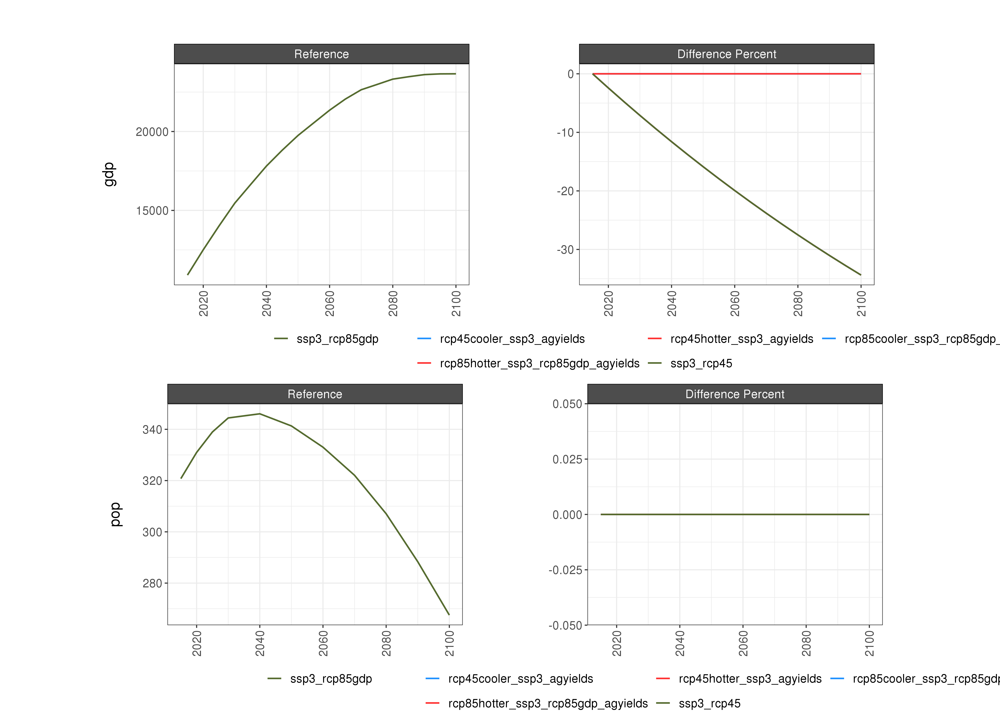
```

<br>

#### Water {.tabset}

<br>

##### RCP4.5

<br>

```{r, echo=FALSE, out.width="200%", fig.align='center', fig.cap="**Comparison of GCAM water outputs**"}
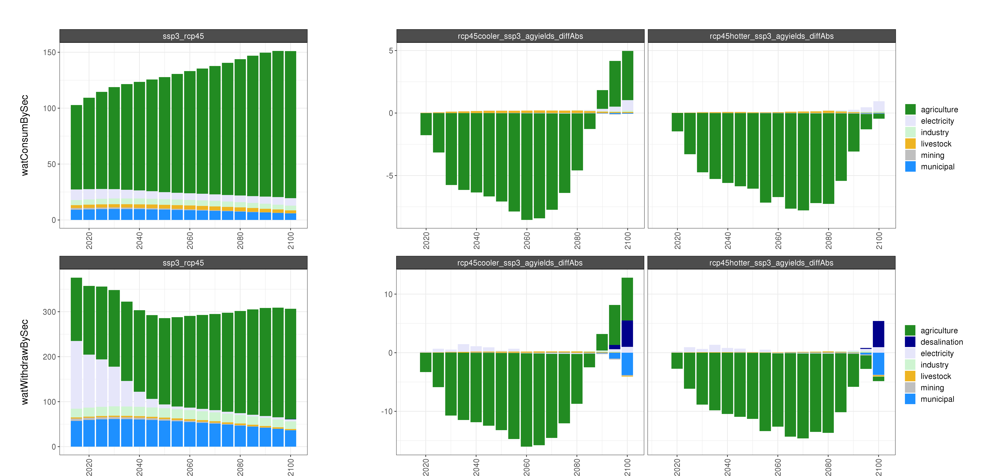
```

<br>

```{r, echo=FALSE, out.width="200%", fig.align='center', fig.cap="**Comparison of GCAM water outputs % Diff **"}
knitr::include_graphics("images/chart_class_diff_percent_water_im3_agyields_ssp3_rcp45.png")
```

<br>

##### RCP8.5

<br>

```{r, echo=FALSE, out.width="200%", fig.align='center', fig.cap="**Comparison of GCAM water outputs**"}
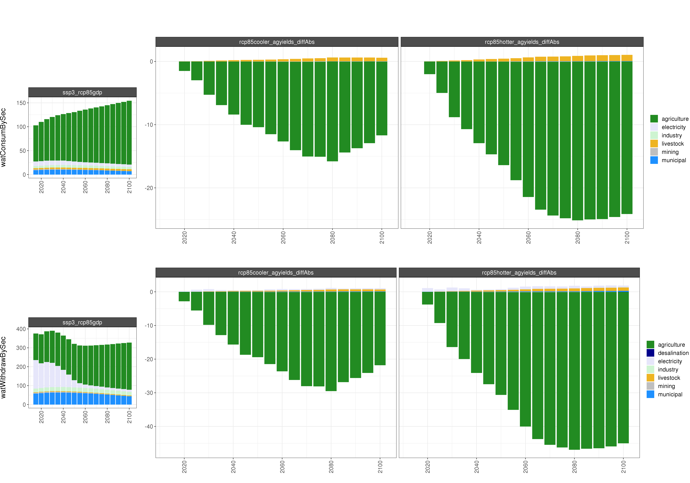
```

<br>

```{r, echo=FALSE, out.width="200%", fig.align='center', fig.cap="**Comparison of GCAM water outputs % Diff **"}
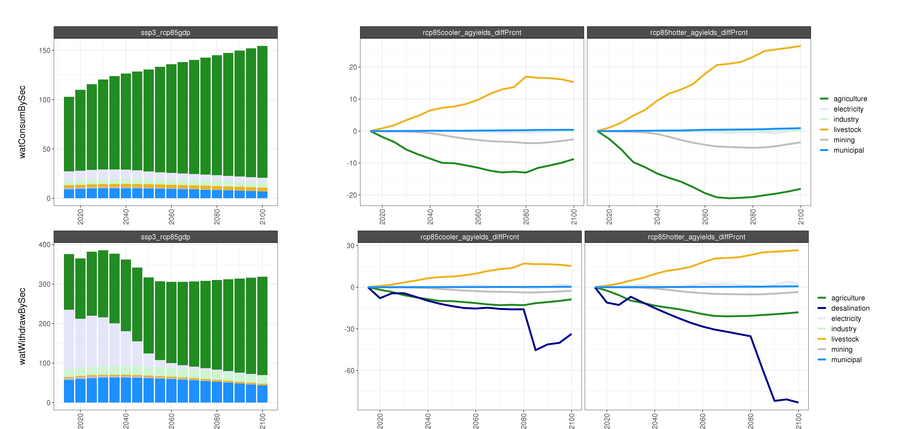
```

<br>

#### Energy {.tabset}

<br>

##### RCP4.5

<br>

```{r, echo=FALSE, out.width="200%", fig.align='center', fig.cap="**Comparison of GCAM electricity outputs**"}
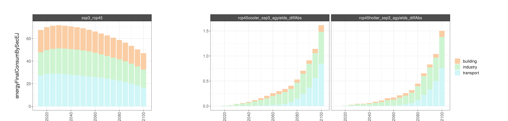
```

<br>

```{r, echo=FALSE, out.width="200%", fig.align='center', fig.cap="**Comparison of GCAM electricity outputs % Diff**"}
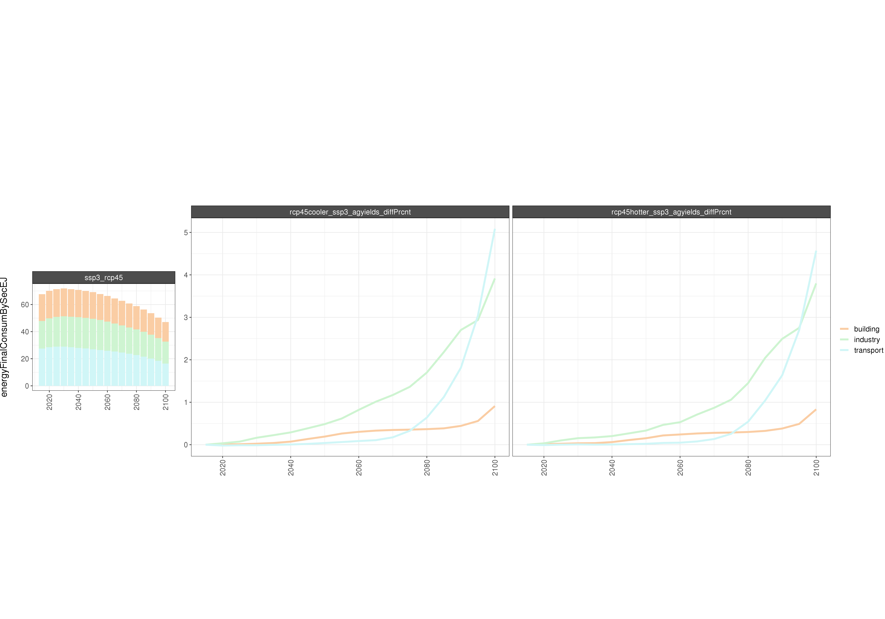
```

<br>

##### RCP8.5

<br>

```{r, echo=FALSE, out.width="200%", fig.align='center', fig.cap="**Comparison of GCAM electricity outputs**"}
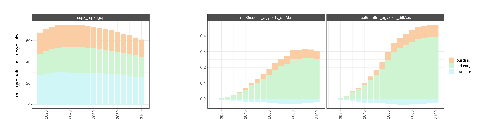
```

<br>

```{r, echo=FALSE, out.width="200%", fig.align='center', fig.cap="**Comparison of GCAM electricity outputs % Diff**"}
knitr::include_graphics("images/chart_class_diff_percent_energy_im3_agyields_ssp3_rcp85gdp.png")
```

<br>

#### Electricity {.tabset}

<br>

##### RCP4.5

<br>

```{r, echo=FALSE, out.width="200%", fig.align='center', fig.cap="**Comparison of GCAM electricity outputs**"}
knitr::include_graphics("images/chart_class_diff_absolute_electricity_im3_agyields_ssp3_rcp45.png")
```

<br>

```{r, echo=FALSE, out.width="200%", fig.align='center', fig.cap="**Comparison of GCAM electricity outputs % Diff**"}
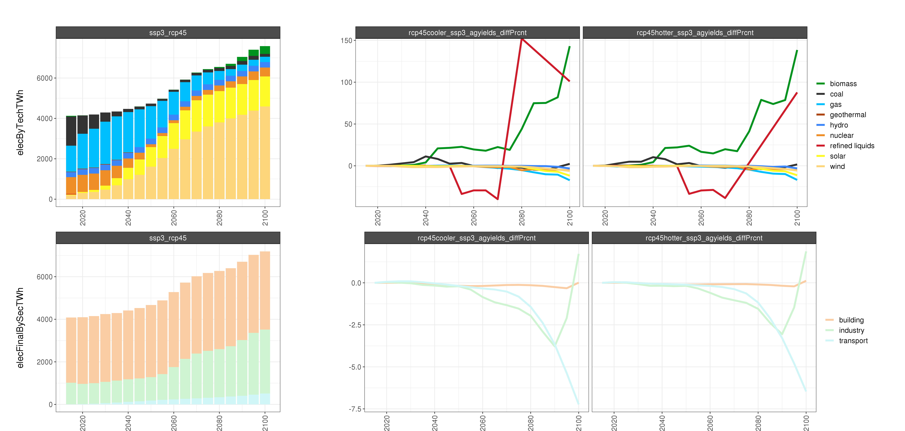
```

<br>

##### RCP8.5

<br>

```{r, echo=FALSE, out.width="200%", fig.align='center', fig.cap="**Comparison of GCAM electricity outputs**"}
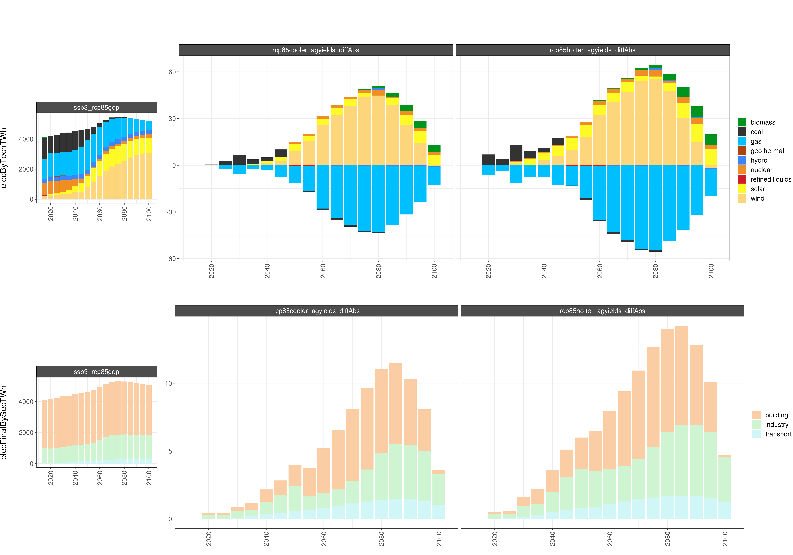
```

<br>

```{r, echo=FALSE, out.width="200%", fig.align='center', fig.cap="**Comparison of GCAM electricity outputs % Diff**"}
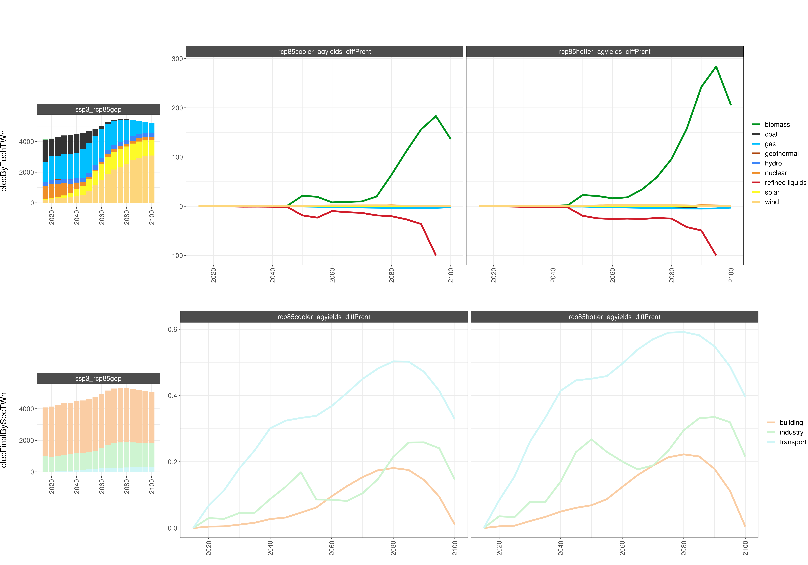
```

<br>

#### AGLU {.tabset}

<br>

##### Summary {.tabset}

<br>

###### RCP4.5 Charts

<br>

```{r, echo=FALSE, out.width="200%", fig.align='center', fig.cap="**Comparison of GCAM AGLU outputs - absolute difference**"}
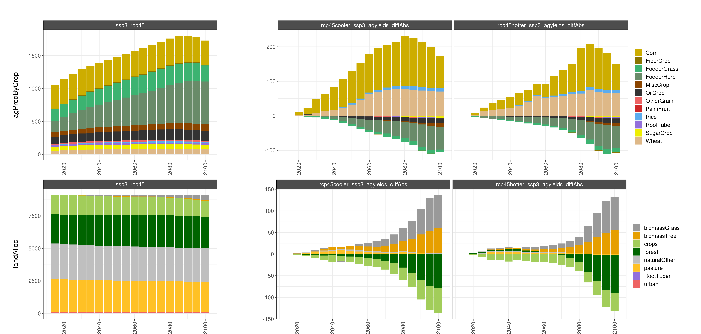
```

<br>

<div class="img_large">
```{r, echo=FALSE, out.width="200%", fig.align='center', fig.cap="**Comparison of GCAM AGLU outputs - percent difference**"}
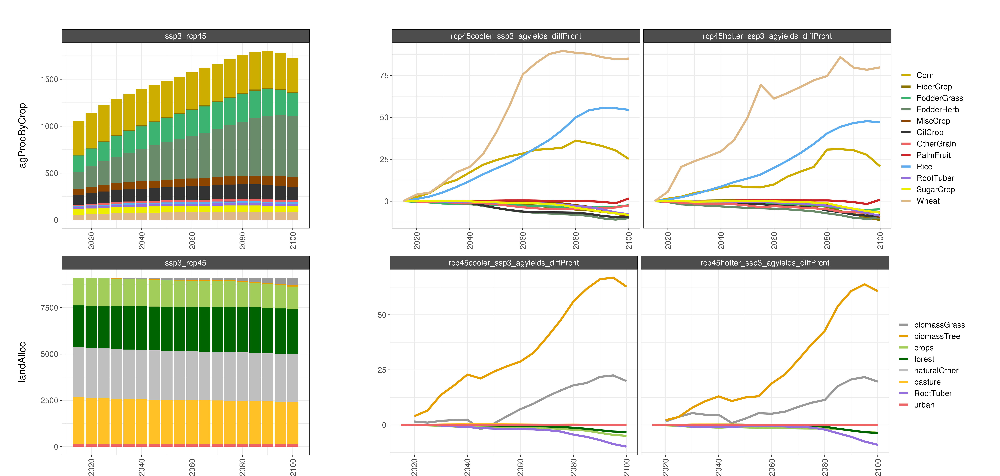
```
</div>

<br>

###### RCP8.5 Charts

<br>

```{r, echo=FALSE, out.width="200%", fig.align='center', fig.cap="**Comparison of GCAM AGLU outputs - absolute difference**"}
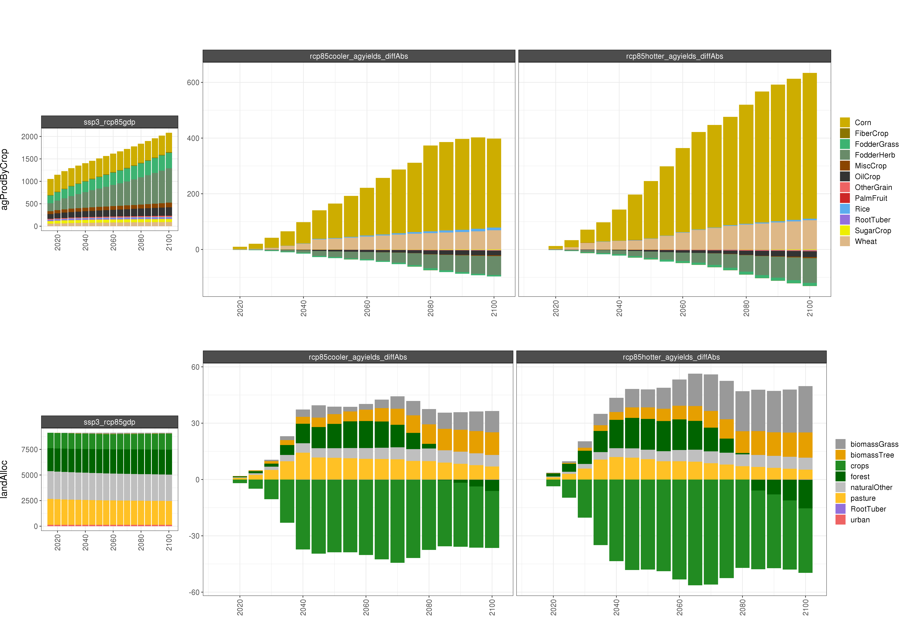
```

<br>

<div class="img_large">
```{r, echo=FALSE, out.width="200%", fig.align='center', fig.cap="**Comparison of GCAM AGLU outputs - percent difference**"}
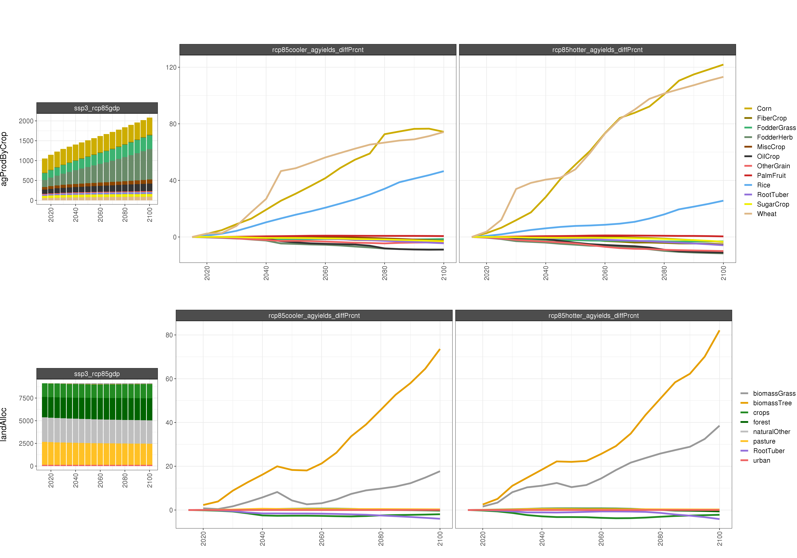
```
</div>

<br>

###### RCP4.5 Maps

<br>

```{r, echo=FALSE, out.width="200%", fig.align='center', fig.cap="**Comparison of agriculture production for 4 climate and socioeconomic scenarios.**"}
knitr::include_graphics("images/map_agProdByCrop_KMEANSim3_agyields_ssp3.png")
```

<br>

```{r, echo=FALSE, out.width="200%", fig.align='center', fig.cap="**Absolute difference of agriculture production from 3 climate and socioeconomic scenarios to Reference scenario (RCP8.5 HOT - SSP3).**"}
knitr::include_graphics("images/map_agProdByCrop_KMEANS_DiffAbsim3_agyields_ssp3.png")
```

<br>

```{r, echo=FALSE, out.width="200%", fig.align='center', fig.cap="**Percent difference of agriculture production from 3 climate and socioeconomic scenarios to Reference scenario (RCP8.5 HOT - SSP3).**"}
knitr::include_graphics("images/map_agProdByCrop_KMEANS_DiffPrcntim3_agyields_ssp3.png")
```

<br>

###### RCP8.5 Maps

<br>

```{r, echo=FALSE, out.width="200%", fig.align='center', fig.cap="**Comparison of agriculture production for 4 climate and socioeconomic scenarios.**"}
knitr::include_graphics("images/map_agProdByCrop_KMEANSim3_agyields_ssp3.png")
```

<br>

```{r, echo=FALSE, out.width="200%", fig.align='center', fig.cap="**Absolute difference of agriculture production from 3 climate and socioeconomic scenarios to Reference scenario (RCP8.5 HOT - SSP3).**"}
knitr::include_graphics("images/map_agProdByCrop_KMEANS_DiffAbsim3_agyields_ssp3.png")
```

<br>

```{r, echo=FALSE, out.width="200%", fig.align='center', fig.cap="**Percent difference of agriculture production from 3 climate and socioeconomic scenarios to Reference scenario (RCP8.5 HOT - SSP3).**"}
knitr::include_graphics("images/map_agProdByCrop_KMEANS_DiffPrcntim3_agyields_ssp3.png")
```

<br>

##### Corn {.tabset}

<br>

###### RCP4.5

<br>

```{r, echo=FALSE, out.width="200%", fig.align='center', fig.cap="**Comparison of GCAM AGLU outputs - absolute difference**"}
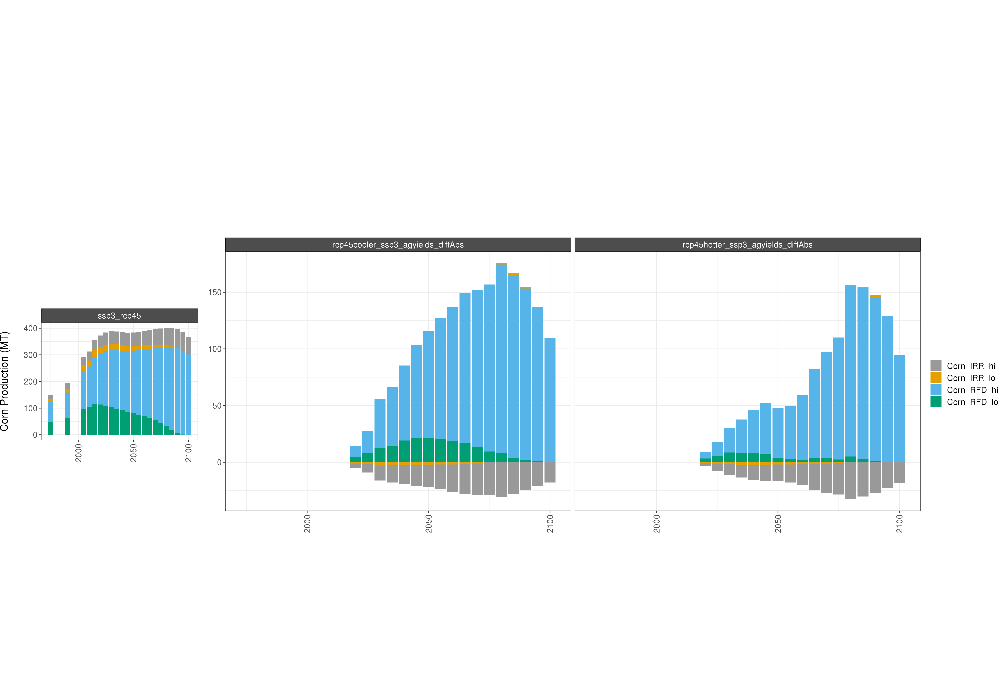
```

<br>

<div class="img_large">
```{r, echo=FALSE, out.width="200%", fig.align='center', fig.cap="**Comparison of GCAM AGLU outputs - percent difference**"}
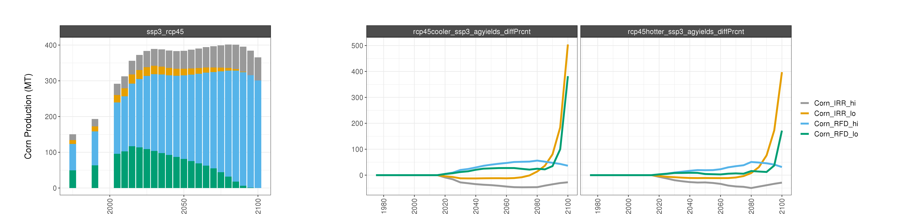
```
</div>

<br>

###### RCP8.5

<br>

```{r, echo=FALSE, out.width="200%", fig.align='center', fig.cap="**Comparison of GCAM AGLU outputs - absolute difference**"}
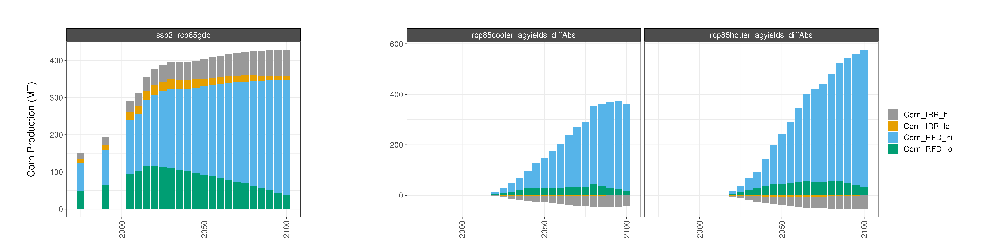
```

<br>

<div class="img_large">
```{r, echo=FALSE, out.width="200%", fig.align='center', fig.cap="**Comparison of GCAM AGLU outputs - percent difference**"}
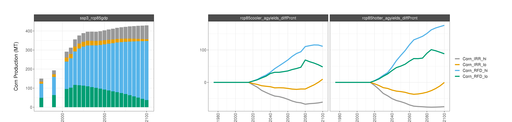
```
</div>

<br>

##### OilCrop {.tabset}

<br>

###### RCP4.5

<br>

```{r, echo=FALSE, out.width="200%", fig.align='center', fig.cap="**Comparison of GCAM AGLU outputs - absolute difference**"}
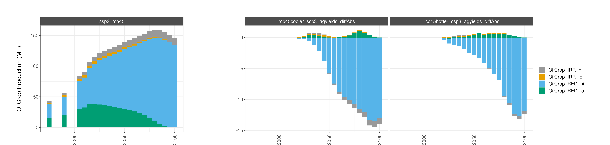
```

<br>

<div class="img_large">
```{r, echo=FALSE, out.width="200%", fig.align='center', fig.cap="**Comparison of GCAM AGLU outputs - percent difference**"}
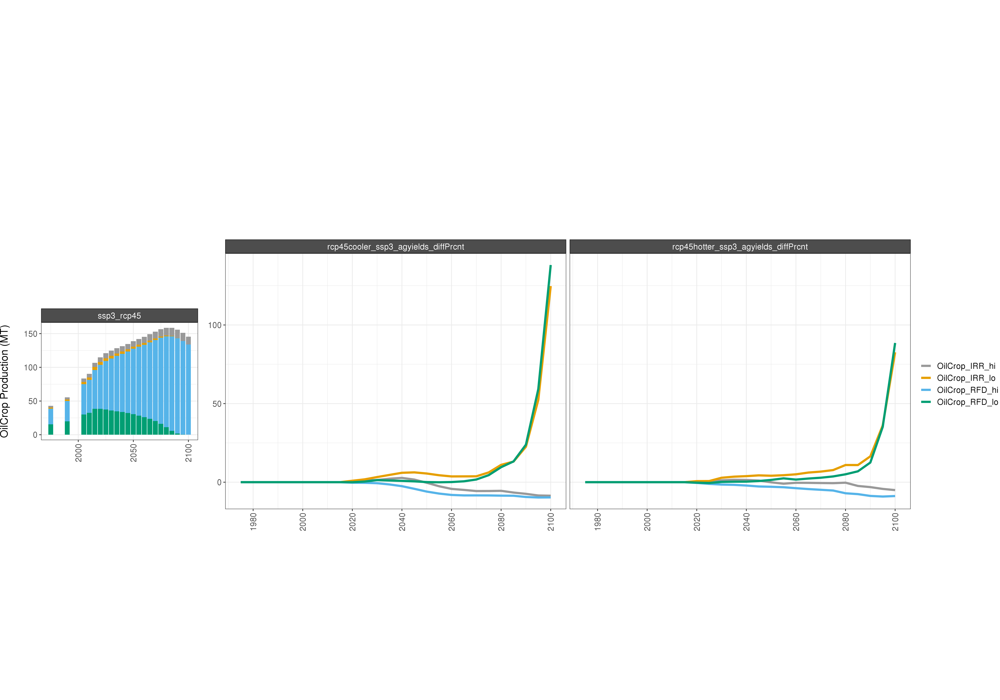
```
</div>

<br>

###### RCP8.5

<br>

```{r, echo=FALSE, out.width="200%", fig.align='center', fig.cap="**Comparison of GCAM AGLU outputs - absolute difference**"}
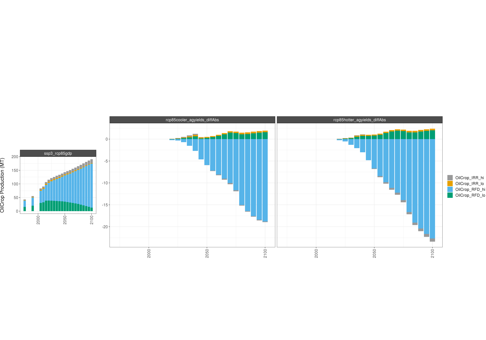
```

<br>

<div class="img_large">
```{r, echo=FALSE, out.width="200%", fig.align='center', fig.cap="**Comparison of GCAM AGLU outputs - percent difference**"}
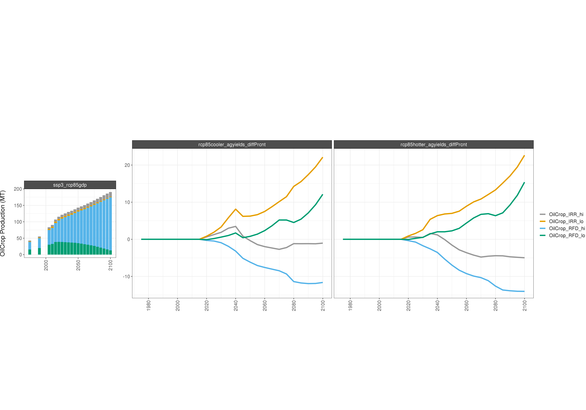
```
</div>

<br>

##### Rice {.tabset}

<br>

###### RCP4.5

<br>

```{r, echo=FALSE, out.width="200%", fig.align='center', fig.cap="**Comparison of GCAM AGLU outputs - absolute difference**"}
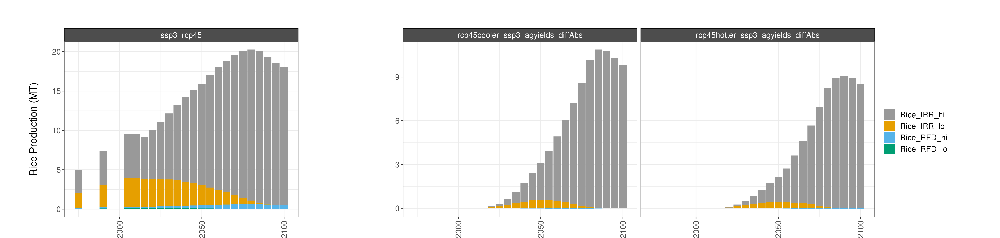
```

<br>

<div class="img_large">
```{r, echo=FALSE, out.width="200%", fig.align='center', fig.cap="**Comparison of GCAM AGLU outputs - percent difference**"}
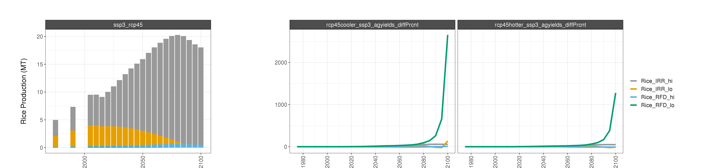
```
</div>

<br>

###### RCP8.5

<br>

```{r, echo=FALSE, out.width="200%", fig.align='center', fig.cap="**Comparison of GCAM AGLU outputs - absolute difference**"}
knitr::include_graphics("images/chart_class_diff_absolute_aglu_rice_im3_agyields_ssp3_rcp85gdp.png")
```

<br>

<div class="img_large">
```{r, echo=FALSE, out.width="200%", fig.align='center', fig.cap="**Comparison of GCAM AGLU outputs - percent difference**"}
knitr::include_graphics("images/chart_class_diff_percent_aglu_rice_im3_agyields_ssp3_rcp85gdp.png")
```
</div>

<br>

##### Wheat {.tabset}

<br>

###### RCP4.5

<br>

```{r, echo=FALSE, out.width="200%", fig.align='center', fig.cap="**Comparison of GCAM AGLU outputs - absolute difference**"}
knitr::include_graphics("images/chart_class_diff_absolute_aglu_wheat_im3_agyields_ssp3_rcp45.png")
```

<br>

<div class="img_large">
```{r, echo=FALSE, out.width="200%", fig.align='center', fig.cap="**Comparison of GCAM AGLU outputs - percent difference**"}
knitr::include_graphics("images/chart_class_diff_percent_aglu_wheat_im3_agyields_ssp3_rcp45.png")
```
</div>

<br>

###### RCP8.5

<br>

```{r, echo=FALSE, out.width="200%", fig.align='center', fig.cap="**Comparison of GCAM AGLU outputs - absolute difference**"}
knitr::include_graphics("images/chart_class_diff_absolute_aglu_wheat_im3_agyields_ssp3_rcp85gdp.png")
```

<br>

<div class="img_large">
```{r, echo=FALSE, out.width="200%", fig.align='center', fig.cap="**Comparison of GCAM AGLU outputs - percent difference**"}
knitr::include_graphics("images/chart_class_diff_percent_aglu_wheat_im3_agyields_ssp3_rcp85gdp.png")
```
</div>

<br>

#### Emissions {.tabset}

<br>

##### RCP4.5

<br>

```{r, echo=FALSE, out.width="100%", fig.align='center', fig.cap="**Cumulative global carbon emission pathways under different combinations of SSP3/SSP5 and RCP4.5/RCP8.5 **"}
knitr::include_graphics("images/compareCO2GlobalCumRCP_im3_agyields_ssp3_rcp45.png")
```
<!-- updated on 4/12/22 -->

<br>

```{r, echo=FALSE, out.width="100%", fig.align='center', fig.cap="**Annual US carbon emissions under different combinations of SSP3/SSP5 and RCP4.5/RCP8.5 **"}
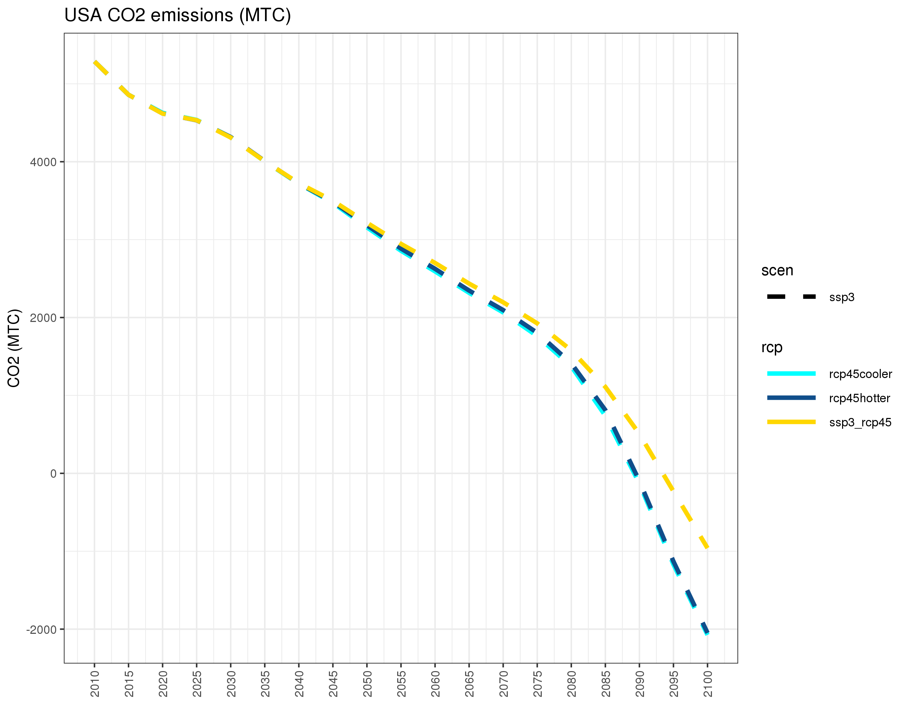
```

<br>

```{r, echo=FALSE, out.width="100%", fig.align='center', fig.cap="**Annual global non-CO~2~ emissions under different combinations of SSP3/SSP5 and RCP4.5/RCP8.5 **"}
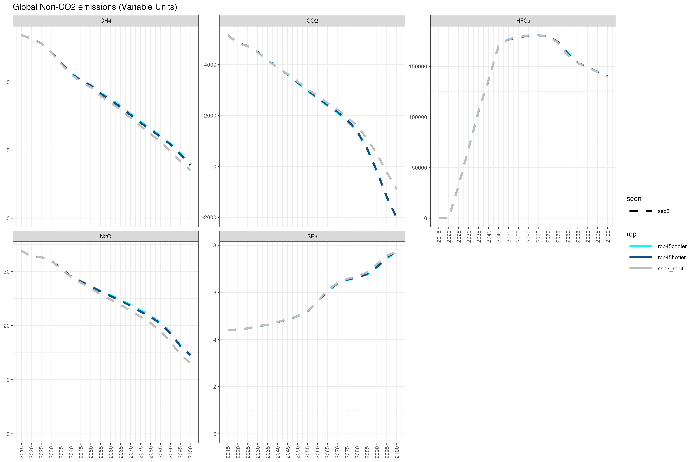
```

<br>


```{r, echo=FALSE, out.width="100%", fig.align='center', fig.cap="**Annual US non-CO~2~ emissions under different combinations of SSP3/SSP5 and RCP4.5/RCP8.5 **"}
knitr::include_graphics("images/compareNonCO2USA_im3_agyields_ssp3_rcp45.png")
```

<br>

##### RCP8.5

<br>

```{r, echo=FALSE, out.width="100%", fig.align='center', fig.cap="**Cumulative global carbon emission pathways under different combinations of SSP3/SSP5 and RCP4.5/RCP8.5 **"}
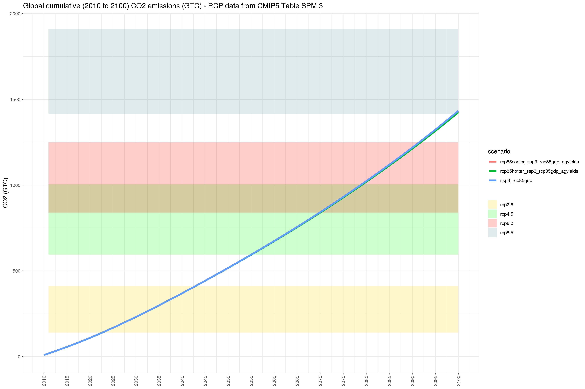
```
<!-- updated on 4/12/22 -->

<br>

```{r, echo=FALSE, out.width="100%", fig.align='center', fig.cap="**Annual US carbon emissions under different combinations of SSP3/SSP5 and RCP4.5/RCP8.5 **"}
knitr::include_graphics("images/compareCO2USA_im3_agyields_ssp3_rcp85gdp.png")
```

<br>

```{r, echo=FALSE, out.width="100%", fig.align='center', fig.cap="**Annual global non-CO~2~ emissions under different combinations of SSP3/SSP5 and RCP4.5/RCP8.5 **"}
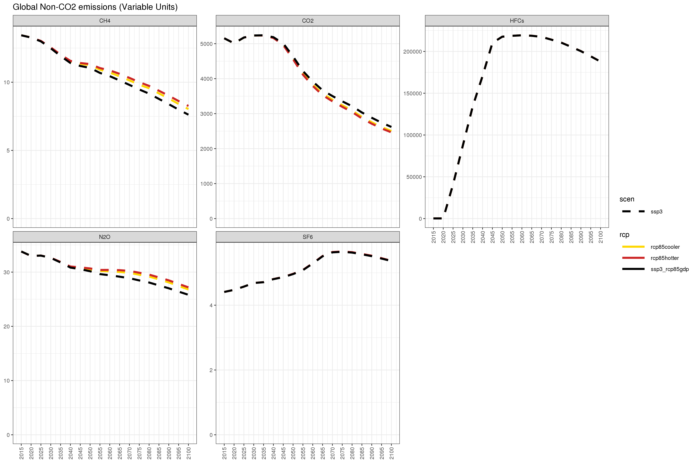
```

<br>


```{r, echo=FALSE, out.width="100%", fig.align='center', fig.cap="**Annual US non-CO~2~ emissions under different combinations of SSP3/SSP5 and RCP4.5/RCP8.5 **"}
knitr::include_graphics("images/compareNonCO2USA_im3_agyields_ssp3_rcp85gdp.png")
```

### GCAM SSP5 {.tabset .tabset-pills}

#### Summary

<br>

```{r, echo=FALSE, out.width="150%", fig.align='center', fig.cap="**Comparison of GCAM outputs global runoff for 5 GCMS **"}
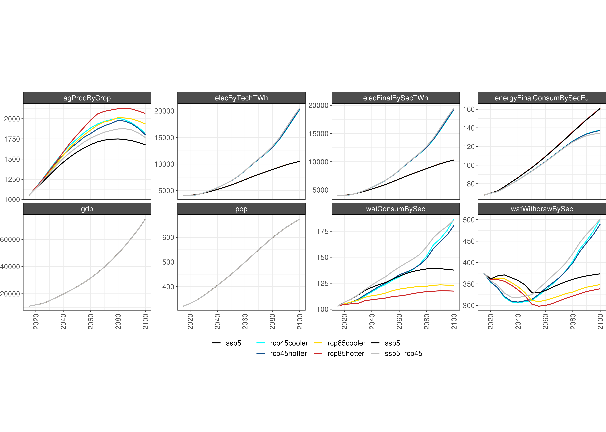
```
<!--updated on 4/12/2022-->


#### Socioeconomics

<br>

```{r, echo=FALSE, out.width="100%", fig.align='center', fig.cap="**Comparison of GCAM socioeconomic outputs**"}
knitr::include_graphics("images/chart_param_socioecon_im3_agyields_ssp5_summary.png")
```
<!--updated on 4/12/2022-->


<br>

```{r, echo=FALSE, out.width="100%", fig.align='center', fig.cap="**Comparison of GCAM socioeconomic outputs % Diff**"}
knitr::include_graphics("images/chart_param_diff_percent_socioecon_im3_agyields_ssp5_summary.png")
```

<br>

#### Water {.tabset}

<br>

##### RCP4.5

<br>

```{r, echo=FALSE, out.width="200%", fig.align='center', fig.cap="**Comparison of GCAM water outputs**"}
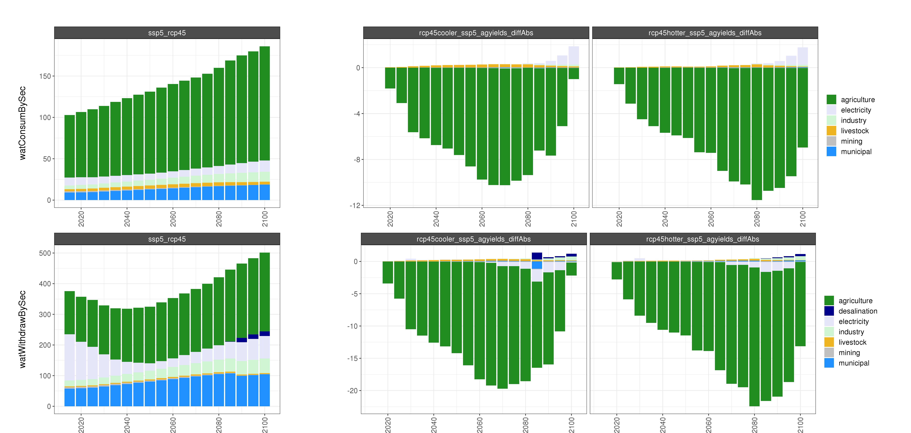
```

<br>

```{r, echo=FALSE, out.width="200%", fig.align='center', fig.cap="**Comparison of GCAM water outputs % Diff **"}
knitr::include_graphics("images/chart_class_diff_percent_water_im3_agyields_ssp5_rcp45.png")
```

<br>

##### RCP8.5

<br>

```{r, echo=FALSE, out.width="200%", fig.align='center', fig.cap="**Comparison of GCAM water outputs**"}
knitr::include_graphics("images/chart_class_diff_absolute_water_im3_agyields_ssp5_rcp85.png")
```

<br>

```{r, echo=FALSE, out.width="200%", fig.align='center', fig.cap="**Comparison of GCAM water outputs % Diff **"}
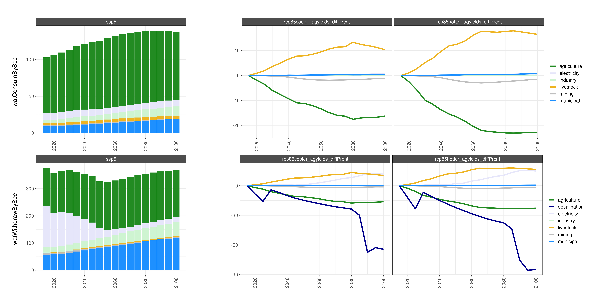
```

<br>

#### Energy {.tabset}

<br>

##### RCP4.5

<br>

```{r, echo=FALSE, out.width="200%", fig.align='center', fig.cap="**Comparison of GCAM electricity outputs**"}
knitr::include_graphics("images/chart_class_diff_absolute_energy_im3_agyields_ssp5_rcp45.png")
```

<br>

```{r, echo=FALSE, out.width="200%", fig.align='center', fig.cap="**Comparison of GCAM electricity outputs % Diff**"}
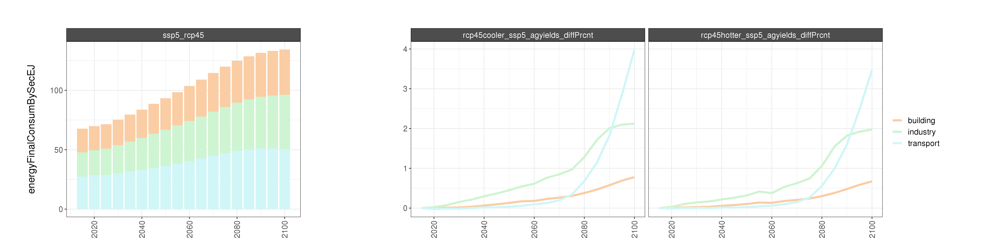
```

<br>

##### RCP8.5

<br>

```{r, echo=FALSE, out.width="200%", fig.align='center', fig.cap="**Comparison of GCAM electricity outputs**"}
knitr::include_graphics("images/chart_class_diff_absolute_energy_im3_agyields_ssp5_rcp85.png")
```

<br>

```{r, echo=FALSE, out.width="200%", fig.align='center', fig.cap="**Comparison of GCAM electricity outputs % Diff**"}
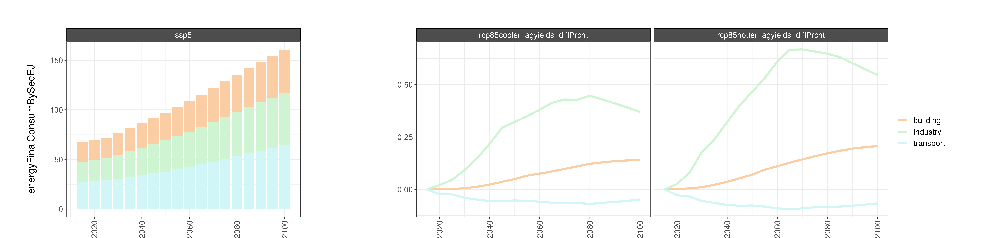
```

<br>

#### Electricity {.tabset}

<br>

##### RCP4.5

<br>

```{r, echo=FALSE, out.width="200%", fig.align='center', fig.cap="**Comparison of GCAM electricity outputs**"}
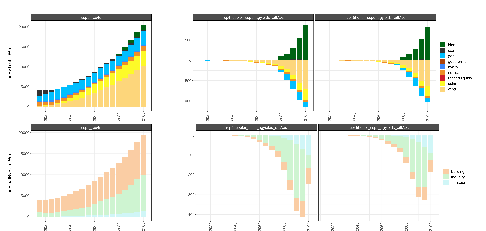
```

<br>

```{r, echo=FALSE, out.width="200%", fig.align='center', fig.cap="**Comparison of GCAM electricity outputs % Diff**"}
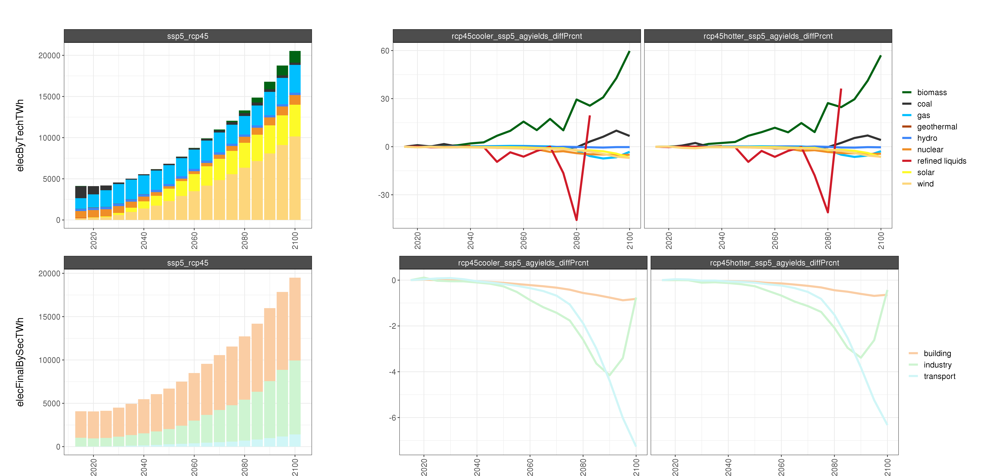
```

<br>

##### RCP8.5

<br>

```{r, echo=FALSE, out.width="200%", fig.align='center', fig.cap="**Comparison of GCAM electricity outputs**"}
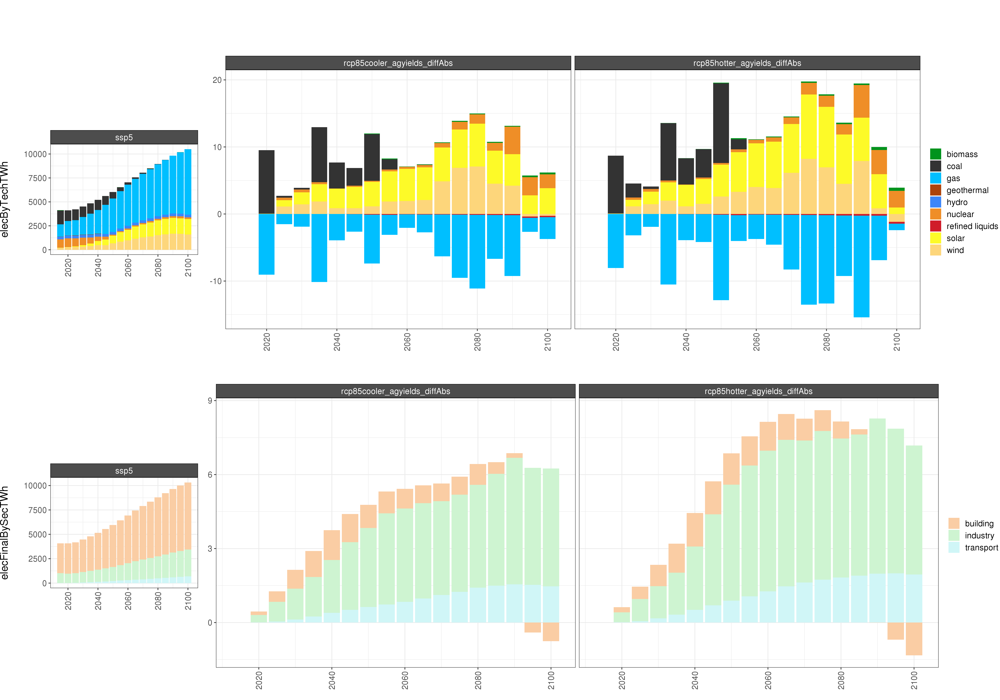
```

<br>

```{r, echo=FALSE, out.width="200%", fig.align='center', fig.cap="**Comparison of GCAM electricity outputs % Diff**"}
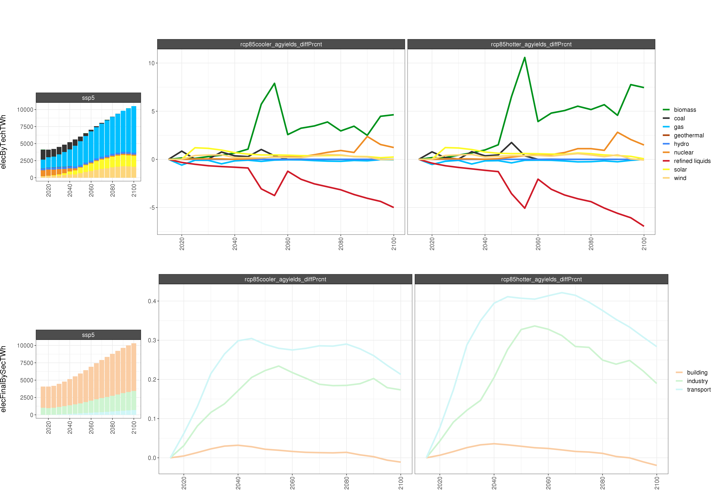
```

<br>

#### AGLU {.tabset}

<br>

##### Summary {.tabset}

<br>

###### RCP4.5 Charts

<br>

```{r, echo=FALSE, out.width="200%", fig.align='center', fig.cap="**Comparison of GCAM AGLU outputs - absolute difference**"}
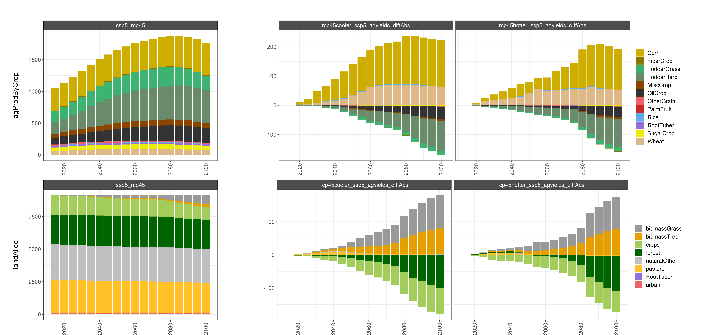
```

<br>

<div class="img_large">
```{r, echo=FALSE, out.width="200%", fig.align='center', fig.cap="**Comparison of GCAM AGLU outputs - percent difference**"}
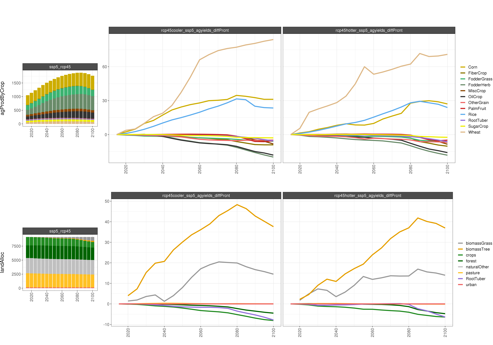
```
</div>

<br>

###### RCP8.5 Charts

<br>

```{r, echo=FALSE, out.width="200%", fig.align='center', fig.cap="**Comparison of GCAM AGLU outputs - absolute difference**"}
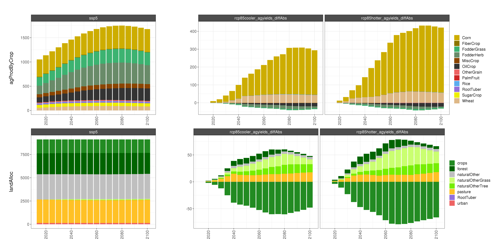
```

<br>

<div class="img_large">
```{r, echo=FALSE, out.width="200%", fig.align='center', fig.cap="**Comparison of GCAM AGLU outputs - percent difference**"}
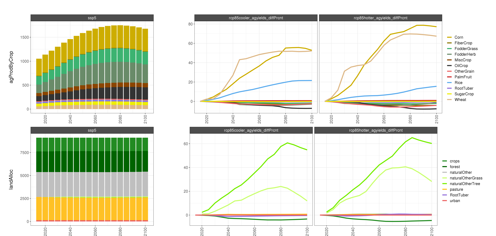
```
</div>

<br>

###### RCP4.5 Maps

<br>

```{r, echo=FALSE, out.width="200%", fig.align='center', fig.cap="**Comparison of agriculture production for 4 climate and socioeconomic scenarios.**"}
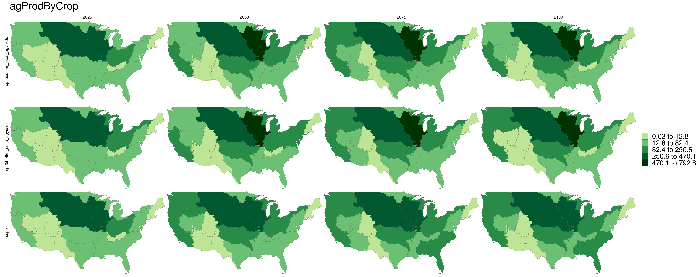
```

<br>

```{r, echo=FALSE, out.width="200%", fig.align='center', fig.cap="**Absolute difference of agriculture production from 3 climate and socioeconomic scenarios to Reference scenario (RCP8.5 HOT - ssp5).**"}
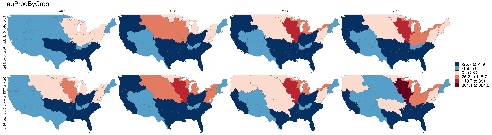
```

<br>

```{r, echo=FALSE, out.width="200%", fig.align='center', fig.cap="**Percent difference of agriculture production from 3 climate and socioeconomic scenarios to Reference scenario (RCP8.5 HOT - ssp5).**"}
knitr::include_graphics("images/map_agProdByCrop_KMEANS_DiffPrcntim3_agyields_ssp5.png")
```

<br>

###### RCP8.5 Maps

<br>

```{r, echo=FALSE, out.width="200%", fig.align='center', fig.cap="**Comparison of agriculture production for 4 climate and socioeconomic scenarios.**"}

```

<br>

```{r, echo=FALSE, out.width="200%", fig.align='center', fig.cap="**Absolute difference of agriculture production from 3 climate and socioeconomic scenarios to Reference scenario (RCP8.5 HOT - ssp5).**"}

```

<br>

```{r, echo=FALSE, out.width="200%", fig.align='center', fig.cap="**Percent difference of agriculture production from 3 climate and socioeconomic scenarios to Reference scenario (RCP8.5 HOT - ssp5).**"}
knitr::include_graphics("images/map_agProdByCrop_KMEANS_DiffPrcntim3_agyields_ssp5.png")
```

<br>

##### Corn {.tabset}

<br>

###### RCP4.5

<br>

```{r, echo=FALSE, out.width="200%", fig.align='center', fig.cap="**Comparison of GCAM AGLU outputs - absolute difference**"}
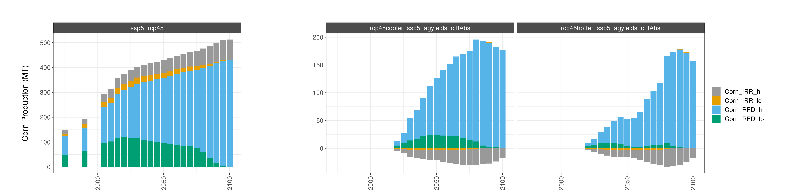
```

<br>

<div class="img_large">
```{r, echo=FALSE, out.width="200%", fig.align='center', fig.cap="**Comparison of GCAM AGLU outputs - percent difference**"}
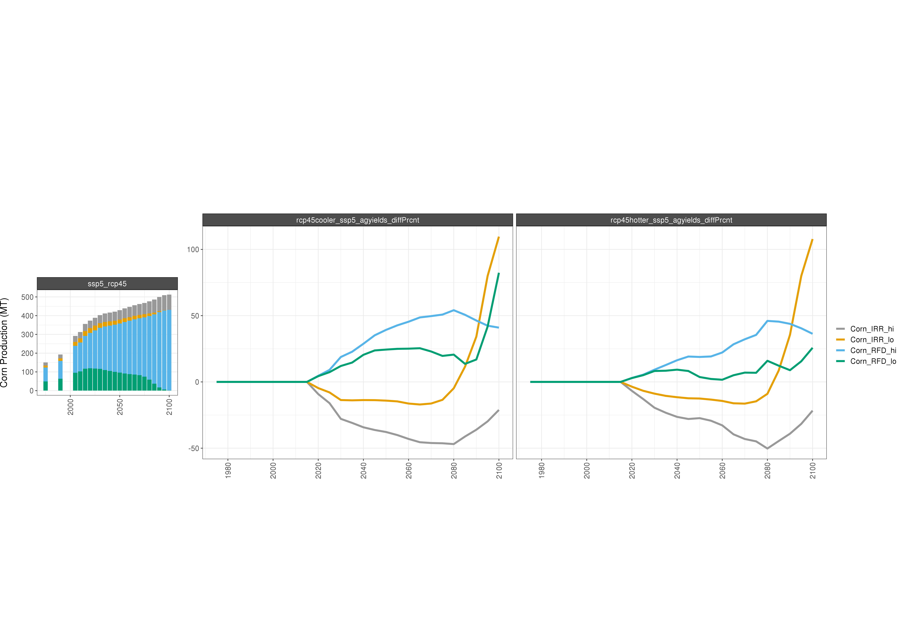
```
</div>

<br>

###### RCP8.5

<br>

```{r, echo=FALSE, out.width="200%", fig.align='center', fig.cap="**Comparison of GCAM AGLU outputs - absolute difference**"}
knitr::include_graphics("images/chart_class_diff_absolute_aglu_corn_im3_agyields_ssp5_rcp85.png")
```

<br>

<div class="img_large">
```{r, echo=FALSE, out.width="200%", fig.align='center', fig.cap="**Comparison of GCAM AGLU outputs - percent difference**"}
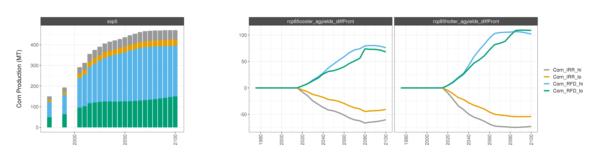
```
</div>

<br>

##### OilCrop {.tabset}

<br>

###### RCP4.5

<br>

```{r, echo=FALSE, out.width="200%", fig.align='center', fig.cap="**Comparison of GCAM AGLU outputs - absolute difference**"}
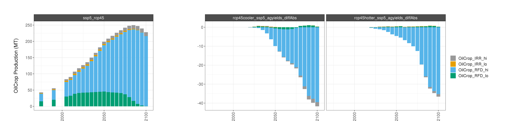
```

<br>

<div class="img_large">
```{r, echo=FALSE, out.width="200%", fig.align='center', fig.cap="**Comparison of GCAM AGLU outputs - percent difference**"}

```
</div>

<br>

###### RCP8.5

<br>

```{r, echo=FALSE, out.width="200%", fig.align='center', fig.cap="**Comparison of GCAM AGLU outputs - absolute difference**"}
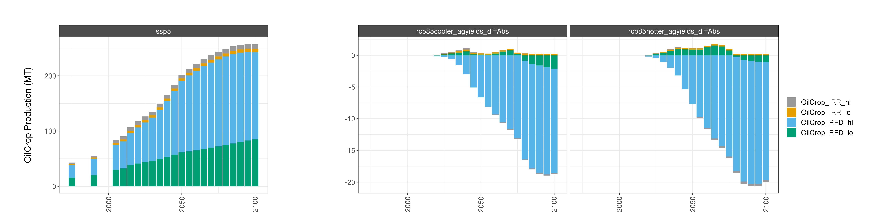
```

<br>

<div class="img_large">
```{r, echo=FALSE, out.width="200%", fig.align='center', fig.cap="**Comparison of GCAM AGLU outputs - percent difference**"}
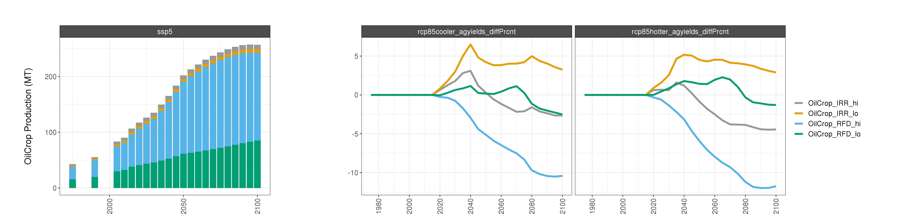
```
</div>

<br>

##### Rice {.tabset}

<br>

###### RCP4.5

<br>

```{r, echo=FALSE, out.width="200%", fig.align='center', fig.cap="**Comparison of GCAM AGLU outputs - absolute difference**"}
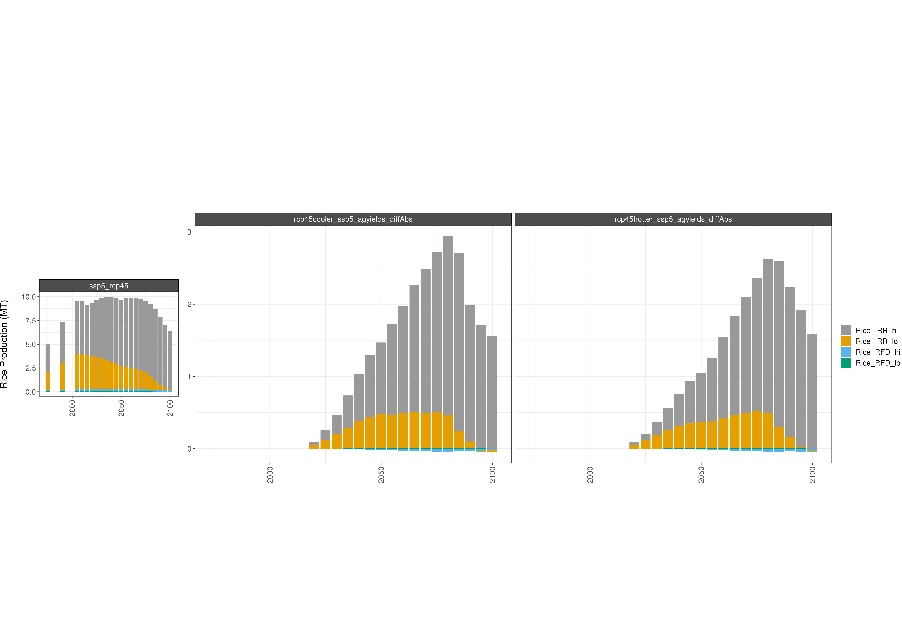
```

<br>

<div class="img_large">
```{r, echo=FALSE, out.width="200%", fig.align='center', fig.cap="**Comparison of GCAM AGLU outputs - percent difference**"}
knitr::include_graphics("images/chart_class_diff_percent_aglu_rice_im3_agyields_ssp5_rcp45.png")
```
</div>

<br>

###### RCP8.5

<br>

```{r, echo=FALSE, out.width="200%", fig.align='center', fig.cap="**Comparison of GCAM AGLU outputs - absolute difference**"}
knitr::include_graphics("images/chart_class_diff_absolute_aglu_rice_im3_agyields_ssp5_rcp85.png")
```

<br>

<div class="img_large">
```{r, echo=FALSE, out.width="200%", fig.align='center', fig.cap="**Comparison of GCAM AGLU outputs - percent difference**"}
knitr::include_graphics("images/chart_class_diff_percent_aglu_rice_im3_agyields_ssp5_rcp85.png")
```
</div>

<br>

##### Wheat {.tabset}

<br>

###### RCP4.5

<br>

```{r, echo=FALSE, out.width="200%", fig.align='center', fig.cap="**Comparison of GCAM AGLU outputs - absolute difference**"}
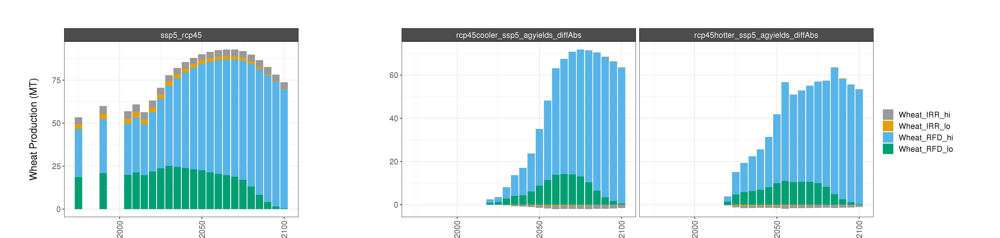
```

<br>

<div class="img_large">
```{r, echo=FALSE, out.width="200%", fig.align='center', fig.cap="**Comparison of GCAM AGLU outputs - percent difference**"}

```
</div>

<br>

###### RCP8.5

<br>

```{r, echo=FALSE, out.width="200%", fig.align='center', fig.cap="**Comparison of GCAM AGLU outputs - absolute difference**"}
knitr::include_graphics("images/chart_class_diff_absolute_aglu_wheat_im3_agyields_ssp5_rcp85.png")
```

<br>

<div class="img_large">
```{r, echo=FALSE, out.width="200%", fig.align='center', fig.cap="**Comparison of GCAM AGLU outputs - percent difference**"}
knitr::include_graphics("images/chart_class_diff_percent_aglu_wheat_im3_agyields_ssp5_rcp85.png")
```
</div>

<br>

#### Emissions {.tabset}

<br>

##### RCP4.5

<br>

```{r, echo=FALSE, out.width="100%", fig.align='center', fig.cap="**Cumulative global carbon emission pathways under different combinations of SSP3/SSP5 and RCP4.5/RCP8.5 **"}
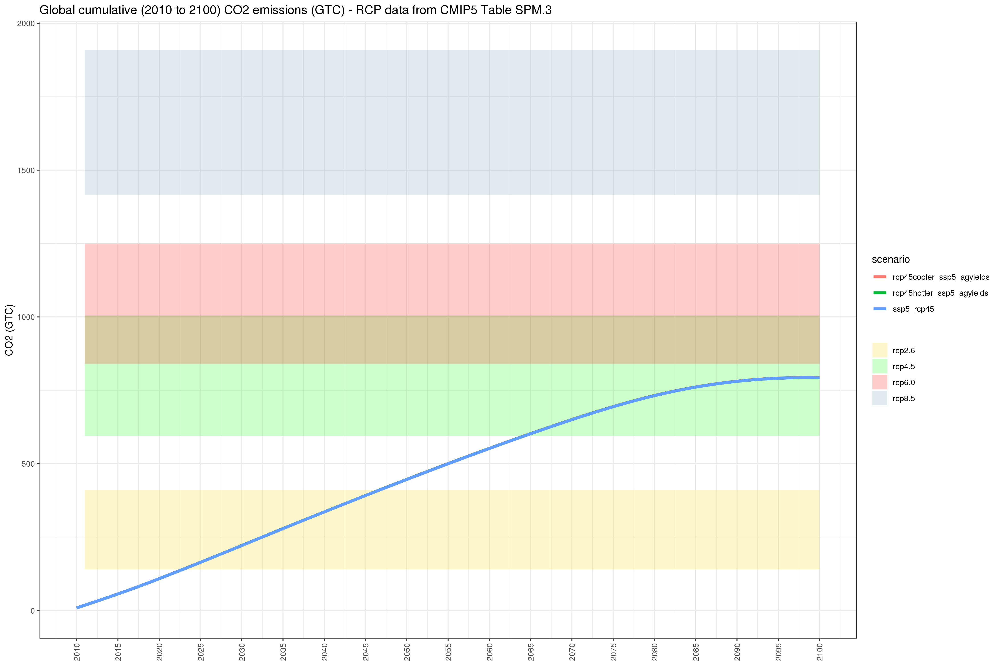
```
<!-- updated on 4/12/22 -->

<br>

```{r, echo=FALSE, out.width="100%", fig.align='center', fig.cap="**Annual US carbon emissions under different combinations of SSP3/SSP5 and RCP4.5/RCP8.5 **"}
knitr::include_graphics("images/compareCO2USA_im3_agyields_ssp5_rcp45.png")
```

<br>

```{r, echo=FALSE, out.width="100%", fig.align='center', fig.cap="**Annual global non-CO~2~ emissions under different combinations of SSP3/SSP5 and RCP4.5/RCP8.5 **"}
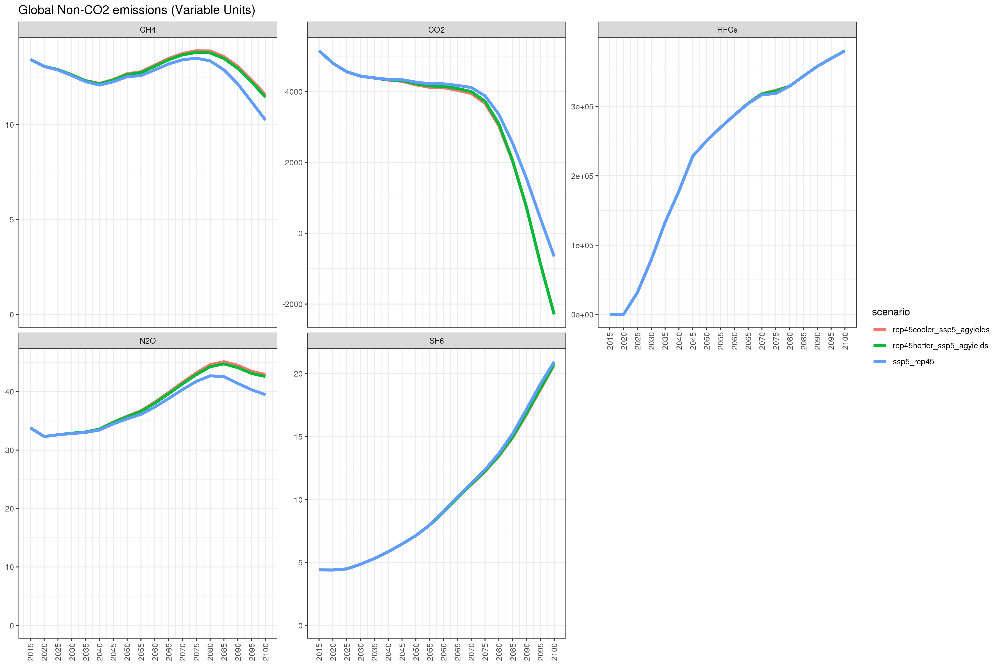
```

<br>


```{r, echo=FALSE, out.width="100%", fig.align='center', fig.cap="**Annual US non-CO~2~ emissions under different combinations of SSP3/SSP5 and RCP4.5/RCP8.5 **"}

```

<br>

##### RCP8.5

<br>

```{r, echo=FALSE, out.width="100%", fig.align='center', fig.cap="**Cumulative global carbon emission pathways under different combinations of SSP3/SSP5 and RCP4.5/RCP8.5 **"}
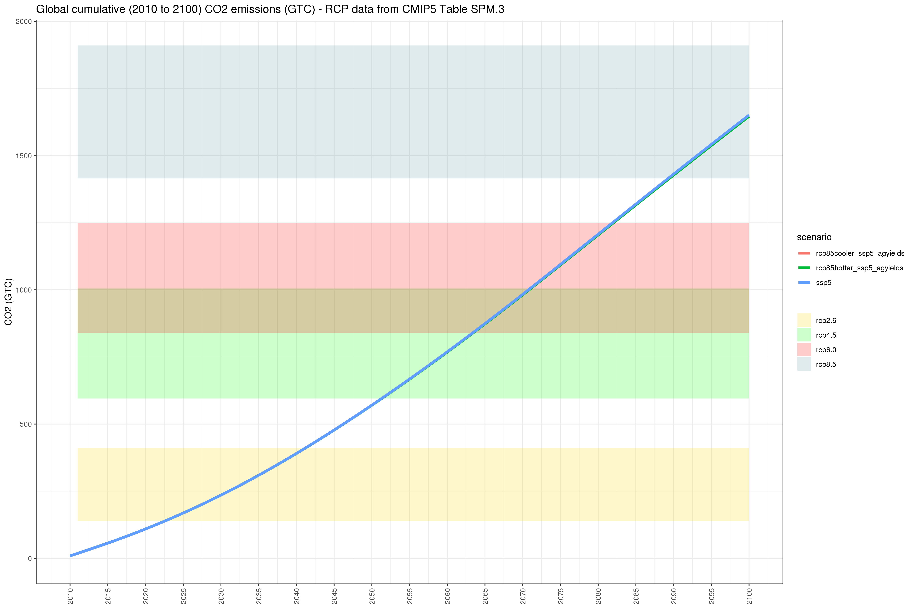
```
<!-- updated on 4/12/22 -->

<br>

```{r, echo=FALSE, out.width="100%", fig.align='center', fig.cap="**Annual US carbon emissions under different combinations of SSP3/SSP5 and RCP4.5/RCP8.5 **"}
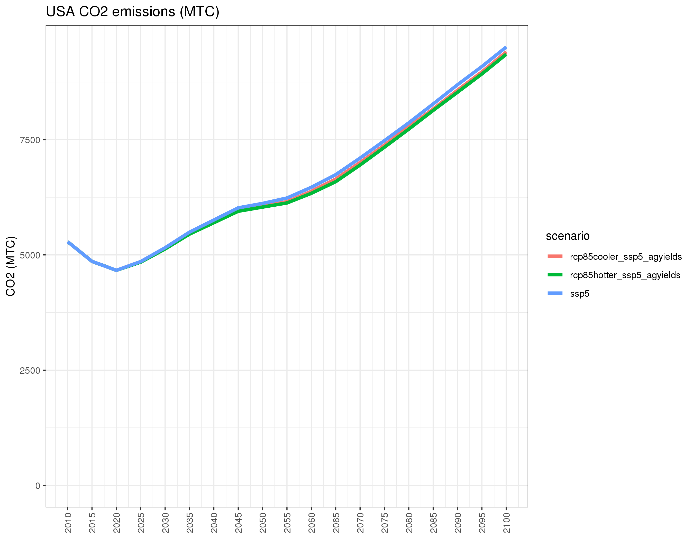
```

<br>

```{r, echo=FALSE, out.width="100%", fig.align='center', fig.cap="**Annual global non-CO~2~ emissions under different combinations of SSP3/SSP5 and RCP4.5/RCP8.5 **"}
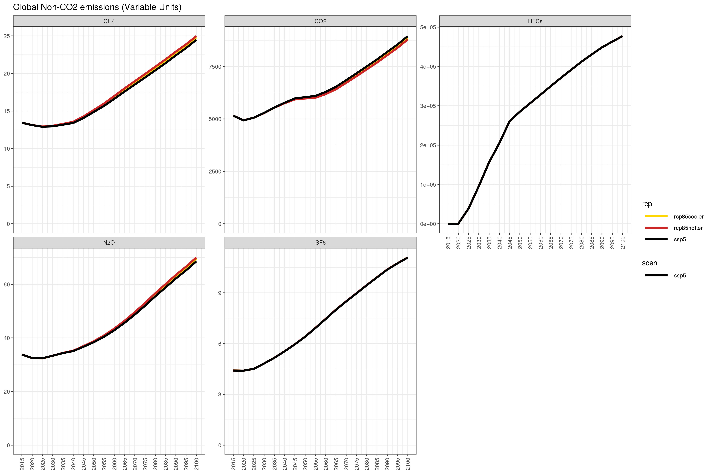
```

<br>


```{r, echo=FALSE, out.width="100%", fig.align='center', fig.cap="**Annual US non-CO~2~ emissions under different combinations of SSP3/SSP5 and RCP4.5/RCP8.5 **"}

```

<br>

<!-------------------------->
<!-------------------------->
# Workflows 4/5 - SSPs
<!-------------------------->
<!-------------------------->
<p align="center"></p>

<br>

## Narratives

Full details of the GCAM-USA model used for this study are available in [Binsted et al. 2022](https://doi.org/10.5194/gmd-15-2533-2022)<sup>1</sup>. The table below provides an overview of key characteristics of Shared Socioeconomic Pathways (SSP) Scenarios used in this study. This study uses SSP3 and SSP5 which is built off the baseline SSP2 scenario with additional files used to modify certain sectors to reflect the characteristics of SSP3 and SSP5. A summary figure from [O'Neill et al. 2014](https://link.springer.com/article/10.1007/s10584-013-0905-2)<sup>2</sup> shows the mitigation and adaptation challenges across all the SSPs. Additional details on SSP assumptions in GCAM can be found in the official documentation on the [SSP page](https://jgcri.github.io/gcam-doc/ssp.html#table3).

<p style="font-size:0.8em; font-style: italic;"> <sup>1</sup>Binsted, M., Iyer, G., Patel, P., Graham, N. T., Ou, Y., Khan, Z., Kholod, N., Narayan, K., Hejazi, M., Kim, S., Calvin, K., and Wise, M.: GCAM-USA v5.3_water_dispatch: integrated modeling of subnational US energy, water, and land systems within a global framework, Geosci. Model Dev., 15, 2533–2559, https://doi.org/10.5194/gmd-15-2533-2022, 2022</p>


<p style="font-size:0.8em; font-style: italic;"> <sup>2</sup>O’Neill, B.C., Kriegler, E., Riahi, K. et al. A new scenario framework for climate change research: the concept of shared socioeconomic pathways. Climatic Change 122, 387–400 (2014). https://doi.org/10.1007/s10584-013-0905-2</p>

<br>

```{r, echo=FALSE, out.width="50%", fig.align='center', fig.cap="**The 'challenges space' to be spanned by SSPs divided into five 'domains' with one SSP located within each domain, represented by a star (O'Neill et al. 2014)**"}
knitr::include_graphics("images/ssp_mitigation_adaptation.PNG")
```


<br>

```{r, results = 'show', eval=TRUE, echo=FALSE, warning=FALSE, error = FALSE, message = FALSE}
library(pander)
mytable = data.frame(
  Detail  = c("**Overall Narrative**", 
              "**Population**", 
              "**Economic Growth**",
              "**Emissions**",
              "**Technology & consumption \
              \n patterns in the US**"),
  SSP2    = c("**Middle of the Road:** (Medium challenges to mitigation and adaptation) The world follows a path in which social, economic, and technological trends do not shift markedly from historical patterns. Development and income growth proceeds unevenly, with some countries making relatively good progress while others fall short of expectations. Global and national institutions work toward but make slow progress in achieving sustainable development goals. Environmental systems experience degradation, although there are some improvements and overall the intensity of resource and energy use declines. Global population growth is moderate and levels off in the second half of the century. Income inequality persists or improves only slowly and challenges to reducing vulnerability to societal and environmental changes remain.",  
              "* **Global**: Population flattens out by 2060 at about 9 billion in 2100. \
               \n * **US**: Population flattens out by 2080 at about 450 million in 2100.", 
               "* **Global**: Increases steadily to about 450 trillion (2015 USD\\) in 2100. \
               \n * **US**: Increases steadily to about 65 trillion (2015 USD\\) in 2100.", 
               "* **Global**: Global cumulative emissions (2010 to 2100\\) rise to about 1250 GTC. \
               \n * **US**: Annual emissions in the US stay steady at about 5 billion tonnes of C per year through 2100.", 
              "* **Service Demands:** Increase in all end-use sectors driven by pop & gdp \
              \n * **Energy Efficiency:** Existing policies (e.g.building efficiency standards\\) continue but don't expand. \
              \n * **Total Final Energy:** Demands increase as efficiency improvements are slower than increases in demand. \
              \n * **Electrification:** End-use sectors tend to become increasingly electrified over time with the trend strongest in buildings. \ 
              \n * **Transportation:** Remains reliant on liquid fossil fuels with some electricifcation in light-duty vehicles (LDVs\\). \
              \n * **Power Demand:** Demand grows steadily to about 8000 TWh in 2100 driven by buildings and industry. \
              \n * **Power Supply:** Increasing demand met by supply from natural gas and renewables with no-new deployment of coal."),
  SSP3    =  c("**Regional Rivalry:** (High challenges to mitigation and adaptation\\) A resurgent nationalism, concerns about competitiveness and security, and regional conflicts push countries to increasingly focus on domestic or, at most, regional issues. Policies shift over time to become increasingly oriented toward national and regional security issues. Countries focus on achieving energy and food security goals within their own regions at the expense of broader-based development. Investments in education and technological development decline. Economic development is slow, consumption is material-intensive, and inequalities persist or worsen over time. Population growth is low in industrialized and high in developing countries. A low international priority for addressing environmental concerns leads to strong environmental degradation in some regions.",  
               "* **Global**: Population rises steadily to about 12 billion in 2100.\
               \n * **US**: Population flattens out by 2040 and then decreases to about 300 million in 2100.", 
               "* **Global**: Increases slower than SSP2 to about 175 trillion (2015 USD\\) in 2100.\
               \n * **US**: Increases slower than SSP2 to about 40 trillion (2015 USD\\) in 2100.", 
               "* **Global**: Global cumulative emissions (2010 to 2100\\) rise to about 1250 GTC similar to SSP2.\
               \n * **US**: Annual emissions in the US drop from about 5 billion to 2.5 billion tonnes of C per year in 2100.",
               "* **Service Demands:**: Decrease in all end-use sectors driven by changes in the pop & gdp \
              \n * **Energy Efficiency:**: Same as SSP2. \
              \n * **Total Final Energy:** Demands decrease driven by changes in pop & gdp. \
              \n * **Electrification:** With higher costs for renewables electrification rates are slightly lower in SSP3. \
              \n * **Transportation:** Remains reliant on liquid fossil fuels with higher renenwable costs impacting electricifcation rates correspondingly. \
              \n * **Power Demand:** Demand grows slowly to about 5000TWh in 2050 and then decreases very slightly to 2100. \
              \n * **Power Supply:** Lower demands relative to SSP2 are met by supply from natural gas and renewables with no-new deployment of coal. Larger % of renewables in electricity mix compared to SSP2 by 2100."),
  SSP5    =  c("**Fossil-fueled Development:** (High challenges to mitigation, low challenges to adaptation\\) This world places increasing faith in competitive markets, innovation and participatory societies to produce rapid technological progress and development of human capital as the path to sustainable development. Global markets are increasingly integrated. There are also strong investments in health, education, and institutions to enhance human and social capital. At the same time, the push for economic and social development is coupled with the exploitation of abundant fossil fuel resources and the adoption of resource and energy intensive lifestyles around the world. All these factors lead to rapid growth of the global economy, while global population peaks and declines in the 21st century. Local environmental problems like air pollution are successfully managed. There is faith in the ability to effectively manage social and ecological systems, including by geo-engineering if necessary.",  
                "* **Global**: Population peaks in about 2050 at 8 billion and then decreases to about 7.5 billion in 2100.\
               \n * **US**: Population increases steadily to about 650 million in 2100.", 
               "* **Global**: Increases faster than SSP2 to about 750 trillion (2015 USD\\) in 2100.\
               \n * **US**: Increases faster than SSP2 to about 125 trillion (2015 USD\\) in 2100.",
               "* **Global**: Global cumulative emissions (2010 to 2100\\) rise to about 1500 GTC.\
               \n * **US**: Annual emissions in the US rise from about 5 billion to 8 billion tonnes of C per year in 2100.",
              "* **Service Demands:**: Increase in all end-use sectors driven by changes in the pop & gdp \
              \n * **Energy Efficiency:**: Same as SSP2. \
              \n * **Total Final Energy:** Demands increase driven by changes in pop & gdp. \
              \n * **Electrification:** Similar costs for power technologies as SSP2 and similar rates of electrification. \
              \n * **Transportation:** Remains reliant on liquid fossil fuels with some electricifcation in light-duty vehicles (LDVs\\). \
              \n * **Power Demand:** Demand grows steadily to about 10000TWh in 2100. \
              \n * **Power Supply:** Higher demands relative to SSP2 are met by supply from natural gas and renewables with no-new deployment of coal. In SSP5 lower gas extraction costs relative to SSP2 lead to a higher % of gas in the electricity mix.")
)

pander::pander(mytable, keep.line.breaks = TRUE, style = 'grid', justify = 'left', split.tables=Inf)
```

<br>


<!-------------------------->
<!-------------------------->
# Emissions pathways
<!-------------------------->
<!-------------------------->
<p align="center"></p>

<br>

We model two emissions pathways, RCP8.5 and RCP4.5. 
RCP8.5 is the default pathway in GCAM-USA. 
Thus, no modifications to the source code are required in order to run an RCP8.5 scenario. 
For RCP4.5, we impose a global CO~2~ emissions constraint. 
This emissions constraint in turn is based on the GCAM core model, release version 5.4 (publicly available [here](https://github.com/JGCRI/gcam-core/releases/tag/gcam-v5.4)), a global model differentiating 32 world regions. 
Specifically, we run GCAM 5.4 in target finder mode.


<br>


## Running GCAM 5.4 in target finder mode {.tabset}

<br>


As described in the [GCAM online documentation on GitHub](https://jgcri.github.io/gcam-doc/user-guide.html#target-finder), running GCAM 5.4 in target finder mode requires enabling (setting to 1) the `find-path` option in the respective configuration file, which is `gcam-core/exe/configuration_RCP45.xml` when running an RCP4.5 scenario:

`"<Value name="find-path">1</Value>"`


Then, the configuration file must be called in `gcam-core/exe/run-gcam.sh` as follows:

`gcam.exe -C configuration_RCP45.xml`

Once the model run is finished, results can be extracted using the model interface: `gcam-core/ModelInterface/run-model-interface.bat`. Specifically, we query "CO2 emissions by region" and "LUC emissions by region" for the region "Global" and sum up the values for each year in a separate spreadsheet. 

The figure below illustrates the final CO~2~ pathway, as well as the corresponding CO~2~-price pathway and the resulting radiative forcing:

<br>

```{r, echo=FALSE, out.width="100%", fig.align='center', fig.cap="**Overview of the RCP4.5 emissions pathway in GCAM.**"}
knitr::include_graphics("images/rcp45_pathway.png")
```
<!-- updated on 4/12/22 -->

<!-- location for images: meta_repos/khan-etal_2022_im3gcamusa/webpage/images -->

<br>


<br>


## Implementing CO~2~ Emissions Constraint In GCAM-USA {.tabset}

<br>


The resulting pathway of CO~2~ emissions from land use and energy is then used as a CO~2~ emissions constraint in GCAM-USA. 
Therefore, we use a file named `/pic/projects/im3/gcamusa/gcam-usa-im3/input/policy/global_CO2_constraint.xml` into which we input the CO~2~ emissions values calculated by GCAM 5.4 (as described above) as constraints. 
We also add an accompanying file called `/pic/projects/im3/gcamusa/gcam-usa-im3/input/policy/global_CO2_link.xml` which performs additional required tasks.


We then create a set of new configuration files in `/pic/projects/im3/gcamusa/gcam-usa-im3/exe/` based on existing ones: 


<br>
```{r, results = 'show', eval=TRUE, echo=FALSE, warning=FALSE, error = FALSE, message = FALSE}
library(kableExtra)
data.frame(
  `Exisitng file` = c("configuration_rcp85cooler_ssp3_rcp85gdp_runoff.xml",
                      "configuration_rcp85hotter_ssp3_rcp85gdp_runoff.xml",
                      "configuration_rcp85cooler_ssp5_runoff.xml",
                      "configuration_rcp85hotter_ssp5_runoff.xml"),
  `New file` = c("configuration_rcp45cooler_ssp3_rcp45gdp_runoff.xml",
                 "configuration_rcp45hotter_ssp3_rcp45gdp_runoff.xml",
                 "configuration_rcp45cooler_ssp5_runoff.xml",
                 "configuration_rcp45hotter_ssp5_runoff.xml")
) %>% 
  kbl() %>%
  kable_styling(bootstrap_options = c("striped", "hover", "condensed", "responsive"))

```
<br>


The main difference in our new configuration files is the addition of the following lines of code immediately after `cal_broyden_config.xml` is called:

```
<!--POLICY ADD ONS-->
<Value name = "global_CO2_constraint">../input/policy/global_CO2_constraint.xml</Value>
<Value name = "global_CO2_link">../input/policy/global_CO2_link.xml</Value>
```

In addition, the following lines need to be updated accordingly in each configuration file (e.g. replace `rcp85hotter` by `rcp45cooler` etc.): 

`<Value write-output="1" append-scenario-name="0" name="xmldb-location">../output/database_rcp85hotter_ssp3_rcp85gdp_runoff</Value>`

`<Value name="ccs_supply">../input/im3scenarios/rcp85hotter/Basin_runoff_km3peryear_comb_ssp585_rcp85_noresm_1979_2100_window5trail_delta_applied2015.xml</Value>`


`<Value name="scenarioName">rcp85hotter_ssp3_rcp85gdp_runoff</Value>`

<br>

<!-------------------------->
<!-------------------------->
# Nuclear Sensitivity {.tabset}
<!-------------------------->
<!-------------------------->
<p align="center"></p>

<br>

```{r, echo=FALSE, out.width="100%", fig.align='center', fig.cap="**Nuclear Sensitivity Workflow**"}
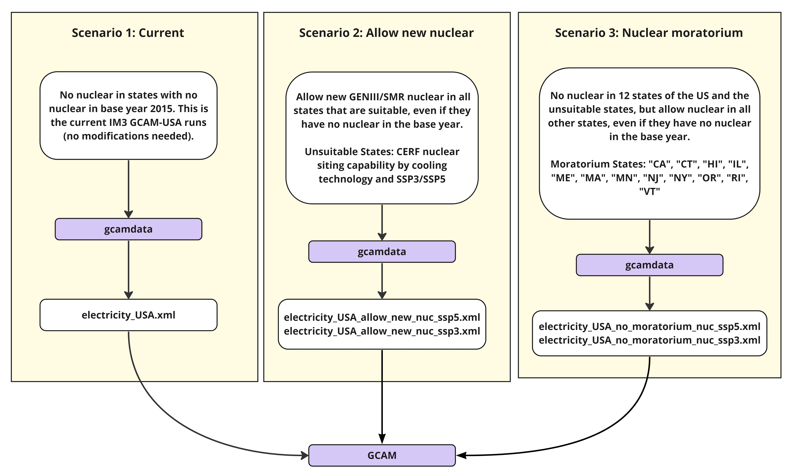
```

<br>

## Table Workflow

<br>

```{r, results = 'show', eval=TRUE, echo=FALSE, warning=FALSE, error = FALSE, message = FALSE}
library(pander)
mytable = data.frame(
  Step     = c("Create Nuclear Scenarios XML", 
               "Run GCAM-USA scenario 1: current",
               "Run GCAM-USA scenario 2: allow new nuclear",
               "Run GCAM-USA scenario 3: nuclear moratorium",
               "Run Diagnostics",
               "Diagnostics Outputs"),
  Description = c("* zchunk_batch_electricity_USA_xml.R",
                  
                  "* configuration_rcp45cooler_ssp3_im3.xml\
                    \n* configuration_rcp45cooler_ssp5_im3.xml\
                    \n* configuration_rcp45hotter_ssp3_im3.xml\
                    \n* configuration_rcp45hotter_ssp5_im3.xml\
                    \n* configuration_rcp85cooler_ssp3_rcp85gdp_im3.xml\
                    \n* configuration_rcp85cooler_ssp5_im3.xml\
                    \n* configuration_rcp85hotter_ssp3_rcp85gdp_im3.xml\
                    \n* configuration_rcp85hotter_ssp5_im3.xml\
                    \n \
                    \n* gcam_parallel_im3_rcp45.sh\
                    \n* gcam_parallel_im3_rcp85.sh",
                  
                  "* configuration_rcp45cooler_ssp3_im3_allow_new_nuc.xml\
                    \n* configuration_rcp45cooler_ssp5_im3_allow_new_nuc.xml\
                    \n* configuration_rcp45hotter_ssp3_im3_allow_new_nuc.xml\
                    \n* configuration_rcp45hotter_ssp5_im3_allow_new_nuc.xml\
                    \n* configuration_rcp85cooler_ssp3_rcp85gdp_im3_allow_new_nuc.xml\
                    \n* configuration_rcp85cooler_ssp5_im3_allow_new_nuc.xml\
                    \n* configuration_rcp85hotter_ssp3_rcp85gdp_im3_allow_new_nuc.xml\
                    \n* configuration_rcp85hotter_ssp5_im3_allow_new_nuc.xml\
                    \n \
                    \n* gcam_parallel_im3_rcp45_allow_new_nuc.sh\
                    \n* gcam_parallel_im3_rcp85_allow_new_nuc.sh",
                  
                  "* configuration_rcp45cooler_ssp3_im3_nuc_moratorium.xml\
                    \n* configuration_rcp45cooler_ssp5_im3_nuc_moratorium.xml\
                    \n* configuration_rcp45hotter_ssp3_im3_nuc_moratorium.xml\
                    \n* configuration_rcp45hotter_ssp5_im3_nuc_moratorium.xml\
                    \n* configuration_rcp85cooler_ssp3_rcp85gdp_im3_nuc_moratorium.xml\
                    \n* configuration_rcp85cooler_ssp5_im3_nuc_moratorium.xml\
                    \n* configuration_rcp85hotter_ssp3_rcp85gdp_im3_nuc_moratorium.xml\
                    \n* configuration_rcp85hotter_ssp5_im3_nuc_moratorium.xml\
                    \n \
                    \n* gcam_parallel_im3_rcp45_nuc_moratorium.sh\
                    \n* gcam_parallel_im3_rcp85_nuc_moratorium.sh",
                  
                  "* gcamDiagnostics_im3_nuclear.R\
                  \n* prep_data_nuclear.R\
                  \n* plot_data_nuclear.R\
                  \n* gcamDiagnostics_im3_nuclear_parallel.sh",
                  
                  "* Each climate impact includes current, allow new nuclear, and nuclear moratorium scenarios"),
  
  Location     = c("[PNNL stash](https://stash.pnnl.gov/projects/JGCRI/repos/gcam-core/browse?at=refs%2Fheads%2Fzk%2Ffeature%2Fgcam-usa-im3)",
                   "(Constance) /pic/projects/im3/gcamusa/gcam-usa-im3/exe",
                   "(Constance) /pic/projects/im3/gcamusa/gcam-usa-im3/exe",
                   "(Constance) /pic/projects/im3/gcamusa/gcam-usa-im3/exe",
                   "(Constance) /pic/projects/im3/gcamusa/diagnostics",
                   "(Constance) /pic/projects/im3/gcamusa/diagnostics/outputs_im3_nuclear")
)

pander::pander(mytable, keep.line.breaks = TRUE, style = 'grid', justify = 'left', split.tables=Inf)
```

<br>


## RCP4.5Cooler SSP3 {.tabset}

<br>


### Summary

<br>

```{r, echo=FALSE, out.width="100%", fig.align='center', fig.cap="**Comparison of GCAM outputs under 3 scenarios: (1) RCP4.5 Cooler SSP3, (2) RCP4.5 Cooler SSP3 + Allow New Nuclear, and (3) RCP4.5 Cooler SSP3 + Nuclear Moratorium.**"}
knitr::include_graphics("images/rcp45cooler_ssp3/chart_param_all_summary_im3_nuclear.png")
```

<br>

### Water

<br>

```{r, echo=FALSE, out.width="100%", fig.align='center', fig.cap="**Comparison of GCAM water outputs (absolute difference).**"}
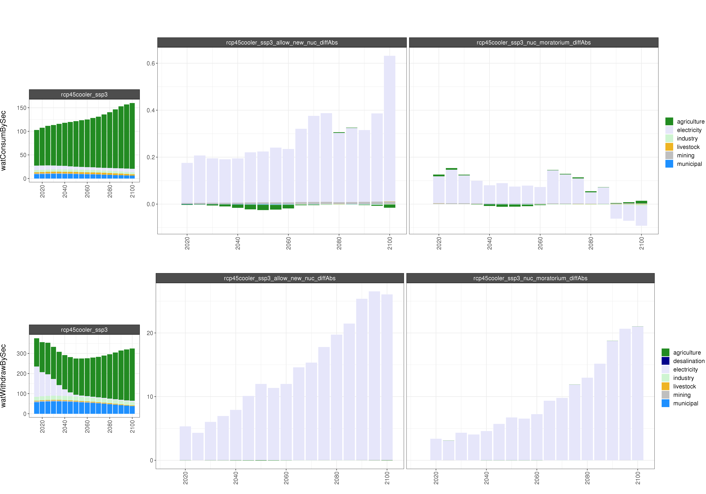
```

<br>


```{r, echo=FALSE, out.width="100%", fig.align='center', fig.cap="**Comparison of GCAM water outputs (percent difference).**"}
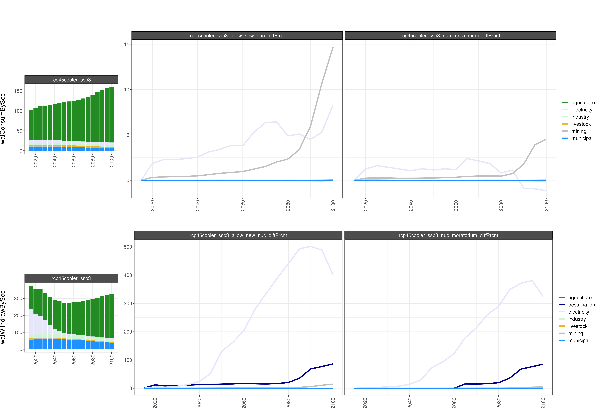
```

<br>

### Energy

<br>

```{r, echo=FALSE, out.width="100%", fig.align='center', fig.cap="**Comparison of GCAM energy outputs (absolute difference).**"}
knitr::include_graphics("images/rcp45cooler_ssp3/chart_class_diff_absolute_energy_im3_nuclear.png")
```

<br>


```{r, echo=FALSE, out.width="100%", fig.align='center', fig.cap="**Comparison of GCAM energy outputs (percent difference).**"}
knitr::include_graphics("images/rcp45cooler_ssp3/chart_class_diff_percent_energy_im3_nuclear.png")
```

<br>

### Electricity {.tabset .tabset-pills}

<br>

#### Total Electricity

<br>

```{r, echo=FALSE, out.width="100%", fig.align='center', fig.cap="**Comparison of GCAM electricity outputs (absolute difference).**"}
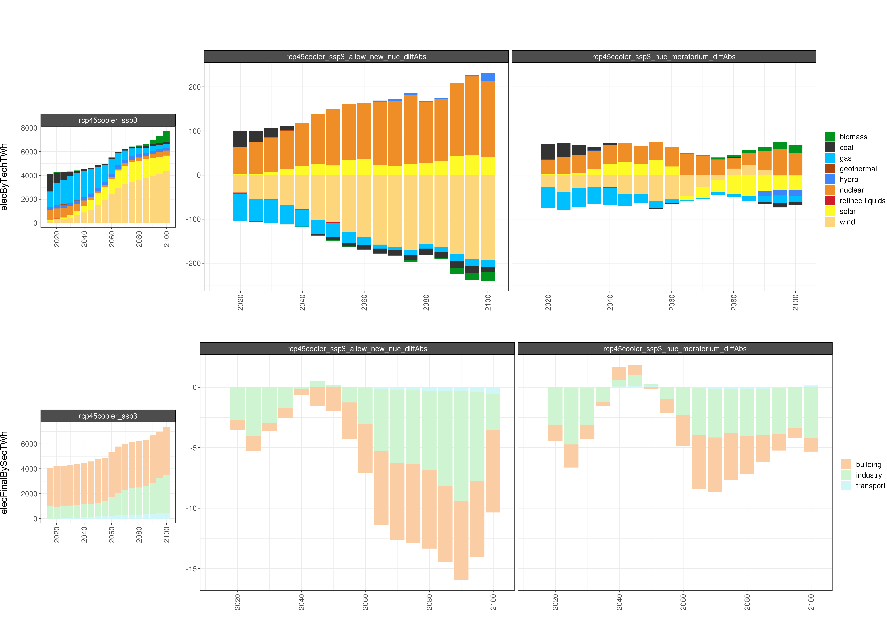
```

<br>


```{r, echo=FALSE, out.width="100%", fig.align='center', fig.cap="**Comparison of GCAM electricity outputs (percent difference).**"}
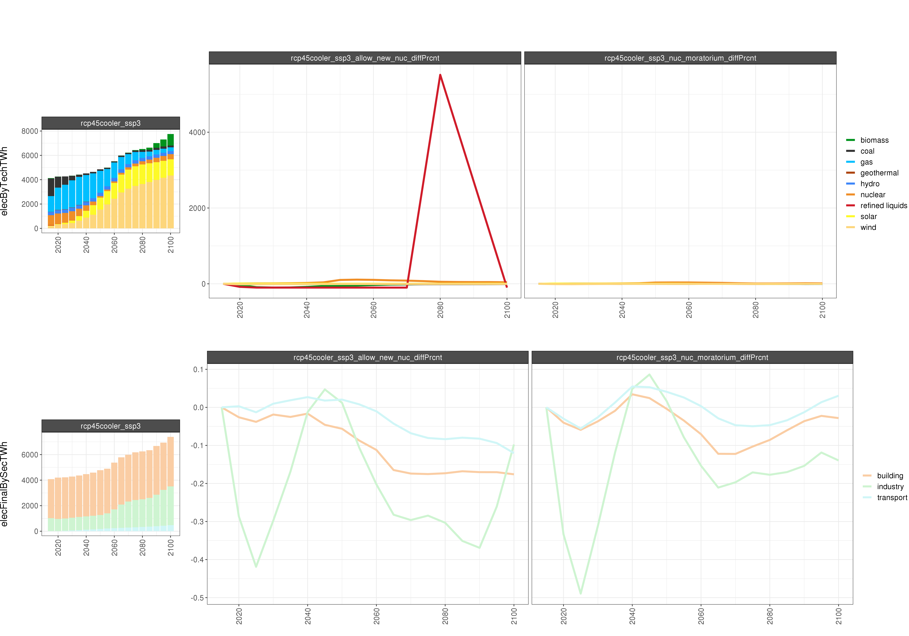
```

<br>

#### Superpeak

<br>


```{r, echo=FALSE, out.width="100%", fig.align='center', fig.cap="**Comparison of GCAM superpeak outputs (percent difference).**"}
knitr::include_graphics("images/rcp45cooler_ssp3/chart_superpeak_electricity_load.png")
```

<br>

### AGLU

<br>

```{r, echo=FALSE, out.width="100%", fig.align='center', fig.cap="**Comparison of GCAM AGLU outputs (absolute difference).**"}
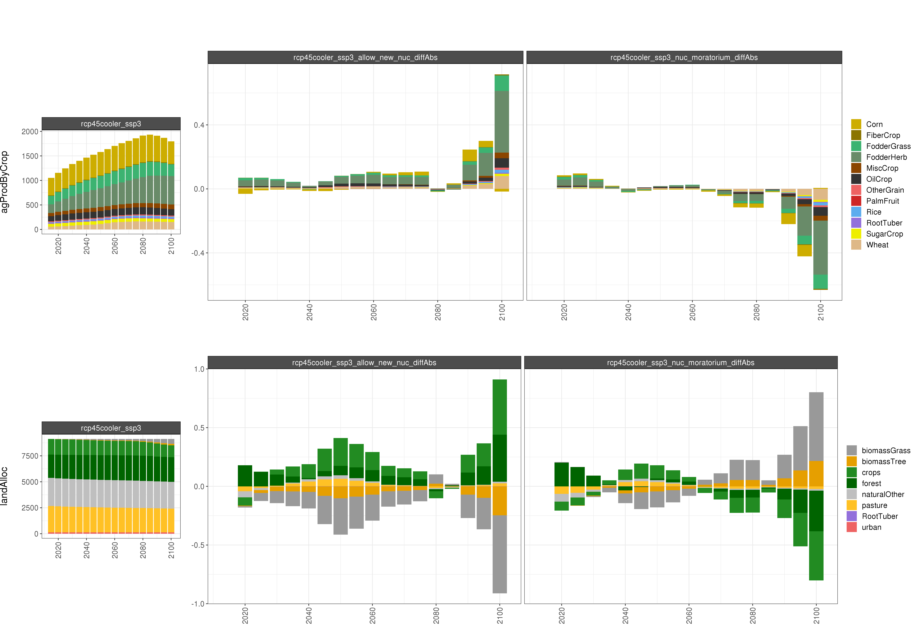
```

<br>


```{r, echo=FALSE, out.width="100%", fig.align='center', fig.cap="**Comparison of GCAM AGLU outputs (percent difference).**"}
knitr::include_graphics("images/rcp45cooler_ssp3/chart_class_diff_percent_aglu_im3_nuclear.png")
```

<br>

### Emissions

<br>

```{r, echo=FALSE, out.width="100%", fig.align='center', fig.cap="**Comparison of GCAM emissions outputs **"}
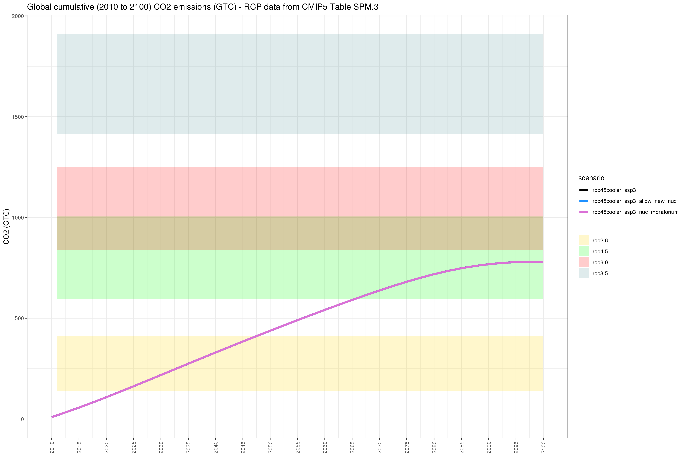
```

<br>

```{r, echo=FALSE, out.width="100%", fig.align='center', fig.cap="**Comparison of GCAM emissions outputs. **"}
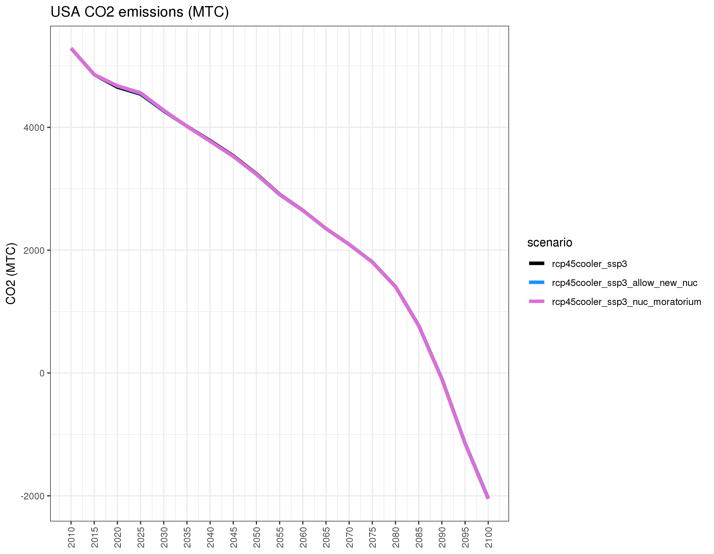
```

<br>

```{r, echo=FALSE, out.width="100%", fig.align='center', fig.cap="**Comparison of GCAM emissions outputsS **"}
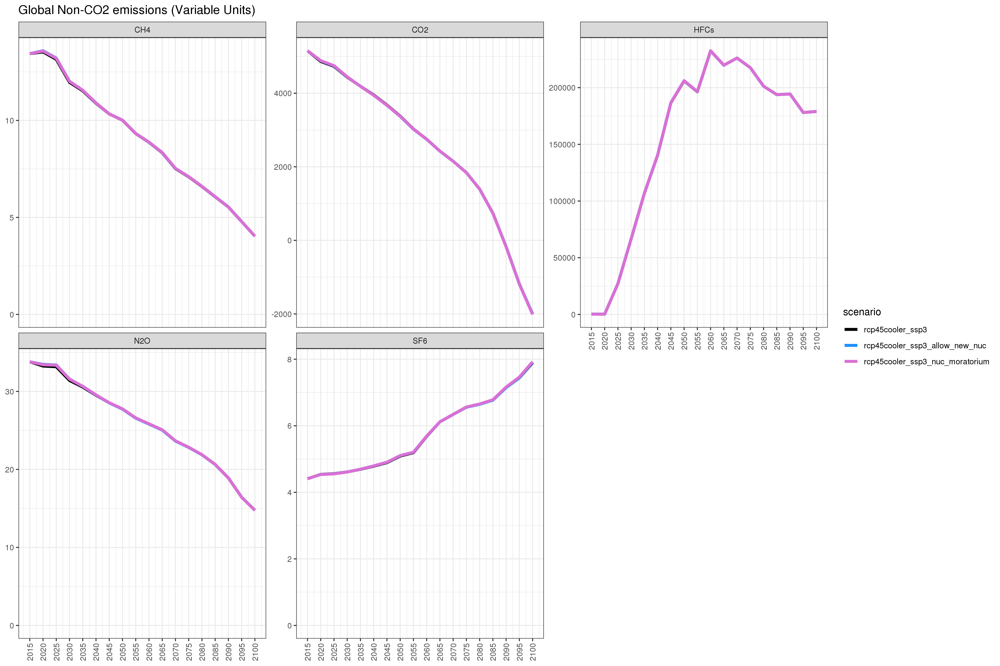
```

<br>

```{r, echo=FALSE, out.width="100%", fig.align='center', fig.cap="**Comparison of GCAM emissions outputs **"}
knitr::include_graphics("images/rcp45cooler_ssp3/compareNonCO2USA_im3_nuclear.png")
```

<br>

### Nuclear Capacity {.tabset .tabset-pills}

<br>

#### Nuclear Capacity by States

<br>

```{r, echo=FALSE, out.width="100%", fig.align='center', fig.cap="**Comparison of GCAM Nuclear Capacity by States (absolute values).**"}
knitr::include_graphics("images/rcp45cooler_ssp3/nuclear_cap_states.png")
```

<br>


```{r, echo=FALSE, out.width="100%", fig.align='center', fig.cap="**Comparison of GCAM Nuclear Capacity by States (difference).**"}
knitr::include_graphics("images/rcp45cooler_ssp3/nuclear_cap_states_diff.png")
```

<br>

#### Nuclear Capacity by Technology

<br>

```{r, echo=FALSE, out.width="100%", fig.align='center', fig.cap="**Comparison of GCAM Nuclear Capacity by Technology (absolute values).**"}
knitr::include_graphics("images/rcp45cooler_ssp3/nuclear_cap_tech.png")
```

<br>


```{r, echo=FALSE, out.width="100%", fig.align='center', fig.cap="**Comparison of GCAM Nuclear Capacity by Technology (difference).**"}
knitr::include_graphics("images/rcp45cooler_ssp3/nuclear_cap_tech_diff.png")
```

<br>


#### Nuclear Capacity for States with New Nuclear

<br>

```{r, echo=FALSE, out.width="100%", fig.align='center', fig.cap="**Comparison of GCAM Nuclear Capacity for Individual State (absolute values).**"}
knitr::include_graphics("images/rcp45cooler_ssp3/nuclear_cap_state_tech.png")
```

<br>


```{r, echo=FALSE, out.width="100%", fig.align='center', fig.cap="**Comparison of GCAM Nuclear Capacity  for Individual State (difference).**"}
knitr::include_graphics("images/rcp45cooler_ssp3/nuclear_cap_state_tech_diff.png")
```

<br>


## RCP4.5Cooler SSP5 {.tabset}

<br>


### Summary

<br>

```{r, echo=FALSE, out.width="100%", fig.align='center', fig.cap="**Comparison of GCAM outputs under 3 scenarios: (1) RCP4.5 Cooler SSP5, (2) RCP4.5 Cooler SSP5 + Allow New Nuclear, and (3) RCP4.5 Cooler SSP5 + Nuclear Moratorium.**"}
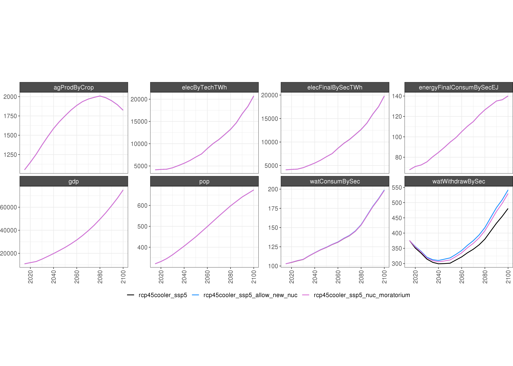
```

<br>

### Water

<br>

```{r, echo=FALSE, out.width="100%", fig.align='center', fig.cap="**Comparison of GCAM water outputs (absolute difference).**"}
knitr::include_graphics("images/rcp45cooler_ssp5/chart_class_diff_absolute_water_im3_nuclear.png")
```

<br>


```{r, echo=FALSE, out.width="100%", fig.align='center', fig.cap="**Comparison of GCAM water outputs (percent difference).**"}
knitr::include_graphics("images/rcp45cooler_ssp5/chart_class_diff_percent_water_im3_nuclear.png")
```

<br>

### Energy

<br>

```{r, echo=FALSE, out.width="100%", fig.align='center', fig.cap="**Comparison of GCAM energy outputs (absolute difference).**"}
knitr::include_graphics("images/rcp45cooler_ssp5/chart_class_diff_absolute_energy_im3_nuclear.png")
```

<br>


```{r, echo=FALSE, out.width="100%", fig.align='center', fig.cap="**Comparison of GCAM energy outputs (percent difference).**"}
knitr::include_graphics("images/rcp45cooler_ssp5/chart_class_diff_percent_energy_im3_nuclear.png")
```

<br>

### Electricity {.tabset .tabset-pills}

<br>

#### Total Electricity

<br>

```{r, echo=FALSE, out.width="100%", fig.align='center', fig.cap="**Comparison of GCAM electricity outputs (absolute difference).**"}
knitr::include_graphics("images/rcp45cooler_ssp5/chart_class_diff_absolute_electricity_im3_nuclear.png")
```

<br>


```{r, echo=FALSE, out.width="100%", fig.align='center', fig.cap="**Comparison of GCAM electricity outputs (percent difference).**"}
knitr::include_graphics("images/rcp45cooler_ssp5/chart_class_diff_percent_electricity_im3_nuclear.png")
```

<br>

#### Superpeak

<br>


```{r, echo=FALSE, out.width="100%", fig.align='center', fig.cap="**Comparison of GCAM superpeak outputs (percent difference).**"}
knitr::include_graphics("images/rcp45cooler_ssp5/chart_superpeak_electricity_load.png")
```

<br>

### AGLU

<br>

```{r, echo=FALSE, out.width="100%", fig.align='center', fig.cap="**Comparison of GCAM AGLU outputs (absolute difference).**"}
knitr::include_graphics("images/rcp45cooler_ssp5/chart_class_diff_absolute_aglu_im3_nuclear.png")
```

<br>


```{r, echo=FALSE, out.width="100%", fig.align='center', fig.cap="**Comparison of GCAM AGLU outputs (percent difference).**"}
knitr::include_graphics("images/rcp45cooler_ssp5/chart_class_diff_percent_aglu_im3_nuclear.png")
```

<br>

### Emissions

<br>

```{r, echo=FALSE, out.width="100%", fig.align='center', fig.cap="**Comparison of GCAM emissions outputs **"}
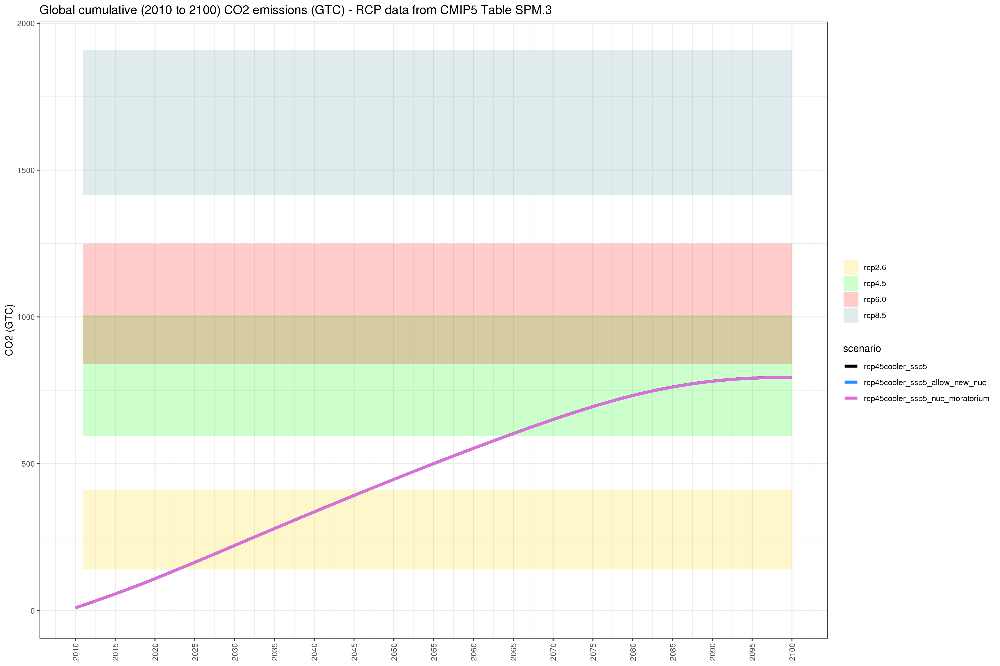
```

<br>

```{r, echo=FALSE, out.width="100%", fig.align='center', fig.cap="**Comparison of GCAM emissions outputs. **"}
knitr::include_graphics("images/rcp45cooler_ssp5/compareCO2USA_im3_nuclear.png")
```

<br>

```{r, echo=FALSE, out.width="100%", fig.align='center', fig.cap="**Comparison of GCAM emissions outputsS **"}
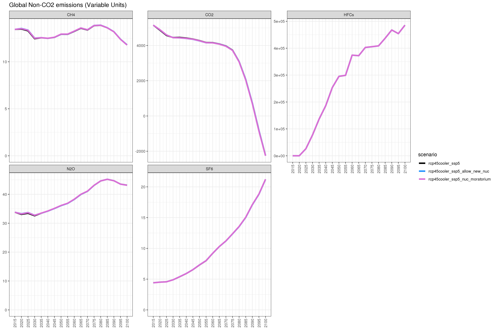
```

<br>

```{r, echo=FALSE, out.width="100%", fig.align='center', fig.cap="**Comparison of GCAM emissions outputs **"}
knitr::include_graphics("images/rcp45cooler_ssp5/compareNonCO2USA_im3_nuclear.png")
```

<br>

### Nuclear Capacity {.tabset .tabset-pills}

<br>

#### Nuclear Capacity by States

<br>

```{r, echo=FALSE, out.width="100%", fig.align='center', fig.cap="**Comparison of GCAM Nuclear Capacity by States (absolute values).**"}
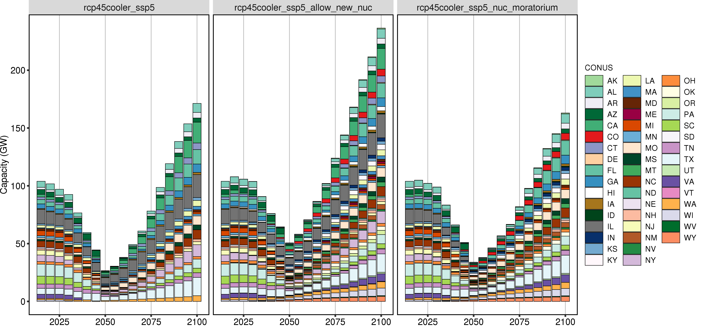
```

<br>


```{r, echo=FALSE, out.width="100%", fig.align='center', fig.cap="**Comparison of GCAM Nuclear Capacity by States (difference).**"}
knitr::include_graphics("images/rcp45cooler_ssp5/nuclear_cap_states_diff.png")
```

<br>

#### Nuclear Capacity by Technology

<br>

```{r, echo=FALSE, out.width="100%", fig.align='center', fig.cap="**Comparison of GCAM Nuclear Capacity by Technology (absolute values).**"}
knitr::include_graphics("images/rcp45cooler_ssp5/nuclear_cap_tech.png")
```

<br>


```{r, echo=FALSE, out.width="100%", fig.align='center', fig.cap="**Comparison of GCAM Nuclear Capacity by Technology (difference).**"}
knitr::include_graphics("images/rcp45cooler_ssp5/nuclear_cap_tech_diff.png")
```

<br>


#### Nuclear Capacity for States with New Nuclear

<br>

```{r, echo=FALSE, out.width="100%", fig.align='center', fig.cap="**Comparison of GCAM Nuclear Capacity for Individual State (absolute values).**"}
knitr::include_graphics("images/rcp45cooler_ssp5/nuclear_cap_state_tech.png")
```

<br>


```{r, echo=FALSE, out.width="100%", fig.align='center', fig.cap="**Comparison of GCAM Nuclear Capacity  for Individual State (difference).**"}
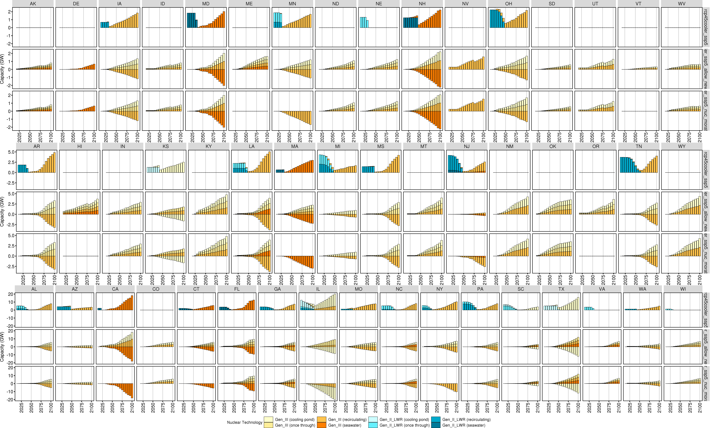
```

<br>


## RCP4.5Hotter SSP3 {.tabset}

<br>


### Summary

<br>

```{r, echo=FALSE, out.width="100%", fig.align='center', fig.cap="**Comparison of GCAM outputs under 3 scenarios: (1) RCP4.5 Hotter SSP3, (2) RCP4.5 Hotter SSP3 + Allow New Nuclear, and (3) RCP4.5 Hotter SSP3 + Nuclear Moratorium.**"}
knitr::include_graphics("images/rcp45hotter_ssp3/chart_param_all_summary_im3_nuclear.png")
```

<br>

### Water

<br>

```{r, echo=FALSE, out.width="100%", fig.align='center', fig.cap="**Comparison of GCAM water outputs (absolute difference).**"}
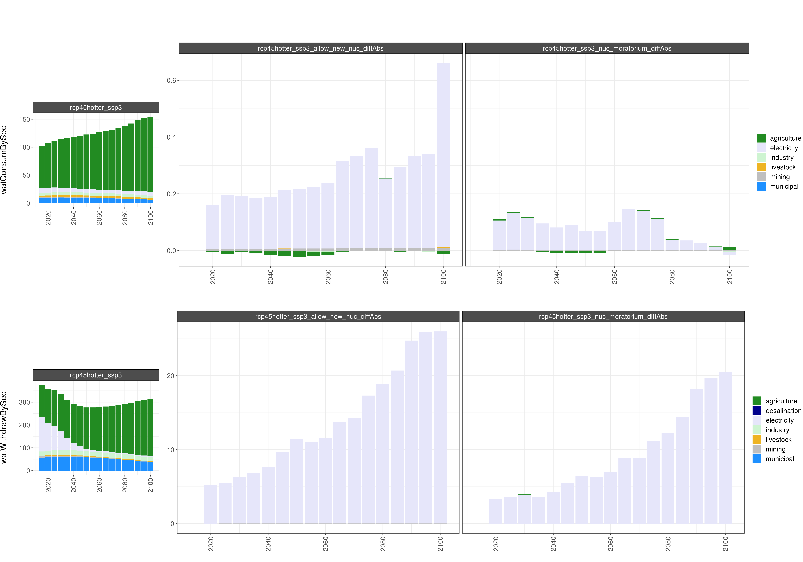
```

<br>


```{r, echo=FALSE, out.width="100%", fig.align='center', fig.cap="**Comparison of GCAM water outputs (percent difference).**"}
knitr::include_graphics("images/rcp45hotter_ssp3/chart_class_diff_percent_water_im3_nuclear.png")
```

<br>

### Energy

<br>

```{r, echo=FALSE, out.width="100%", fig.align='center', fig.cap="**Comparison of GCAM energy outputs (absolute difference).**"}
knitr::include_graphics("images/rcp45hotter_ssp3/chart_class_diff_absolute_energy_im3_nuclear.png")
```

<br>


```{r, echo=FALSE, out.width="100%", fig.align='center', fig.cap="**Comparison of GCAM energy outputs (percent difference).**"}
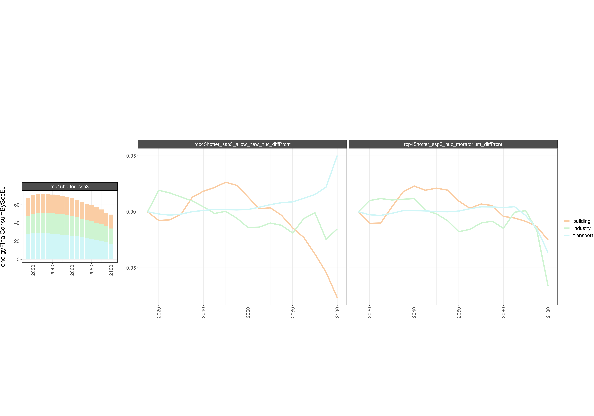
```

<br>

### Electricity {.tabset .tabset-pills}

<br>

#### Total Electricity

<br>

```{r, echo=FALSE, out.width="100%", fig.align='center', fig.cap="**Comparison of GCAM electricity outputs (absolute difference).**"}
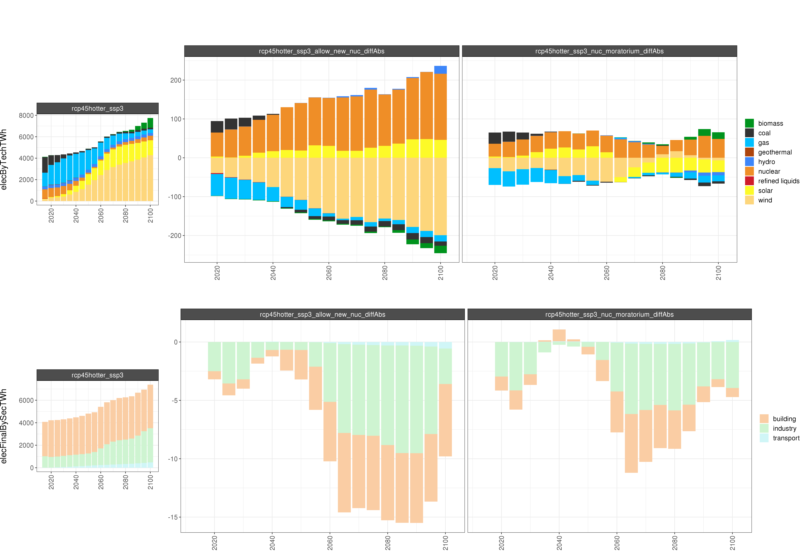
```

<br>


```{r, echo=FALSE, out.width="100%", fig.align='center', fig.cap="**Comparison of GCAM electricity outputs (percent difference).**"}
knitr::include_graphics("images/rcp45hotter_ssp3/chart_class_diff_percent_electricity_im3_nuclear.png")
```

<br>

#### Superpeak

<br>


```{r, echo=FALSE, out.width="100%", fig.align='center', fig.cap="**Comparison of GCAM superpeak outputs (percent difference).**"}
knitr::include_graphics("images/rcp45hotter_ssp3/chart_superpeak_electricity_load.png")
```

<br>

### AGLU

<br>

```{r, echo=FALSE, out.width="100%", fig.align='center', fig.cap="**Comparison of GCAM AGLU outputs (absolute difference).**"}
knitr::include_graphics("images/rcp45hotter_ssp3/chart_class_diff_absolute_aglu_im3_nuclear.png")
```

<br>


```{r, echo=FALSE, out.width="100%", fig.align='center', fig.cap="**Comparison of GCAM AGLU outputs (percent difference).**"}
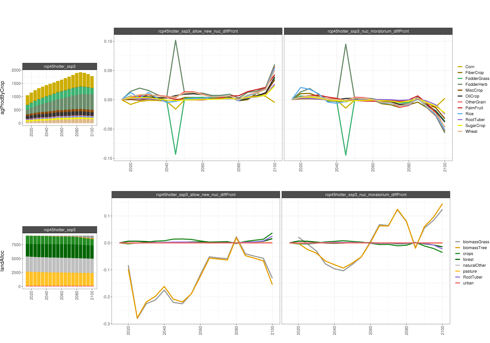
```

<br>

### Emissions

<br>

```{r, echo=FALSE, out.width="100%", fig.align='center', fig.cap="**Comparison of GCAM emissions outputs **"}

```

<br>

```{r, echo=FALSE, out.width="100%", fig.align='center', fig.cap="**Comparison of GCAM emissions outputs. **"}
knitr::include_graphics("images/rcp45hotter_ssp3/compareCO2USA_im3_nuclear.png")
```

<br>

```{r, echo=FALSE, out.width="100%", fig.align='center', fig.cap="**Comparison of GCAM emissions outputsS **"}
knitr::include_graphics("images/rcp45hotter_ssp3/compareNonCO2global_im3_nuclear.png")
```

<br>

```{r, echo=FALSE, out.width="100%", fig.align='center', fig.cap="**Comparison of GCAM emissions outputs **"}

```

<br>

### Nuclear Capacity {.tabset .tabset-pills}

<br>

#### Nuclear Capacity by States

<br>

```{r, echo=FALSE, out.width="100%", fig.align='center', fig.cap="**Comparison of GCAM Nuclear Capacity by States (absolute values).**"}
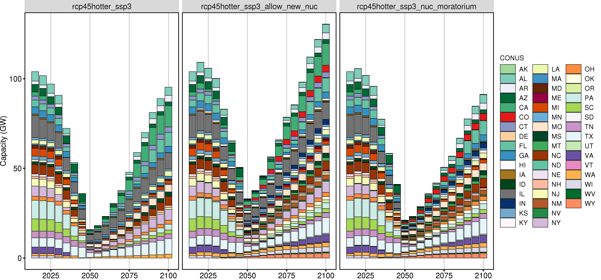
```

<br>


```{r, echo=FALSE, out.width="100%", fig.align='center', fig.cap="**Comparison of GCAM Nuclear Capacity by States (difference).**"}
knitr::include_graphics("images/rcp45hotter_ssp3/nuclear_cap_states_diff.png")
```

<br>

#### Nuclear Capacity by Technology

<br>

```{r, echo=FALSE, out.width="100%", fig.align='center', fig.cap="**Comparison of GCAM Nuclear Capacity by Technology (absolute values).**"}
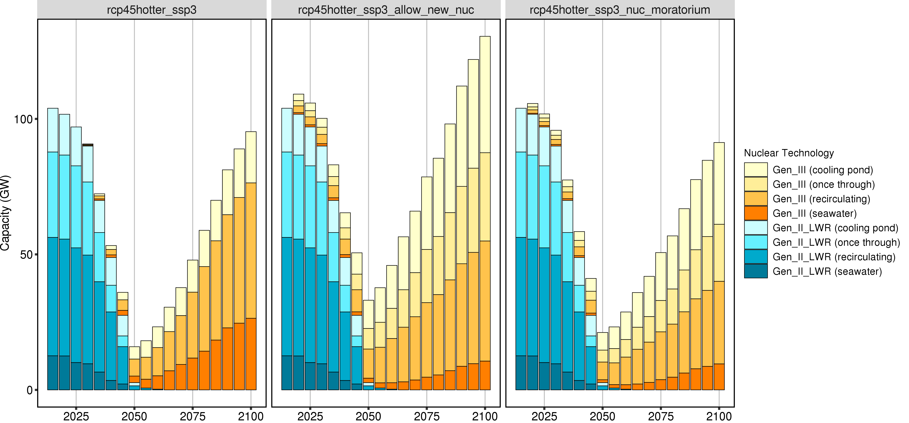
```

<br>


```{r, echo=FALSE, out.width="100%", fig.align='center', fig.cap="**Comparison of GCAM Nuclear Capacity by Technology (difference).**"}
knitr::include_graphics("images/rcp45hotter_ssp3/nuclear_cap_tech_diff.png")
```

<br>


#### Nuclear Capacity for States with New Nuclear

<br>

```{r, echo=FALSE, out.width="100%", fig.align='center', fig.cap="**Comparison of GCAM Nuclear Capacity for Individual State (absolute values).**"}
knitr::include_graphics("images/rcp45hotter_ssp3/nuclear_cap_state_tech.png")
```

<br>


```{r, echo=FALSE, out.width="100%", fig.align='center', fig.cap="**Comparison of GCAM Nuclear Capacity  for Individual State (difference).**"}
knitr::include_graphics("images/rcp45hotter_ssp3/nuclear_cap_state_tech_diff.png")
```

<br>


## RCP4.5Hotter SSP5 {.tabset}

<br>


### Summary

<br>

```{r, echo=FALSE, out.width="100%", fig.align='center', fig.cap="**Comparison of GCAM outputs under 3 scenarios: (1) RCP4.5 Hotter SSP5, (2) RCP4.5 Hotter SSP5 + Allow New Nuclear, and (3) RCP4.5 Hotter SSP5 + Nuclear Moratorium.**"}
knitr::include_graphics("images/rcp45hotter_ssp5/chart_param_all_summary_im3_nuclear.png")
```

<br>

### Water

<br>

```{r, echo=FALSE, out.width="100%", fig.align='center', fig.cap="**Comparison of GCAM water outputs (absolute difference).**"}
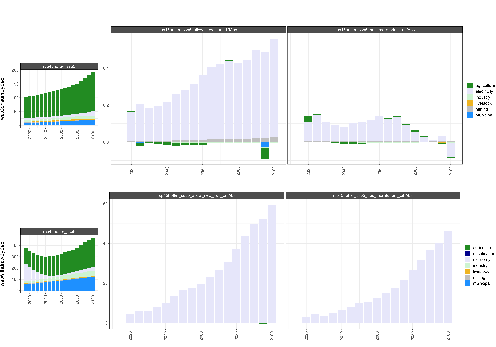
```

<br>


```{r, echo=FALSE, out.width="100%", fig.align='center', fig.cap="**Comparison of GCAM water outputs (percent difference).**"}
knitr::include_graphics("images/rcp45hotter_ssp5/chart_class_diff_percent_water_im3_nuclear.png")
```

<br>

### Energy

<br>

```{r, echo=FALSE, out.width="100%", fig.align='center', fig.cap="**Comparison of GCAM energy outputs (absolute difference).**"}
knitr::include_graphics("images/rcp45hotter_ssp5/chart_class_diff_absolute_energy_im3_nuclear.png")
```

<br>


```{r, echo=FALSE, out.width="100%", fig.align='center', fig.cap="**Comparison of GCAM energy outputs (percent difference).**"}
knitr::include_graphics("images/rcp45hotter_ssp5/chart_class_diff_percent_energy_im3_nuclear.png")
```

<br>

### Electricity {.tabset .tabset-pills}

<br>

#### Total Electricity

<br>

```{r, echo=FALSE, out.width="100%", fig.align='center', fig.cap="**Comparison of GCAM electricity outputs (absolute difference).**"}
knitr::include_graphics("images/rcp45hotter_ssp5/chart_class_diff_absolute_electricity_im3_nuclear.png")
```

<br>


```{r, echo=FALSE, out.width="100%", fig.align='center', fig.cap="**Comparison of GCAM electricity outputs (percent difference).**"}
knitr::include_graphics("images/rcp45hotter_ssp5/chart_class_diff_percent_electricity_im3_nuclear.png")
```

<br>

#### Superpeak

<br>


```{r, echo=FALSE, out.width="100%", fig.align='center', fig.cap="**Comparison of GCAM superpeak outputs (percent difference).**"}
knitr::include_graphics("images/rcp45hotter_ssp5/chart_superpeak_electricity_load.png")
```

<br>

### AGLU

<br>

```{r, echo=FALSE, out.width="100%", fig.align='center', fig.cap="**Comparison of GCAM AGLU outputs (absolute difference).**"}
knitr::include_graphics("images/rcp45hotter_ssp5/chart_class_diff_absolute_aglu_im3_nuclear.png")
```

<br>


```{r, echo=FALSE, out.width="100%", fig.align='center', fig.cap="**Comparison of GCAM AGLU outputs (percent difference).**"}
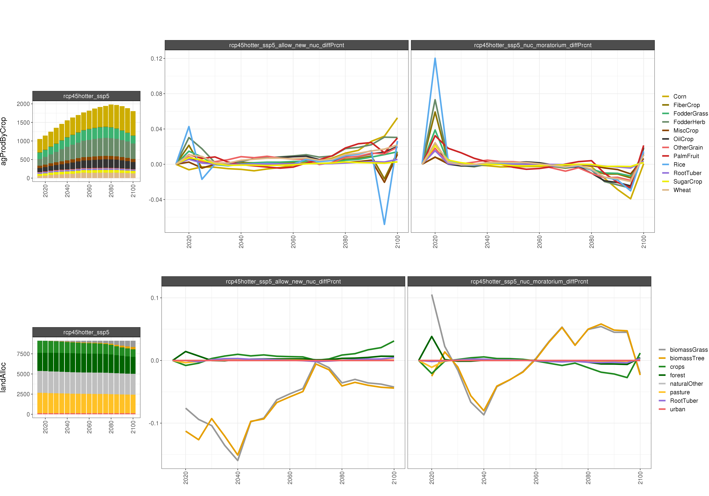
```

<br>

### Emissions

<br>

```{r, echo=FALSE, out.width="100%", fig.align='center', fig.cap="**Comparison of GCAM emissions outputs **"}
knitr::include_graphics("images/rcp45hotter_ssp5/compareCO2GlobalCumRCP_im3_nuclear.png")
```

<br>

```{r, echo=FALSE, out.width="100%", fig.align='center', fig.cap="**Comparison of GCAM emissions outputs. **"}
knitr::include_graphics("images/rcp45hotter_ssp5/compareCO2USA_im3_nuclear.png")
```

<br>

```{r, echo=FALSE, out.width="100%", fig.align='center', fig.cap="**Comparison of GCAM emissions outputsS **"}
knitr::include_graphics("images/rcp45hotter_ssp5/compareNonCO2global_im3_nuclear.png")
```

<br>

```{r, echo=FALSE, out.width="100%", fig.align='center', fig.cap="**Comparison of GCAM emissions outputs **"}
knitr::include_graphics("images/rcp45hotter_ssp5/compareNonCO2USA_im3_nuclear.png")
```

<br>

### Nuclear Capacity {.tabset .tabset-pills}

<br>

#### Nuclear Capacity by States

<br>

```{r, echo=FALSE, out.width="100%", fig.align='center', fig.cap="**Comparison of GCAM Nuclear Capacity by States (absolute values).**"}
knitr::include_graphics("images/rcp45hotter_ssp5/nuclear_cap_states.png")
```

<br>


```{r, echo=FALSE, out.width="100%", fig.align='center', fig.cap="**Comparison of GCAM Nuclear Capacity by States (difference).**"}
knitr::include_graphics("images/rcp45hotter_ssp5/nuclear_cap_states_diff.png")
```

<br>

#### Nuclear Capacity by Technology

<br>

```{r, echo=FALSE, out.width="100%", fig.align='center', fig.cap="**Comparison of GCAM Nuclear Capacity by Technology (absolute values).**"}
knitr::include_graphics("images/rcp45hotter_ssp5/nuclear_cap_tech.png")
```

<br>


```{r, echo=FALSE, out.width="100%", fig.align='center', fig.cap="**Comparison of GCAM Nuclear Capacity by Technology (difference).**"}
knitr::include_graphics("images/rcp45hotter_ssp5/nuclear_cap_tech_diff.png")
```

<br>


#### Nuclear Capacity for States with New Nuclear

<br>

```{r, echo=FALSE, out.width="100%", fig.align='center', fig.cap="**Comparison of GCAM Nuclear Capacity for Individual State (absolute values).**"}
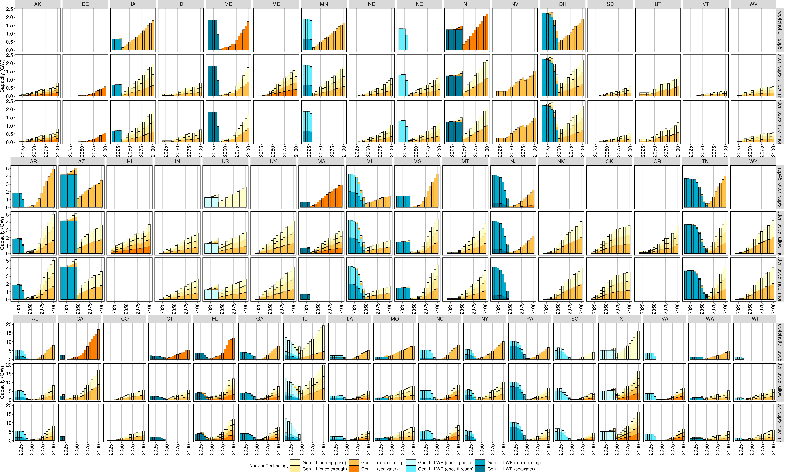
```

<br>


```{r, echo=FALSE, out.width="100%", fig.align='center', fig.cap="**Comparison of GCAM Nuclear Capacity  for Individual State (difference).**"}
knitr::include_graphics("images/rcp45hotter_ssp5/nuclear_cap_state_tech_diff.png")
```

<br>


## RCP8.5Cooler SSP3 {.tabset}

<br>


### Summary

<br>

```{r, echo=FALSE, out.width="100%", fig.align='center', fig.cap="**Comparison of GCAM outputs under 3 scenarios: (1) RCP8.5 Cooler SSP3, (2) RCP8.5 Cooler SSP3 + Allow New Nuclear, and (3) RCP8.5 Cooler SSP3 + Nuclear Moratorium.**"}
knitr::include_graphics("images/rcp85cooler_ssp3/chart_param_all_summary_im3_nuclear.png")
```

<br>

### Water

<br>

```{r, echo=FALSE, out.width="100%", fig.align='center', fig.cap="**Comparison of GCAM water outputs (absolute difference).**"}
knitr::include_graphics("images/rcp85cooler_ssp3/chart_class_diff_absolute_water_im3_nuclear.png")
```

<br>


```{r, echo=FALSE, out.width="100%", fig.align='center', fig.cap="**Comparison of GCAM water outputs (percent difference).**"}
knitr::include_graphics("images/rcp85cooler_ssp3/chart_class_diff_percent_water_im3_nuclear.png")
```

<br>

### Energy

<br>

```{r, echo=FALSE, out.width="100%", fig.align='center', fig.cap="**Comparison of GCAM energy outputs (absolute difference).**"}
knitr::include_graphics("images/rcp85cooler_ssp3/chart_class_diff_absolute_energy_im3_nuclear.png")
```

<br>


```{r, echo=FALSE, out.width="100%", fig.align='center', fig.cap="**Comparison of GCAM energy outputs (percent difference).**"}
knitr::include_graphics("images/rcp85cooler_ssp3/chart_class_diff_percent_energy_im3_nuclear.png")
```

<br>

### Electricity {.tabset .tabset-pills}

<br>

#### Total Electricity

<br>

```{r, echo=FALSE, out.width="100%", fig.align='center', fig.cap="**Comparison of GCAM electricity outputs (absolute difference).**"}
knitr::include_graphics("images/rcp85cooler_ssp3/chart_class_diff_absolute_electricity_im3_nuclear.png")
```

<br>


```{r, echo=FALSE, out.width="100%", fig.align='center', fig.cap="**Comparison of GCAM electricity outputs (percent difference).**"}
knitr::include_graphics("images/rcp85cooler_ssp3/chart_class_diff_percent_electricity_im3_nuclear.png")
```

<br>

#### Superpeak

<br>


```{r, echo=FALSE, out.width="100%", fig.align='center', fig.cap="**Comparison of GCAM superpeak outputs (percent difference).**"}
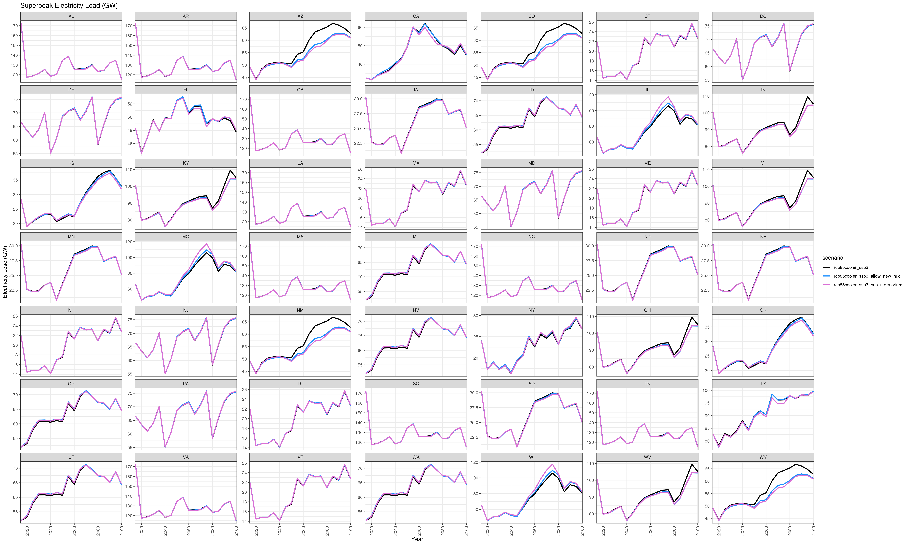
```

<br>

### AGLU

<br>

```{r, echo=FALSE, out.width="100%", fig.align='center', fig.cap="**Comparison of GCAM AGLU outputs (absolute difference).**"}
knitr::include_graphics("images/rcp85cooler_ssp3/chart_class_diff_absolute_aglu_im3_nuclear.png")
```

<br>


```{r, echo=FALSE, out.width="100%", fig.align='center', fig.cap="**Comparison of GCAM AGLU outputs (percent difference).**"}
knitr::include_graphics("images/rcp85cooler_ssp3/chart_class_diff_percent_aglu_im3_nuclear.png")
```

<br>

### Emissions

<br>

```{r, echo=FALSE, out.width="100%", fig.align='center', fig.cap="**Comparison of GCAM emissions outputs **"}
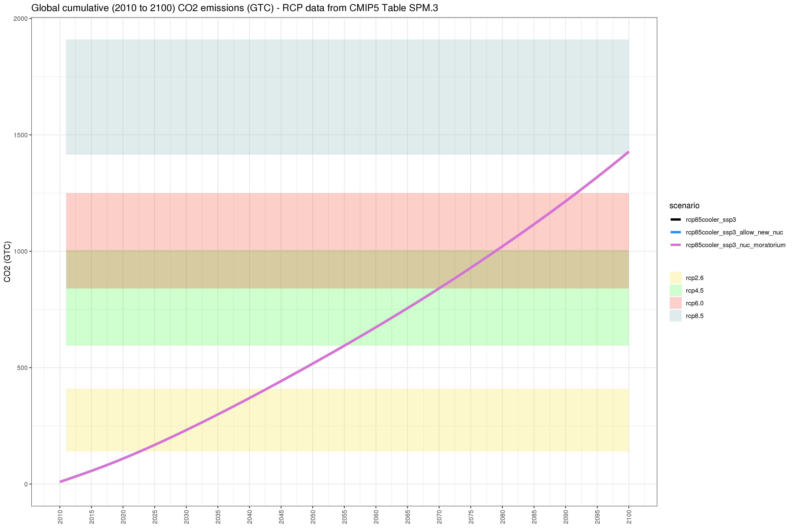
```

<br>

```{r, echo=FALSE, out.width="100%", fig.align='center', fig.cap="**Comparison of GCAM emissions outputs. **"}
knitr::include_graphics("images/rcp85cooler_ssp3/compareCO2USA_im3_nuclear.png")
```

<br>

```{r, echo=FALSE, out.width="100%", fig.align='center', fig.cap="**Comparison of GCAM emissions outputsS **"}
knitr::include_graphics("images/rcp85cooler_ssp3/compareNonCO2global_im3_nuclear.png")
```

<br>

```{r, echo=FALSE, out.width="100%", fig.align='center', fig.cap="**Comparison of GCAM emissions outputs **"}
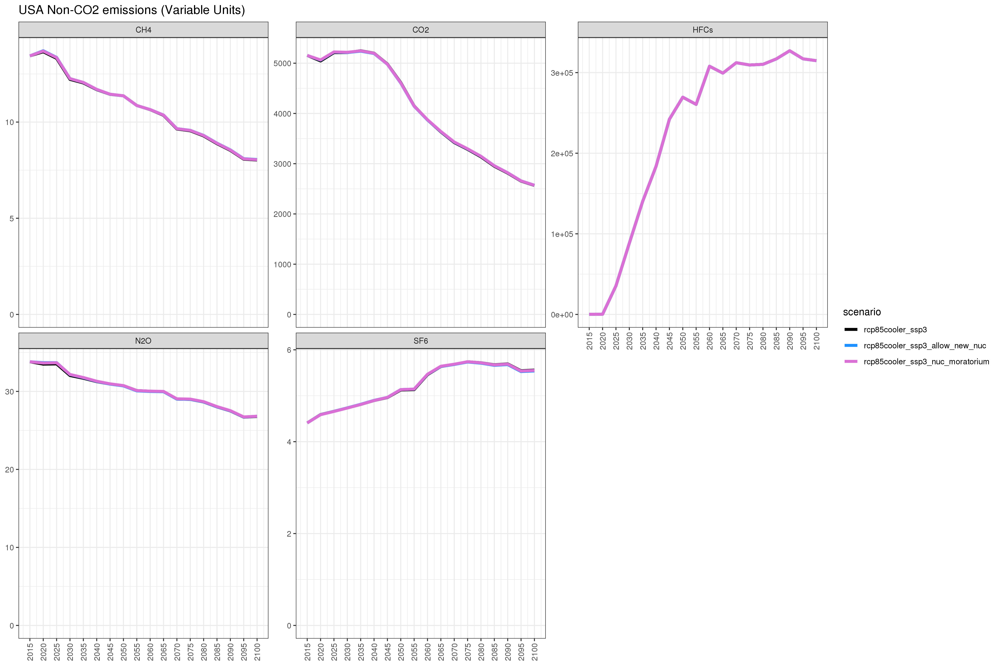
```

<br>

### Nuclear Capacity {.tabset .tabset-pills}

<br>

#### Nuclear Capacity by States

<br>

```{r, echo=FALSE, out.width="100%", fig.align='center', fig.cap="**Comparison of GCAM Nuclear Capacity by States (absolute values).**"}
knitr::include_graphics("images/rcp85cooler_ssp3/nuclear_cap_states.png")
```

<br>


```{r, echo=FALSE, out.width="100%", fig.align='center', fig.cap="**Comparison of GCAM Nuclear Capacity by States (difference).**"}
knitr::include_graphics("images/rcp85cooler_ssp3/nuclear_cap_states_diff.png")
```

<br>

#### Nuclear Capacity by Technology

<br>

```{r, echo=FALSE, out.width="100%", fig.align='center', fig.cap="**Comparison of GCAM Nuclear Capacity by Technology (absolute values).**"}
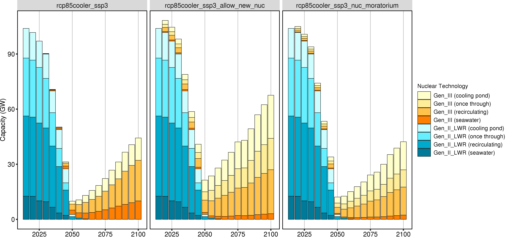
```

<br>


```{r, echo=FALSE, out.width="100%", fig.align='center', fig.cap="**Comparison of GCAM Nuclear Capacity by Technology (difference).**"}
knitr::include_graphics("images/rcp85cooler_ssp3/nuclear_cap_tech_diff.png")
```

<br>


#### Nuclear Capacity for States with New Nuclear

<br>

```{r, echo=FALSE, out.width="100%", fig.align='center', fig.cap="**Comparison of GCAM Nuclear Capacity for Individual State (absolute values).**"}
knitr::include_graphics("images/rcp85cooler_ssp3/nuclear_cap_state_tech.png")
```

<br>


```{r, echo=FALSE, out.width="100%", fig.align='center', fig.cap="**Comparison of GCAM Nuclear Capacity  for Individual State (difference).**"}
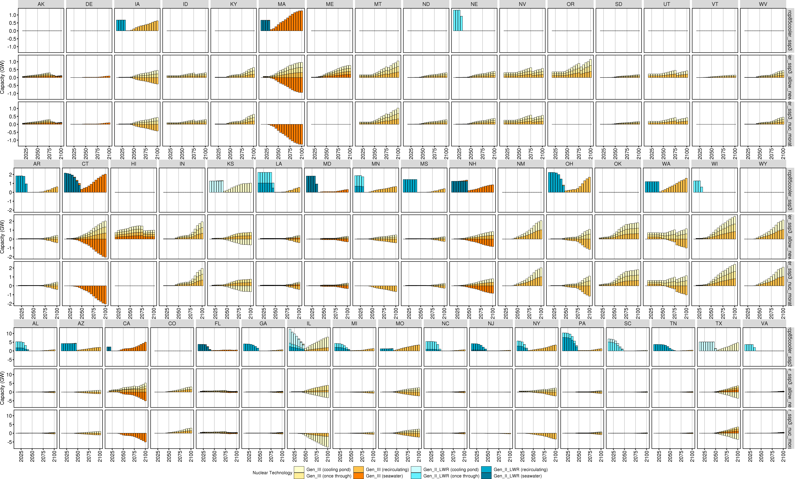
```

<br>


## RCP8.5Cooler SSP5 {.tabset}

<br>


### Summary

<br>

```{r, echo=FALSE, out.width="100%", fig.align='center', fig.cap="**Comparison of GCAM outputs under 3 scenarios: (1) RCP8.5 Cooler SSP5, (2) RCP8.5 Cooler SSP5 + Allow New Nuclear, and (3) RCP8.5 Cooler SSP5 + Nuclear Moratorium.**"}
knitr::include_graphics("images/rcp85cooler_ssp5/chart_param_all_summary_im3_nuclear.png")
```

<br>

### Water

<br>

```{r, echo=FALSE, out.width="100%", fig.align='center', fig.cap="**Comparison of GCAM water outputs (absolute difference).**"}
knitr::include_graphics("images/rcp85cooler_ssp5/chart_class_diff_absolute_water_im3_nuclear.png")
```

<br>


```{r, echo=FALSE, out.width="100%", fig.align='center', fig.cap="**Comparison of GCAM water outputs (percent difference).**"}
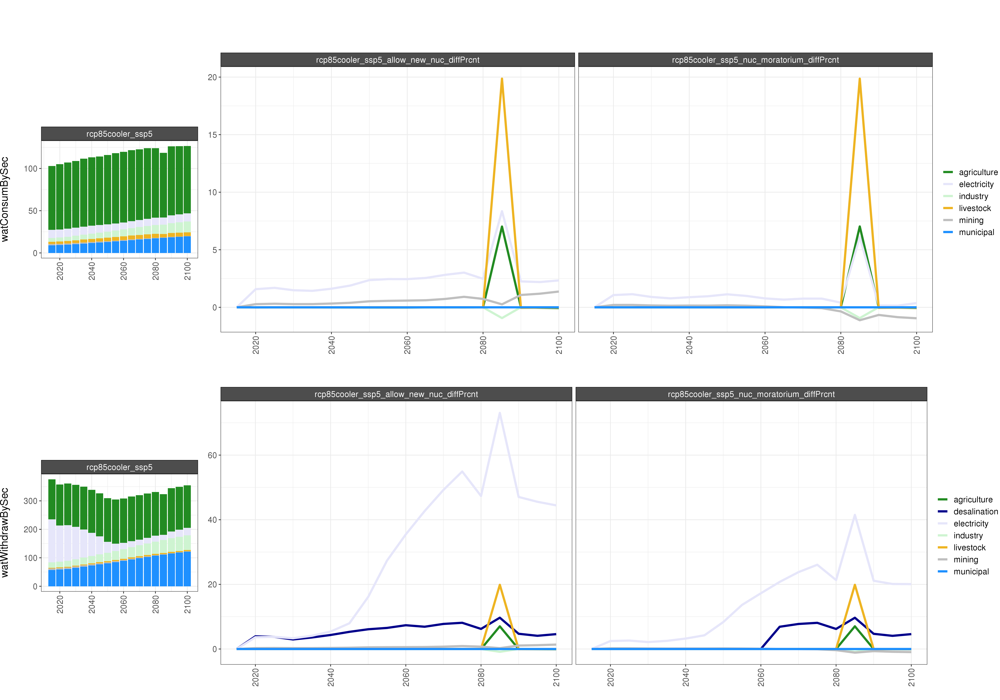
```

<br>

### Energy

<br>

```{r, echo=FALSE, out.width="100%", fig.align='center', fig.cap="**Comparison of GCAM energy outputs (absolute difference).**"}
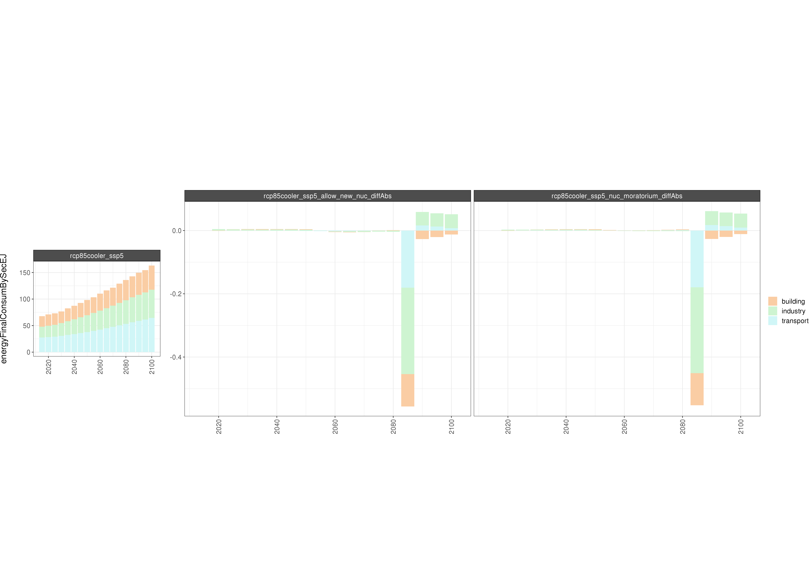
```

<br>


```{r, echo=FALSE, out.width="100%", fig.align='center', fig.cap="**Comparison of GCAM energy outputs (percent difference).**"}
knitr::include_graphics("images/rcp85cooler_ssp5/chart_class_diff_percent_energy_im3_nuclear.png")
```

<br>

### Electricity {.tabset .tabset-pills}

<br>

#### Total Electricity

<br>

```{r, echo=FALSE, out.width="100%", fig.align='center', fig.cap="**Comparison of GCAM electricity outputs (absolute difference).**"}
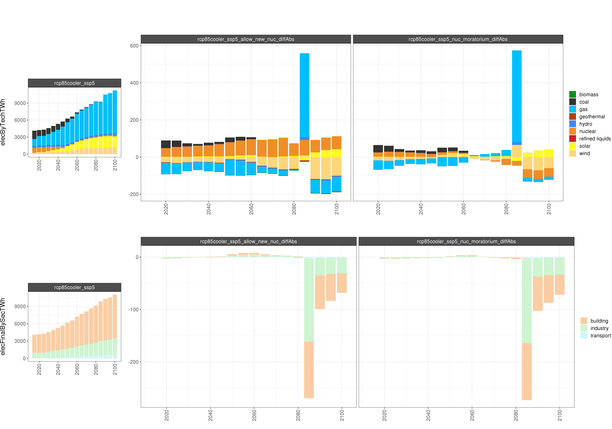
```

<br>


```{r, echo=FALSE, out.width="100%", fig.align='center', fig.cap="**Comparison of GCAM electricity outputs (percent difference).**"}
knitr::include_graphics("images/rcp85cooler_ssp5/chart_class_diff_percent_electricity_im3_nuclear.png")
```

<br>

#### Superpeak

<br>


```{r, echo=FALSE, out.width="100%", fig.align='center', fig.cap="**Comparison of GCAM superpeak outputs (percent difference).**"}
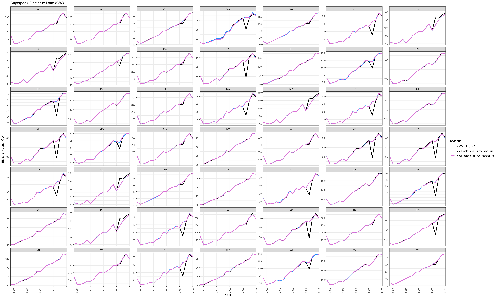
```

<br>

### AGLU

<br>

```{r, echo=FALSE, out.width="100%", fig.align='center', fig.cap="**Comparison of GCAM AGLU outputs (absolute difference).**"}
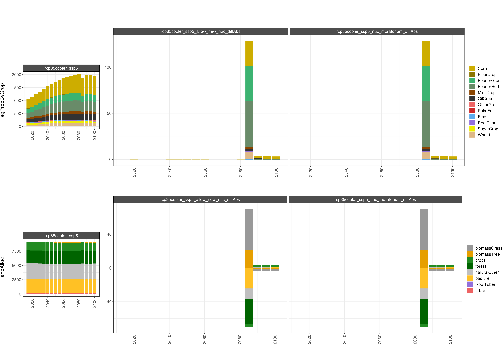
```

<br>


```{r, echo=FALSE, out.width="100%", fig.align='center', fig.cap="**Comparison of GCAM AGLU outputs (percent difference).**"}
knitr::include_graphics("images/rcp85cooler_ssp5/chart_class_diff_percent_aglu_im3_nuclear.png")
```

<br>

### Emissions

<br>

```{r, echo=FALSE, out.width="100%", fig.align='center', fig.cap="**Comparison of GCAM emissions outputs **"}

```

<br>

```{r, echo=FALSE, out.width="100%", fig.align='center', fig.cap="**Comparison of GCAM emissions outputs. **"}
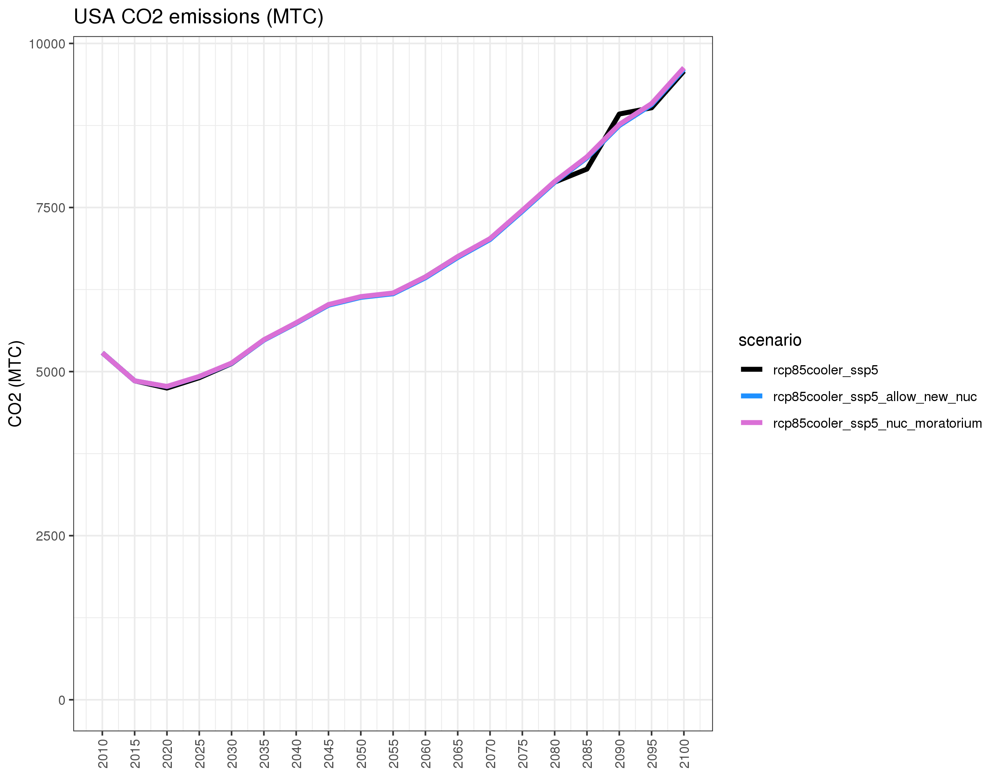
```

<br>

```{r, echo=FALSE, out.width="100%", fig.align='center', fig.cap="**Comparison of GCAM emissions outputsS **"}
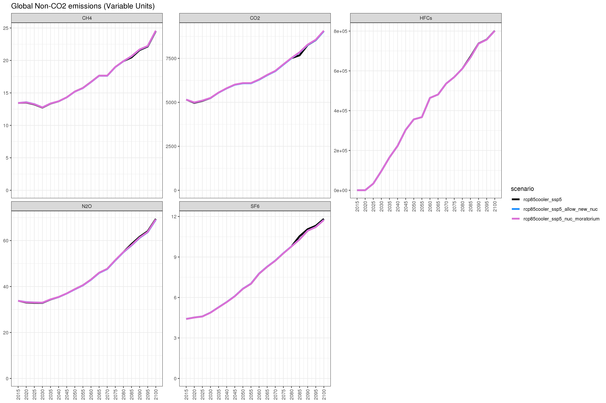
```

<br>

```{r, echo=FALSE, out.width="100%", fig.align='center', fig.cap="**Comparison of GCAM emissions outputs **"}
knitr::include_graphics("images/rcp85cooler_ssp5/compareNonCO2USA_im3_nuclear.png")
```

<br>

### Nuclear Capacity {.tabset .tabset-pills}

<br>

#### Nuclear Capacity by States

<br>

```{r, echo=FALSE, out.width="100%", fig.align='center', fig.cap="**Comparison of GCAM Nuclear Capacity by States (absolute values).**"}
knitr::include_graphics("images/rcp85cooler_ssp5/nuclear_cap_states.png")
```

<br>


```{r, echo=FALSE, out.width="100%", fig.align='center', fig.cap="**Comparison of GCAM Nuclear Capacity by States (difference).**"}
knitr::include_graphics("images/rcp85cooler_ssp5/nuclear_cap_states_diff.png")
```

<br>

#### Nuclear Capacity by Technology

<br>

```{r, echo=FALSE, out.width="100%", fig.align='center', fig.cap="**Comparison of GCAM Nuclear Capacity by Technology (absolute values).**"}
knitr::include_graphics("images/rcp85cooler_ssp5/nuclear_cap_tech.png")
```

<br>


```{r, echo=FALSE, out.width="100%", fig.align='center', fig.cap="**Comparison of GCAM Nuclear Capacity by Technology (difference).**"}
knitr::include_graphics("images/rcp85cooler_ssp5/nuclear_cap_tech_diff.png")
```

<br>


#### Nuclear Capacity for States with New Nuclear

<br>

```{r, echo=FALSE, out.width="100%", fig.align='center', fig.cap="**Comparison of GCAM Nuclear Capacity for Individual State (absolute values).**"}
knitr::include_graphics("images/rcp85cooler_ssp5/nuclear_cap_state_tech.png")
```

<br>


```{r, echo=FALSE, out.width="100%", fig.align='center', fig.cap="**Comparison of GCAM Nuclear Capacity  for Individual State (difference).**"}
knitr::include_graphics("images/rcp85cooler_ssp5/nuclear_cap_state_tech_diff.png")
```

<br>


## RCP8.5Hotter SSP3 {.tabset}

<br>


### Summary

<br>

```{r, echo=FALSE, out.width="100%", fig.align='center', fig.cap="**Comparison of GCAM outputs under 3 scenarios: (1) RCP8.5 Hotter SSP3, (2) RCP8.5 Hotter SSP3 + Allow New Nuclear, and (3) RCP8.5 Hotter SSP3 + Nuclear Moratorium.**"}
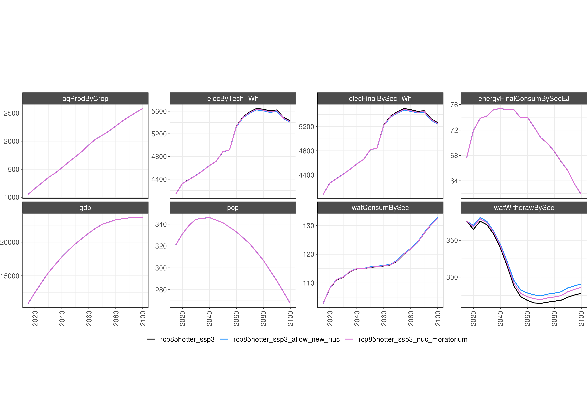
```

<br>

### Water

<br>

```{r, echo=FALSE, out.width="100%", fig.align='center', fig.cap="**Comparison of GCAM water outputs (absolute difference).**"}
knitr::include_graphics("images/rcp85hotter_ssp3/chart_class_diff_absolute_water_im3_nuclear.png")
```

<br>


```{r, echo=FALSE, out.width="100%", fig.align='center', fig.cap="**Comparison of GCAM water outputs (percent difference).**"}
knitr::include_graphics("images/rcp85hotter_ssp3/chart_class_diff_percent_water_im3_nuclear.png")
```

<br>

### Energy

<br>

```{r, echo=FALSE, out.width="100%", fig.align='center', fig.cap="**Comparison of GCAM energy outputs (absolute difference).**"}
knitr::include_graphics("images/rcp85hotter_ssp3/chart_class_diff_absolute_energy_im3_nuclear.png")
```

<br>


```{r, echo=FALSE, out.width="100%", fig.align='center', fig.cap="**Comparison of GCAM energy outputs (percent difference).**"}
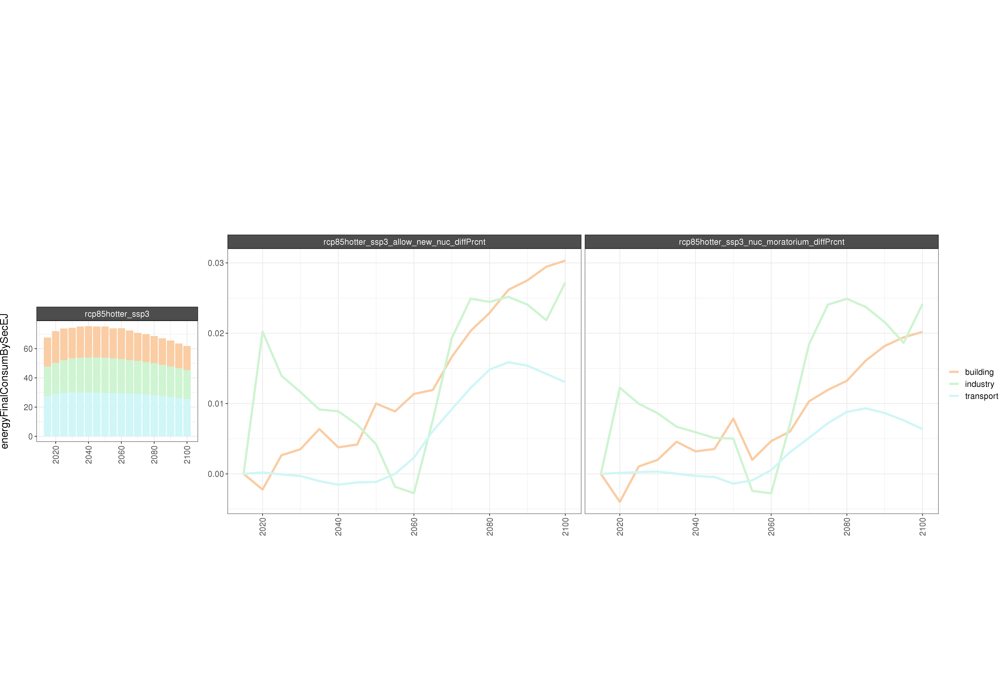
```

<br>

### Electricity {.tabset .tabset-pills}

<br>

#### Total Electricity

<br>

```{r, echo=FALSE, out.width="100%", fig.align='center', fig.cap="**Comparison of GCAM electricity outputs (absolute difference).**"}
knitr::include_graphics("images/rcp85hotter_ssp3/chart_class_diff_absolute_electricity_im3_nuclear.png")
```

<br>


```{r, echo=FALSE, out.width="100%", fig.align='center', fig.cap="**Comparison of GCAM electricity outputs (percent difference).**"}
knitr::include_graphics("images/rcp85hotter_ssp3/chart_class_diff_percent_electricity_im3_nuclear.png")
```

<br>

#### Superpeak

<br>


```{r, echo=FALSE, out.width="100%", fig.align='center', fig.cap="**Comparison of GCAM superpeak outputs (percent difference).**"}
knitr::include_graphics("images/rcp85hotter_ssp3/chart_superpeak_electricity_load.png")
```

<br>

### AGLU

<br>

```{r, echo=FALSE, out.width="100%", fig.align='center', fig.cap="**Comparison of GCAM AGLU outputs (absolute difference).**"}
knitr::include_graphics("images/rcp85hotter_ssp3/chart_class_diff_absolute_aglu_im3_nuclear.png")
```

<br>


```{r, echo=FALSE, out.width="100%", fig.align='center', fig.cap="**Comparison of GCAM AGLU outputs (percent difference).**"}
knitr::include_graphics("images/rcp85hotter_ssp3/chart_class_diff_percent_aglu_im3_nuclear.png")
```

<br>

### Emissions

<br>

```{r, echo=FALSE, out.width="100%", fig.align='center', fig.cap="**Comparison of GCAM emissions outputs **"}
knitr::include_graphics("images/rcp85hotter_ssp3/compareCO2GlobalCumRCP_im3_nuclear.png")
```

<br>

```{r, echo=FALSE, out.width="100%", fig.align='center', fig.cap="**Comparison of GCAM emissions outputs. **"}
knitr::include_graphics("images/rcp85hotter_ssp3/compareCO2USA_im3_nuclear.png")
```

<br>

```{r, echo=FALSE, out.width="100%", fig.align='center', fig.cap="**Comparison of GCAM emissions outputsS **"}
knitr::include_graphics("images/rcp85hotter_ssp3/compareNonCO2global_im3_nuclear.png")
```

<br>

```{r, echo=FALSE, out.width="100%", fig.align='center', fig.cap="**Comparison of GCAM emissions outputs **"}
knitr::include_graphics("images/rcp85hotter_ssp3/compareNonCO2USA_im3_nuclear.png")
```

<br>

### Nuclear Capacity {.tabset .tabset-pills}

<br>

#### Nuclear Capacity by States

<br>

```{r, echo=FALSE, out.width="100%", fig.align='center', fig.cap="**Comparison of GCAM Nuclear Capacity by States (absolute values).**"}
knitr::include_graphics("images/rcp85hotter_ssp3/nuclear_cap_states.png")
```

<br>


```{r, echo=FALSE, out.width="100%", fig.align='center', fig.cap="**Comparison of GCAM Nuclear Capacity by States (difference).**"}
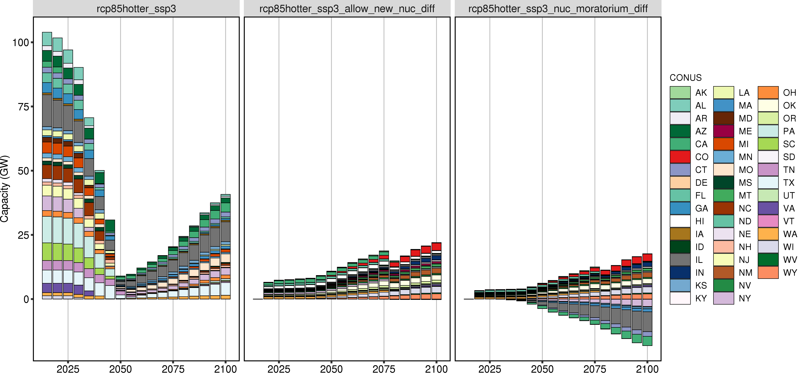
```

<br>

#### Nuclear Capacity by Technology

<br>

```{r, echo=FALSE, out.width="100%", fig.align='center', fig.cap="**Comparison of GCAM Nuclear Capacity by Technology (absolute values).**"}
knitr::include_graphics("images/rcp85hotter_ssp3/nuclear_cap_tech.png")
```

<br>


```{r, echo=FALSE, out.width="100%", fig.align='center', fig.cap="**Comparison of GCAM Nuclear Capacity by Technology (difference).**"}
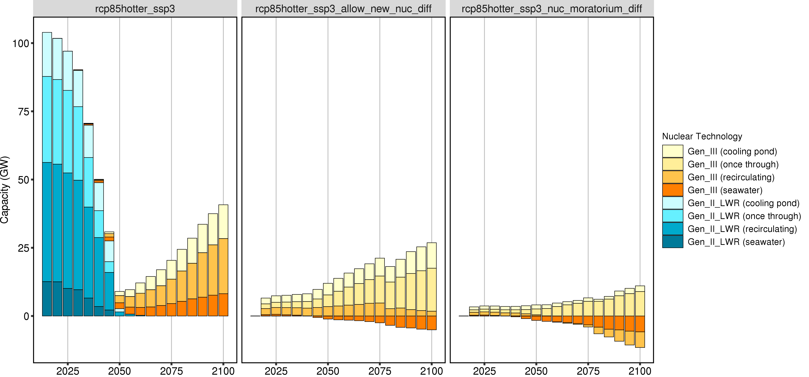
```

<br>


#### Nuclear Capacity for States with New Nuclear

<br>

```{r, echo=FALSE, out.width="100%", fig.align='center', fig.cap="**Comparison of GCAM Nuclear Capacity for Individual State (absolute values).**"}
knitr::include_graphics("images/rcp85hotter_ssp3/nuclear_cap_state_tech.png")
```

<br>


```{r, echo=FALSE, out.width="100%", fig.align='center', fig.cap="**Comparison of GCAM Nuclear Capacity  for Individual State (difference).**"}
knitr::include_graphics("images/rcp85hotter_ssp3/nuclear_cap_state_tech_diff.png")
```

<br>


## RCP8.5Hotter SSP5 {.tabset}

<br>


### Summary

<br>

```{r, echo=FALSE, out.width="100%", fig.align='center', fig.cap="**Comparison of GCAM outputs under 3 scenarios: (1) RCP8.5 Hotter SSP5, (2) RCP8.5 Hotter SSP5 + Allow New Nuclear, and (3) RCP8.5 Hotter SSP5 + Nuclear Moratorium.**"}
knitr::include_graphics("images/rcp85hotter_ssp5/chart_param_all_summary_im3_nuclear.png")
```

<br>

### Water

<br>

```{r, echo=FALSE, out.width="100%", fig.align='center', fig.cap="**Comparison of GCAM water outputs (absolute difference).**"}
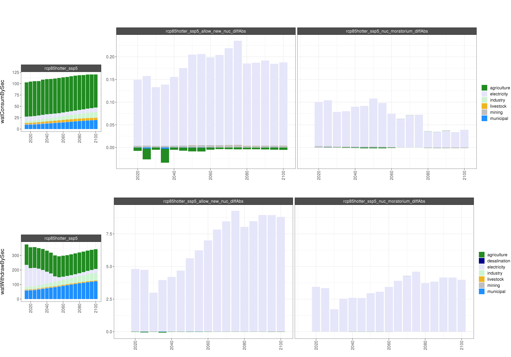
```

<br>


```{r, echo=FALSE, out.width="100%", fig.align='center', fig.cap="**Comparison of GCAM water outputs (percent difference).**"}
knitr::include_graphics("images/rcp85hotter_ssp5/chart_class_diff_percent_water_im3_nuclear.png")
```

<br>

### Energy

<br>

```{r, echo=FALSE, out.width="100%", fig.align='center', fig.cap="**Comparison of GCAM energy outputs (absolute difference).**"}
knitr::include_graphics("images/rcp85hotter_ssp5/chart_class_diff_absolute_energy_im3_nuclear.png")
```

<br>


```{r, echo=FALSE, out.width="100%", fig.align='center', fig.cap="**Comparison of GCAM energy outputs (percent difference).**"}
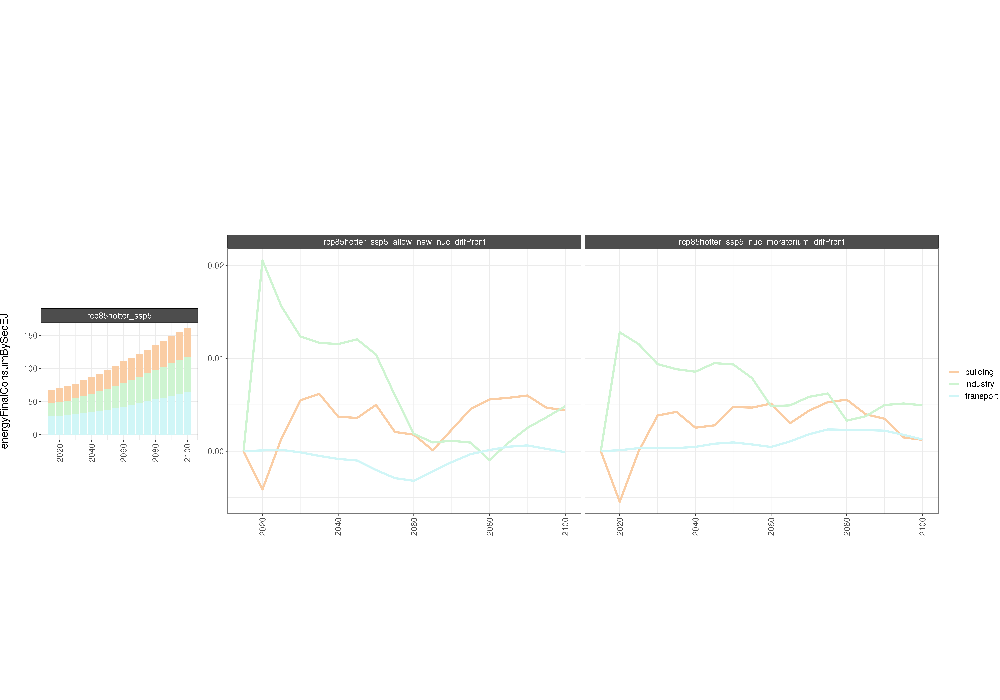
```

<br>

### Electricity {.tabset .tabset-pills}

<br>

#### Total Electricity

<br>

```{r, echo=FALSE, out.width="100%", fig.align='center', fig.cap="**Comparison of GCAM electricity outputs (absolute difference).**"}
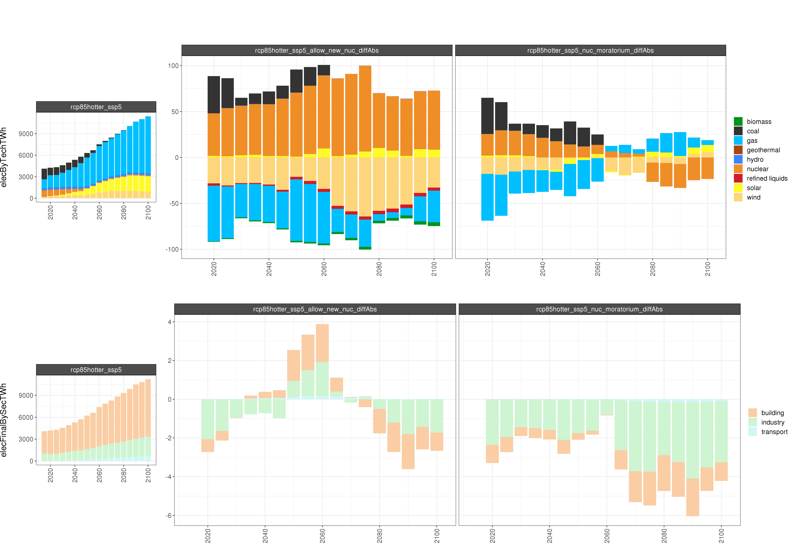
```

<br>


```{r, echo=FALSE, out.width="100%", fig.align='center', fig.cap="**Comparison of GCAM electricity outputs (percent difference).**"}
knitr::include_graphics("images/rcp85hotter_ssp5/chart_class_diff_percent_electricity_im3_nuclear.png")
```

<br>

#### Superpeak

<br>


```{r, echo=FALSE, out.width="100%", fig.align='center', fig.cap="**Comparison of GCAM superpeak outputs (percent difference).**"}
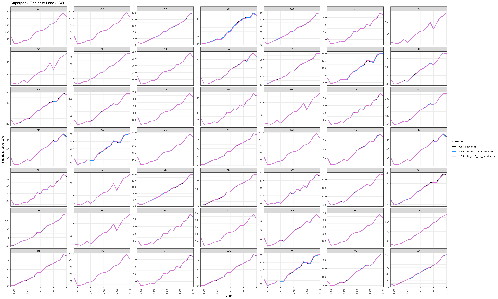
```

<br>

### AGLU

<br>

```{r, echo=FALSE, out.width="100%", fig.align='center', fig.cap="**Comparison of GCAM AGLU outputs (absolute difference).**"}
knitr::include_graphics("images/rcp85hotter_ssp5/chart_class_diff_absolute_aglu_im3_nuclear.png")
```

<br>


```{r, echo=FALSE, out.width="100%", fig.align='center', fig.cap="**Comparison of GCAM AGLU outputs (percent difference).**"}
knitr::include_graphics("images/rcp85hotter_ssp5/chart_class_diff_percent_aglu_im3_nuclear.png")
```

<br>

### Emissions

<br>

```{r, echo=FALSE, out.width="100%", fig.align='center', fig.cap="**Comparison of GCAM emissions outputs **"}
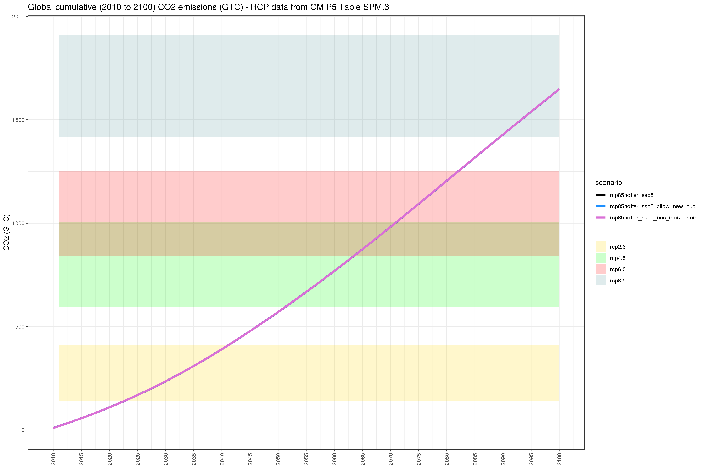
```

<br>

```{r, echo=FALSE, out.width="100%", fig.align='center', fig.cap="**Comparison of GCAM emissions outputs. **"}
knitr::include_graphics("images/rcp85hotter_ssp5/compareCO2USA_im3_nuclear.png")
```

<br>

```{r, echo=FALSE, out.width="100%", fig.align='center', fig.cap="**Comparison of GCAM emissions outputsS **"}
knitr::include_graphics("images/rcp85hotter_ssp5/compareNonCO2global_im3_nuclear.png")
```

<br>

```{r, echo=FALSE, out.width="100%", fig.align='center', fig.cap="**Comparison of GCAM emissions outputs **"}
knitr::include_graphics("images/rcp85hotter_ssp5/compareNonCO2USA_im3_nuclear.png")
```

<br>

### Nuclear Capacity {.tabset .tabset-pills}

<br>

#### Nuclear Capacity by States

<br>

```{r, echo=FALSE, out.width="100%", fig.align='center', fig.cap="**Comparison of GCAM Nuclear Capacity by States (absolute values).**"}
knitr::include_graphics("images/rcp85hotter_ssp5/nuclear_cap_states.png")
```

<br>


```{r, echo=FALSE, out.width="100%", fig.align='center', fig.cap="**Comparison of GCAM Nuclear Capacity by States (difference).**"}
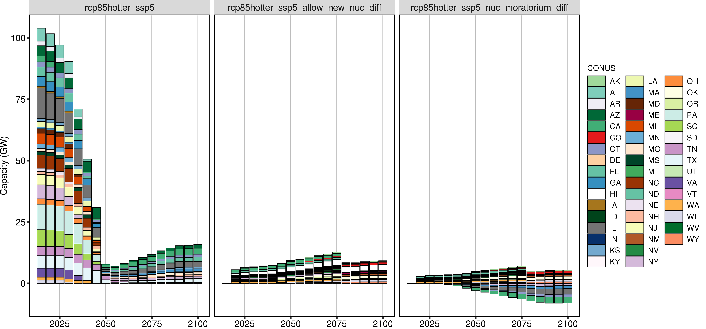
```

<br>

#### Nuclear Capacity by Technology

<br>

```{r, echo=FALSE, out.width="100%", fig.align='center', fig.cap="**Comparison of GCAM Nuclear Capacity by Technology (absolute values).**"}
knitr::include_graphics("images/rcp85hotter_ssp5/nuclear_cap_tech.png")
```

<br>


```{r, echo=FALSE, out.width="100%", fig.align='center', fig.cap="**Comparison of GCAM Nuclear Capacity by Technology (difference).**"}
knitr::include_graphics("images/rcp85hotter_ssp5/nuclear_cap_tech_diff.png")
```

<br>


#### Nuclear Capacity for States with New Nuclear

<br>

```{r, echo=FALSE, out.width="100%", fig.align='center', fig.cap="**Comparison of GCAM Nuclear Capacity for Individual State (absolute values).**"}
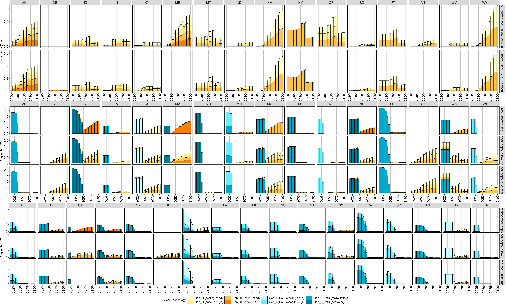
```

<br>


```{r, echo=FALSE, out.width="100%", fig.align='center', fig.cap="**Comparison of GCAM Nuclear Capacity  for Individual State (difference).**"}
knitr::include_graphics("images/rcp85hotter_ssp5/nuclear_cap_state_tech_diff.png")
```

<br>


