```{css zoom-lib-src, echo = FALSE}
script src = "https://ajax.googleapis.com/ajax/libs/jquery/3.4.1/jquery.min.js"
```

```{js zoom-jquery, echo = FALSE}
 $(document).ready(function() {
    $('body').prepend('<div class=\"zoomDiv\"></div>');
    // onClick function for all plots (img's)
    $('img:not(.zoomImg)').click(function() {
      $('.zoomImg').attr('src', $(this).attr('src')).css({width: '100%'});
      $('.zoomDiv').css({opacity: '1', width: 'auto', border: '1px solid white', borderRadius: '5px', position: 'fixed', top: '50%', left: '50%', marginRight: '-50%', transform: 'translate(-50%, -50%)', boxShadow: '0px 0px 50px #888888', zIndex: '50', overflow: 'auto', maxHeight: '100%'});
    });
    // onClick function for zoomImg
    $('img.zoomImg').click(function() {
      $('.zoomDiv').css({opacity: '0', width: '0%'}); 
    });
  });
```

<div class="header_logo">

</div>


<!-------------------------->
<!-------------------------->
# Citation
<!-------------------------->
<!-------------------------->
<p align="center"></p>

Khan, Z., Wolfram, P., Iyer, G., Rice, J., Vernon, C., Binsted, M., Graham, N. 2022. Coevolution of future water, energy and land systems across the United States in response to national and global socioeconomics, climate, and energy transitions. (In-Prep) Journal_TBD, DOI: XXXX

<br>

<!-------------------------->
<!-------------------------->
# Models Used
<!-------------------------->
<!-------------------------->
<p align="center"></p>

<br>

```{r, results = 'show', eval=TRUE, echo=FALSE, warning=FALSE, error = FALSE, message = FALSE}
library(kableExtra)
data.frame(
    Model     = c("WRF",
                  "GCAM",
                  "Xanthos",
                  "Helios",
                  "GGCMI",
                  "rpackageutils",
                  "im3components",
                  "gcamextractor"),
    Version = c("-",
                "gcam v5.3 (branch gcam-usa-im3)",
                "xanthos v2.4.1",
                "helios v1.0.0",
                "ggcmi v1.0.0",
                "rpackageutils v1.0.0",
                "im3components v1.0.0",
                "gcamextractor"),
    Description = c("Climate simulation model",
                    "Global Change Analysis Model. Human-earth systems dynamic model.",
                    "Water runoff emulator at 0.5 degree grids and monthly timesteps.",
                    "Gridded Heating and cooling degree day calculator at multiple spatial and temporal resolution.",
                    "Emulators to model agricultural yield impacts in response to climate",
                    "Utility functions to process, aggregate and reformat data.",
                    "Functions to process data between different IM3 models.",
                    "Model to extract and process data from GCAM output databases."),
    Language = c("-",
                  "C++/R",
                  "Python",
                  "R",
                  "?",
                  "R",
                  "R/Python",
                  "R"),
    Link = c("https://www.mmm.ucar.edu/weather-research-and-forecasting-model",
             "https://stash.pnnl.gov/projects/JGCRI/repos/gcam-core/browse?at=refs%2Fheads%2Fzk%2Ffeature%2Fgcam-usa-im3",
            "https://github.com/JGCRI/xanthos",
            "Helios",
            "GGCMI",
            "https://github.com/JGCRI/rpackageutils",
            "https://github.com/IMMM-SFA/im3components",
            "https://github.com/JGCRI/gcamextractor")
    ) %>% 
  kbl() %>%
  kable_styling(bootstrap_options = c("striped", "hover", "condensed", "responsive"))

```

<br>

<!-------------------------->
<!-------------------------->
# Data
<!-------------------------->
<!-------------------------->
<p align="center"></p>

<br>

```{r, results = 'show', eval=TRUE, echo=FALSE, warning=FALSE, error = FALSE, message = FALSE}
library(kableExtra)
data.frame(
    Data     = c("WRF Outputs",
                 "Xanthos Outputs",
                 "Helios Outputs",
                 "GGCMI Outputs",
                 "Population US States",
                 "Population Gridded",
                 "GCAM Outputs"),
     Source = c("WRF runs",
                "Xanthos runs (Workflow 1)",
                "Helios runs (Workflow 2)",
                "GGCMI runs (Workflow 3)",
                "xxx",
                "xxx",
                "GCAM runs (Workflow 7)"),
    `Used by` = c("Xanthos, Helios, GGCMI",
                  "GCAM",
                  "GCAM",
                  "GCAM",
                  "GCAM",
                  "GCAM",
                  "-"),
    Location = c("(NERSC) /global/cfs/cdirs/m2702/gsharing",
                 "zenodo link",
                  "zenodo link",
                  "zenodo link",
                  "zenodo link",
                  "zenodo link",
                  "zenodo link")
    ) %>% 
  kbl() %>%
  kable_styling(bootstrap_options = c("striped", "hover", "condensed", "responsive"))

```


<br>

<!-------------------------->
<!-------------------------->
# Emissions pathways
<!-------------------------->
<!-------------------------->
<p align="center"></p>

<br>

We model two emissions pathways, RCP8.5 and RCP4.5. 
RCP8.5 is the default pathway in GCAM-USA. 
Thus, no modifications to the source code are required in order to run an RCP8.5 scenario. 
For RCP4.5, we impose a global CO~2~ emissions constraint. 
This emissions constraint in turn is based on the GCAM core model, release version 5.4 (publicly available [here](https://github.com/JGCRI/gcam-core/releases/tag/gcam-v5.4)), a global model differentiating 32 world regions. 
Specifically, we run GCAM 5.4 in target finder mode.


<br>


## Running GCAM 5.4 in target finder mode {.tabset}

<br>


As described in the [GCAM online documentation on GitHub](https://jgcri.github.io/gcam-doc/user-guide.html#target-finder), running GCAM 5.4 in target finder mode requires enabling (setting to 1) the `find-path` option in the respective configuration file, which is `gcam-core/exe/configuration_RCP45.xml` when running an RCP4.5 scenario:

`"<Value name="find-path">1</Value>"`


Then, the configuration file must be called in `gcam-core/exe/run-gcam.sh` as follows:

`gcam.exe -C configuration_RCP45.xml`

Once the model run is finished, results can be extracted using the model interface: `gcam-core/ModelInterface/run-model-interface.bat`. Specifically, we query "CO2 emissions by region" and "LUC emissions by region" for the region "Global" and sum up the values for each year in a separate spreadsheet. 

The figure below illustrates the final CO~2~ pathway, as well as the corresponding CO~2~-price pathway and the resulting radiative forcing:

<br>

```{r, echo=FALSE, out.width="100%", fig.align='center', fig.cap="**Overview of the RCP4.5 emissions pathway in GCAM.**"}
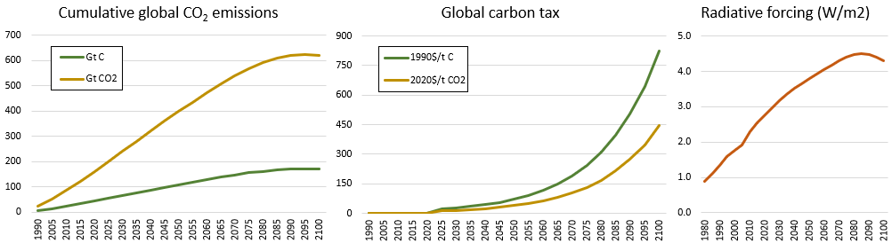
```
<!-- updated on 4/12/22 -->

<!-- location for images: meta_repos/khan-etal_2022_im3gcamusa/webpage/images -->

<br>


<br>


## Implementing CO~2~ Emissions Constraint In GCAM-USA {.tabset}

<br>


The resulting pathway of CO~2~ emissions from land use and energy is then used as a CO~2~ emissions constraint in GCAM-USA. 
Therefore, we use a file named `/pic/projects/im3/gcamusa/gcam-usa-im3/input/policy/global_CO2_constraint.xml` into which we input the CO~2~ emissions values calculated by GCAM 5.4 (as described above) as constraints. 
We also add an accompanying file called `/pic/projects/im3/gcamusa/gcam-usa-im3/input/policy/global_CO2_link.xml` which performs additional required tasks.


We then create a set of new configuration files in `/pic/projects/im3/gcamusa/gcam-usa-im3/exe/` based on existing ones: 


<br>
```{r, results = 'show', eval=TRUE, echo=FALSE, warning=FALSE, error = FALSE, message = FALSE}
library(kableExtra)
data.frame(
    `Exisitng file` = c("configuration_rcp85cooler_ssp3_rcp85gdp_runoff.xml",
                 "configuration_rcp85hotter_ssp3_rcp85gdp_runoff.xml",
                 "configuration_rcp85cooler_ssp5_runoff.xml",
                 "configuration_rcp85hotter_ssp5_runoff.xml"),
     `New file` = c("configuration_rcp45cooler_ssp3_rcp45gdp_runoff.xml",
                 "configuration_rcp45hotter_ssp3_rcp45gdp_runoff.xml",
                 "configuration_rcp45cooler_ssp5_runoff.xml",
                 "configuration_rcp45hotter_ssp5_runoff.xml")
    ) %>% 
  kbl() %>%
  kable_styling(bootstrap_options = c("striped", "hover", "condensed", "responsive"))

```
<br>


The main difference in our new configuration files is the addition of the following lines of code immediately after `cal_broyden_config.xml` is called:

```
<!--POLICY ADD ONS-->
<Value name = "global_CO2_constraint">../input/policy/global_CO2_constraint.xml</Value>
<Value name = "global_CO2_link">../input/policy/global_CO2_link.xml</Value>
```

In addition, the following lines need to be updated accordingly in each configuration file (e.g. replace `rcp85hotter` by `rcp45cooler` etc.): 

`<Value write-output="1" append-scenario-name="0" name="xmldb-location">../output/database_rcp85hotter_ssp3_rcp85gdp_runoff</Value>`

`<Value name="ccs_supply">../input/im3scenarios/rcp85hotter/Basin_runoff_km3peryear_comb_ssp585_rcp85_noresm_1979_2100_window5trail_delta_applied2015.xml</Value>`


`<Value name="scenarioName">rcp85hotter_ssp3_rcp85gdp_runoff</Value>`


<br>

<!-------------------------->
<!-------------------------->
# Workflows Summary
<!-------------------------->
<!-------------------------->
<p align="center"></p>

<br>

```{r, echo=FALSE, out.width="100%", fig.align='center', fig.cap="**Summary of experiment workflows.**"}
knitr::include_graphics("images/im3_gcamusa_workflow_summary.jpg")
```

<br>

<!-------------------------->
<!-------------------------->
# Workflow 1 - Runoff
<!-------------------------->
<!-------------------------->
<p align="center"></p>


<br>

```{r, echo=FALSE, out.width="80%", fig.align='center', fig.cap="**Workflow 1: Climate Impacts Runoff.**"}
knitr::include_graphics("images/im3_gcamusa_workflow_1_climate_impacts_runoff.jpg")
```

<br>


## Workflow 1A US Basins {.tabset}

<br>

### Table Workflow 1A

<br>

Workflow 1A results in WRF outputs being processed and run through Xanthos to produce runoff in mm per month for US Basins to be combined with Non-US Basins runoff results from Workflow 1B. 

<br>

```{r, results = 'show', eval=TRUE, echo=FALSE, warning=FALSE, error = FALSE, message = FALSE}
library(pander)
mytable = data.frame(
    Step     = c("WRF Outputs Raw", 
                 "wrf_to_xanthos",
                 "xanthos"),
    Description = c("* RCP 4.5, 8.5, hot and cool\
                    \n * hourly, 1979_01 to 2099_12\
                    \n * 12km x 12km resolution\
                    \n * Temperature (K)\
                    \n * Minimum temperature (K)\
                    \n * Wind speed (m/s)\
                    \n * Relative humidity (%)\
                    \n * GLW (W/m2)\
                    \n * SWDOWN (W/m2)",
                    "* wrf_to_xanthos_preprocess_historical.sh\ 
                    \n* wrf_to_xanthos_preprocess_ssp585_hot_near.sh\
                    \n* wrf_to_xanthos_preprocess_ssp585_hot_far.sh\
                    \n* wrf_to_xanthos_process_historical.sh\
                    \n* wrf_to_xanthos_process_ssp585_hot_near.sh\
                    \n* wrf_to_xanthos_process_ssp585_hot_far.sh\
                    \n* wrf_to_xanthos_combine_historical_ssp585_hot_near_far.sh", "wrf_to_xanthos_combine_historical_ssp585_hot_near_far_us_global_xanthos.sh"),
    Location     = c("(NERSC) /global/cfs/cdirs/m2702/gsharing",
                     "* (NERSC) /global/cfs/cdirs/m2702/gcamusa/wrf_to_xanthos\
                     \n* (Repo) https://github.com/IMMM-SFA/khan-etal_2022_im3gcamusa/scripts",
                     "* (NERSC) /global/cfs/cdirs/m2702/gcamusa/wrf_to_xanthos\
                     \n* (NERSC) /global/cfs/cdirs/m2702/gcamusa/wrf_to_xanthos/xanthos_files/example/output\
                     \n*  (Repo) https://github.com/IMMM-SFA/khan-etal_2022_im3gcamusa/scripts")
    )

pander::pander(mytable, keep.line.breaks = TRUE, style = 'grid', justify = 'left', split.tables=Inf)
```

<br>

## Workflow 1B Global Basins {.tabset}

<br>

### Table Workflow 1B

<br>

```{r, results = 'show', eval=TRUE, echo=FALSE, warning=FALSE, error = FALSE, message = FALSE}
library(pander)
mytable = data.frame(
    Step     = c("CMIP5 Outputs Raw", 
                 "Xanthos Outputs on PIC",
                 "Xanthos GCAM GCM Sensitivity Analysis",
                 "Xanthos GCAM smoothing Sensitivity Analysis"),
    Description = c("* RCP 4.5, 8.5\
                    \n * annualy, 1950 to 2099\
                    \n * 235 river basins\
                    \n * Basin runoff (km3/year)",
                    "runoff_global_xanthos_to_gcam.sh",
                    "gcamDiagnostics_runoff_GCMs_5trail_delta.sh",
                    "gcamDiagnostics_runoff_NORESM_smooth_delta.sh"
                    ),
    Location     = c("*(PIC) /pic/projects/im3/gcamusa/climateimpacts/raw_global_runoff_files",
                     "*(Repo) https://github.com/IMMM-SFA/khan-etal_2022_im3gcamusa/scripts",
                     "*(PIC) /pic/projects/im3/gcamusa/diagnostics\
                     \n * /pic/projects/im3/gcamusa/diagnostics/outputs_runoff_GCMs_5trail_delta",
                     "*(PIC) /pic/projects/im3/gcamusa/diagnostics\
                     \n * /pic/projects/im3/gcamusa/diagnostics/outputs_runoff_NORESM_smooth_delta")
    )

pander::pander(mytable, keep.line.breaks = TRUE, style = 'grid', justify = 'left', split.tables=Inf)
```


### Runoff Diagnostics {.tabset .tabset-pills}

#### Compare GCMs

<br>

```{r, echo=FALSE, out.width="100%", fig.align='center', fig.cap="**Comparison of water runoff across five global climate models (GCMs).**"}
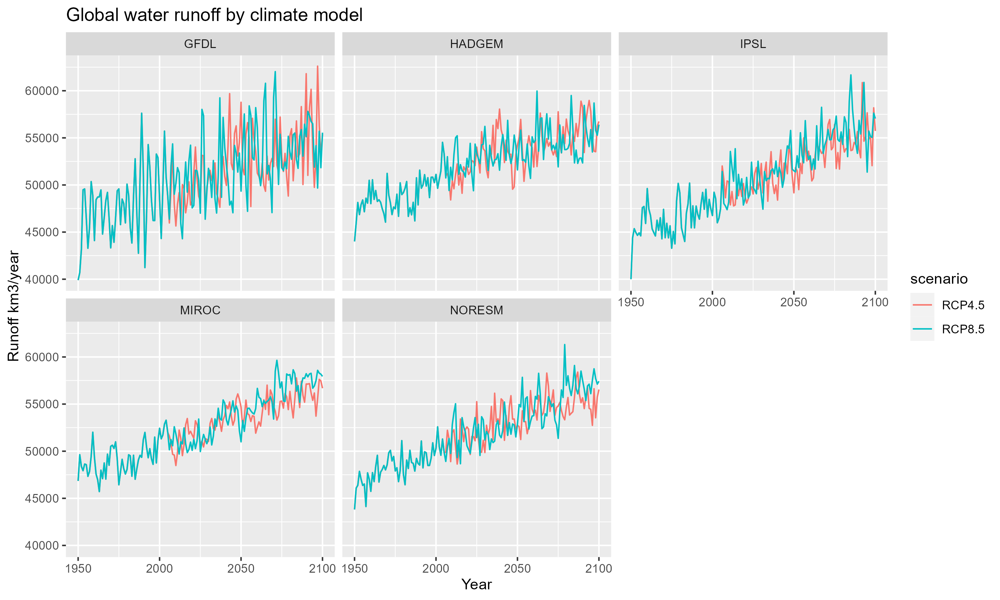
```

#### Compare Smoothing

<br>

```{r, echo=FALSE, out.width="100%", fig.align='center', fig.cap="**Comparison of smoothed runoff data from the NORESM model **"}
knitr::include_graphics("images/water_runoff_facet_scenario.png")
```

#### Compare Deltas

<br>

```{r, echo=FALSE, out.width="100%", fig.align='center', fig.cap="**Comparison of baseline data, smoothed runoff data,  and 'delta' applied to smoothed data **"}
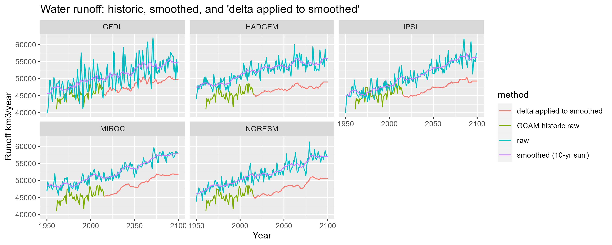
```

### GCAM Outputs GCMs {.tabset .tabset-pills}

#### Summary

<br>

```{r, echo=FALSE, out.width="150%", fig.align='center', fig.cap="**Comparison of GCAM outputs global runoff for 5 GCMS **"}
knitr::include_graphics("images/chart_param_all_summary_runoff_GCMs_5trail_delta.png")
```

<br>

#### Socioeconomics

<br>

```{r, echo=FALSE, out.width="100%", fig.align='center', fig.cap="**Comparison of GCAM socioeconomic outputs for 5 GCMS **"}
knitr::include_graphics("images/chart_param_socioecon_runoff_GCMs_5trail_delta.png")
```

<br>

```{r, echo=FALSE, out.width="100%", fig.align='center', fig.cap="**Comparison of GCAM socioeconomic outputs for 5 GCMS % Diff**"}
knitr::include_graphics("images/chart_param_diff_percent_socioecon_runoff_GCMs_5trail_delta.png")
```

<br>

#### Water

<br>

```{r, echo=FALSE, out.width="200%", fig.align='center', fig.cap="**Comparison of GCAM water outputs for 5 GCMS **"}
knitr::include_graphics("images/chart_class_diff_absolute_water_runoff_GCMs_5trail_delta.png")
```

<br>

```{r, echo=FALSE, out.width="200%", fig.align='center', fig.cap="**Comparison of GCAM water outputs for 5 GCMS % Diff**"}
knitr::include_graphics("images/chart_class_diff_percent_water_runoff_GCMs_5trail_delta.png")
```

<br>

#### Energy

<br>

```{r, echo=FALSE, out.width="200%", fig.align='center', fig.cap="**Comparison of GCAM electricity outputs for 5 GCMS **"}
knitr::include_graphics("images/chart_class_diff_absolute_energy_runoff_GCMs_5trail_delta.png")
```


<br>

```{r, echo=FALSE, out.width="200%", fig.align='center', fig.cap="**Comparison of GCAM electricity outputs for 5 GCMS % Diff**"}
knitr::include_graphics("images/chart_class_diff_percent_energy_runoff_GCMs_5trail_delta.png")
```

<br>

#### Electricity

<br>

```{r, echo=FALSE, out.width="200%", fig.align='center', fig.cap="**Comparison of GCAM electricity outputs for 5 GCMS **"}

```

<br>

```{r, echo=FALSE, out.width="200%", fig.align='center', fig.cap="**Comparison of GCAM electricity outputs for 5 GCMS % Diff**"}

```

<br>

#### AGLU

<br>

```{r, echo=FALSE, out.width="200%", fig.align='center', fig.cap="**Comparison of GCAM AGLU outputs for 5 GCMS **"}
knitr::include_graphics("images/chart_class_diff_absolute_aglu_runoff_GCMs_5trail_delta.png")
```

<br>

```{r, echo=FALSE, out.width="200%", fig.align='center', fig.cap="**Comparison of GCAM AGLU outputs for 5 GCMS % Diff**"}
knitr::include_graphics("images/chart_class_diff_percent_aglu_runoff_GCMs_5trail_delta.png")
```

<br>

#### Emissions

<br>

```{r, echo=FALSE, out.width="100%", fig.align='center', fig.cap="**Comparison of GCAM emissions outputs for 5 GCMS **"}
knitr::include_graphics("images/compareCO2GlobalCumRCP_GCMs_5trail_delta.png")
```

<br>

```{r, echo=FALSE, out.width="100%", fig.align='center', fig.cap="**Comparison of GCAM emissions outputs for 5 GCMS **"}
knitr::include_graphics("images/compareCO2USA_GCMs_5trail_delta.png")
```

<br>

```{r, echo=FALSE, out.width="100%", fig.align='center', fig.cap="**Comparison of GCAM emissions outputs for 5 GCMS **"}
knitr::include_graphics("images/compareNonCO2global_GCMs_5trail_delta.png")
```

<br>

```{r, echo=FALSE, out.width="100%", fig.align='center', fig.cap="**Comparison of GCAM emissions outputs for 5 GCMS **"}
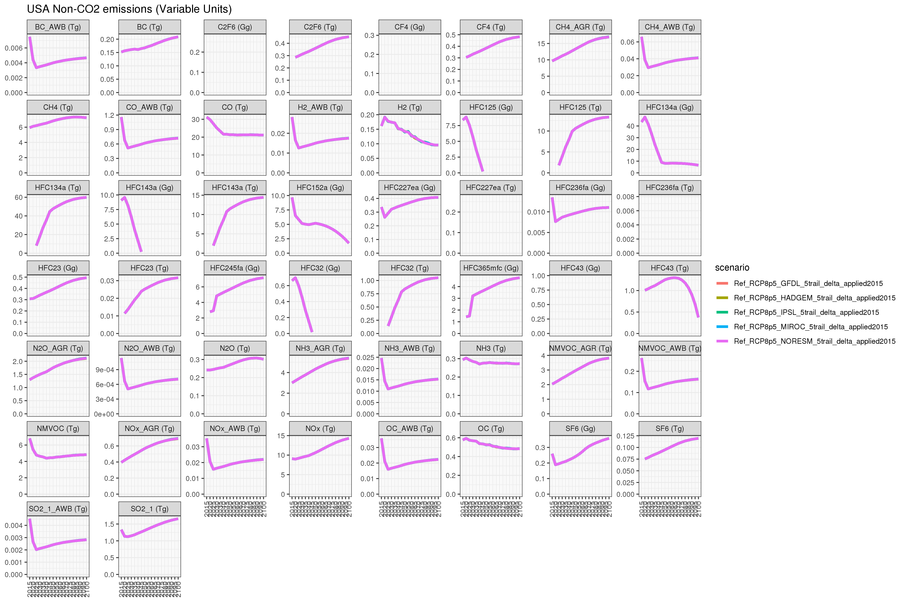
```


### GCAM Outputs Smoothing {.tabset .tabset-pills}

#### Summary

<br>

```{r, echo=FALSE, out.width="150%", fig.align='center', fig.cap="**Comparison of GCAM outputs global runoff for 5 GCMS **"}
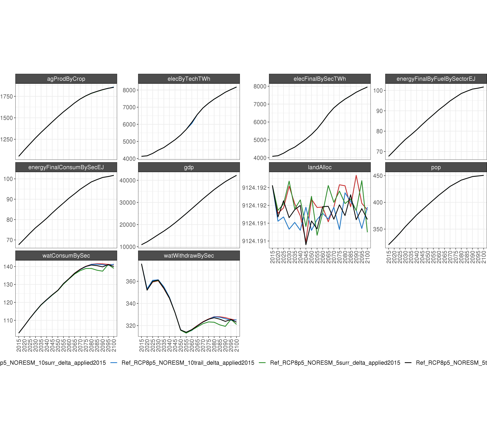
```

<br>

#### Socioeconomics

<br>

```{r, echo=FALSE, out.width="100%", fig.align='center', fig.cap="**Comparison of GCAM socioeconomic outputs for Smoothing **"}
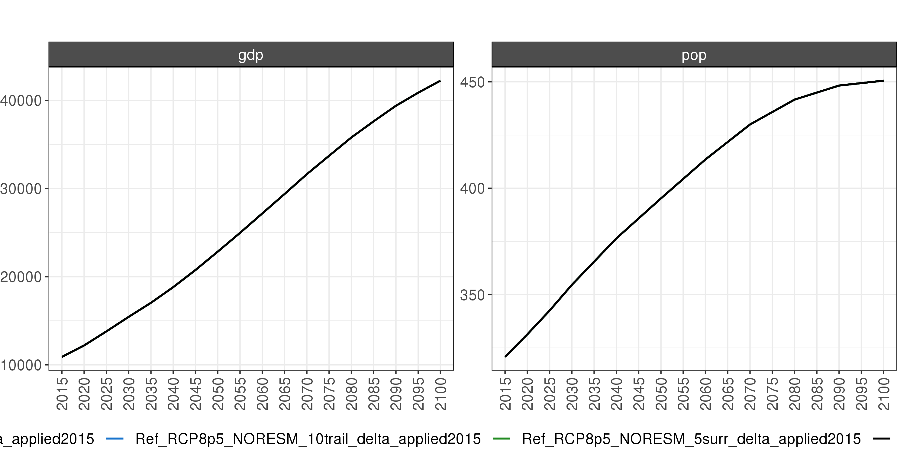
```

<br>

```{r, echo=FALSE, out.width="100%", fig.align='center', fig.cap="**Comparison of GCAM socioeconomic outputs for Smoothing % Diff**"}
knitr::include_graphics("images/chart_param_diff_percent_socioecon_runoff_NORESM_smooth_delta.png")
```

<br>

#### Water

<br>

```{r, echo=FALSE, out.width="200%", fig.align='center', fig.cap="**Comparison of GCAM water outputs for Smoothing **"}
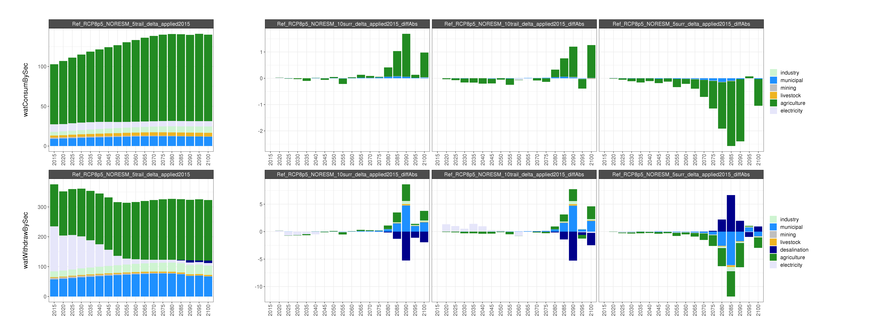
```

<br>

```{r, echo=FALSE, out.width="200%", fig.align='center', fig.cap="**Comparison of GCAM water outputs for Smoothing % Diff **"}
knitr::include_graphics("images/chart_class_diff_percent_water_runoff_NORESM_smooth_delta.png")
```

<br>

#### Energy

<br>

```{r, echo=FALSE, out.width="200%", fig.align='center', fig.cap="**Comparison of GCAM electricity outputs for Smoothing **"}
knitr::include_graphics("images/chart_class_diff_absolute_energy_runoff_NORESM_smooth_delta.png")
```

<br>

```{r, echo=FALSE, out.width="200%", fig.align='center', fig.cap="**Comparison of GCAM electricity outputs for Smoothing % Diff **"}
knitr::include_graphics("images/chart_class_diff_percent_energy_runoff_NORESM_smooth_delta.png")
```

<br>

#### Electricity

<br>

```{r, echo=FALSE, out.width="200%", fig.align='center', fig.cap="**Comparison of GCAM electricity outputs for Smoothing **"}
knitr::include_graphics("images/chart_class_diff_absolute_energy_runoff_NORESM_smooth_delta.png")
```

<br>

```{r, echo=FALSE, out.width="200%", fig.align='center', fig.cap="**Comparison of GCAM electricity outputs for Smoothing % Diff**"}
knitr::include_graphics("images/chart_class_diff_percent_energy_runoff_NORESM_smooth_delta.png")
```

<br>

#### AGLU

<br>

```{r, echo=FALSE, out.width="200%", fig.align='center', fig.cap="**Comparison of GCAM AGLU outputs for Smoothing **"}
knitr::include_graphics("images/chart_class_diff_absolute_aglu_runoff_NORESM_smooth_delta.png")
```

<br>

```{r, echo=FALSE, out.width="200%", fig.align='center', fig.cap="**Comparison of GCAM AGLU outputs for Smoothing % Diff **"}
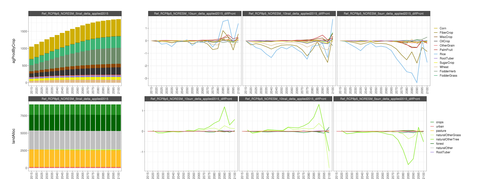
```

<br>

#### Emissions

<br>

```{r, echo=FALSE, out.width="100%", fig.align='center', fig.cap="**Comparison of GCAM emissions outputs for 5 GCMS **"}
knitr::include_graphics("images/compareCO2GlobalCumRCP_smooth_delta.png")
```

<br>

```{r, echo=FALSE, out.width="100%", fig.align='center', fig.cap="**Comparison of GCAM emissions outputs for 5 GCMS **"}
knitr::include_graphics("images/compareCO2USA_smooth_delta.png")
```

<br>

```{r, echo=FALSE, out.width="100%", fig.align='center', fig.cap="**Comparison of GCAM emissions outputs for 5 GCMS **"}
knitr::include_graphics("images/compareNonCO2global_smooth_delta.png")
```

<br>

```{r, echo=FALSE, out.width="100%", fig.align='center', fig.cap="**Comparison of GCAM emissions outputs for 5 GCMS **"}
knitr::include_graphics("images/compareNonCO2USA_smooth_delta.png")
```


<br>

## Workflow 1C US and Global {.tabset}

<br>

### Table Workflow 1C

<br>

```{r, results = 'show', eval=TRUE, echo=FALSE, warning=FALSE, error = FALSE, message = FALSE}
library(pander)
mytable = data.frame(
    Step     = c("Workflow 1A Outputs",
                 "Workflow 1B Outputs",
                 "Combine US and Non-US runoff",
                 "Extrapolate 2099 to 2100",
                 "Smoothing",
                 "Convert to XML",
                 "Run GCAM scenario rcp85hotter_ssp35_runoff"),
    Description = c("Runoff mm per month for US Basins.",
                 "Runoff mm per month for Non-US Basins.",
                 "* xanthos_process_us_global_ssp585hotter_gcmChosen.sh\ 
                    \n* xanthos_combine_us_global_ssp585hotter_gcmChosen.R",
                 "* xanthos_extrapolate_2099to2100_ssp585hotter_gcmChosen.R",
                 "* xanthos_smooth5trail_2099to2100_ssp585hotter_gcmChosen.R",
                 "* xanthos_convert2xml_ssp585hotter_gcmChosen.R",
                 "* Run GCAM using rcp85hotter_ssp35_runoff."),
    Location     = c("* /pic/projects/im3/gcamusa/climateimpacts/runoff/outputs_workflow1a\
                     \n* Copied from (NERSC) /global/cfs/cdirs/m2702/gcamusa/wrf_to_xanthos/xanthos_files/example/output",
                 "* /pic/projects/im3/gcamusa/climateimpacts/raw_global_runoff_files",
                 "* /pic/projects/im3/gcamusa/climateimpacts/runoff",
                 "* /pic/projects/im3/gcamusa/climateimpacts/runoff",
                 "* /pic/projects/im3/gcamusa/climateimpacts/runoff",
                 "* /pic/projects/im3/gcamusa/climateimpacts/runoff",
                 "* /pic/projects/im3/gcamusa/gcam-usa-im3/exe\
                 \n * gcam_parallel_im3.sh\
                 \n * configuration_rcp85hotter_ssp35_runoff.xml")
    )

pander::pander(mytable, keep.line.breaks = TRUE, style = 'grid', justify = 'left', split.tables=Inf)
```

### Runoff Diagnostics {.tabset .tabset-pills}

#### Global vs WRF

<br>

```{r, echo=FALSE, out.width="100%", fig.align='center', fig.cap="**Comparison of Global vs WRF Xanthos Runoff for U.S. Basins**"}
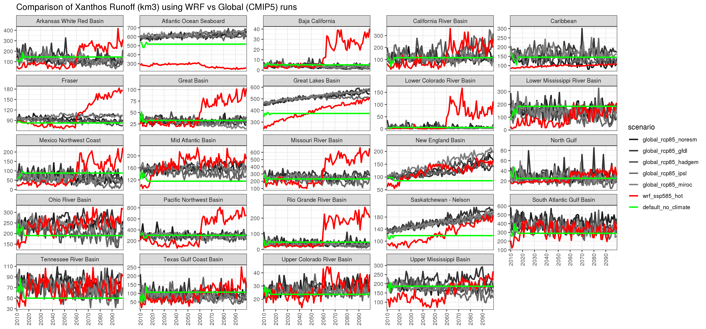
```

<br>

#### Smoothing

<br>

```{r, echo=FALSE, out.width="100%", fig.align='center', fig.cap="**Smoothing diagnostics for selected US Basins for rcp85hotter_ssp5**"}
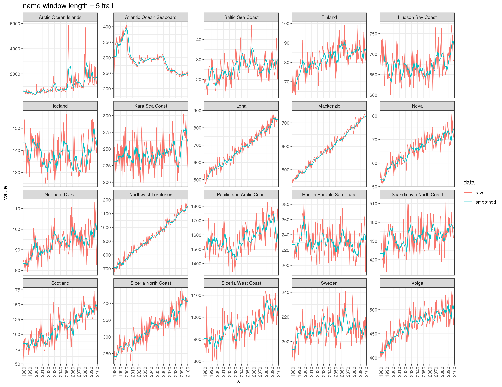
```

<br>

#### Deltas

<br>

```{r, echo=FALSE, out.width="100%", fig.align='center', fig.cap="**Delta processing diagnostics for selected US Basins for rcp85hotter_ssp5**"}
knitr::include_graphics("images/Basin_runoff_km3peryear_comb_ssp585_rcp85_noresm_1979_2100_window5trail_delta2015_1.png")
```


<br>

#### Maps of water runoff in the US 

<br>

```{r, echo=FALSE, out.width="100%", fig.align='center', fig.cap="**Comparison of global water runoff in 2100 (km3) under RCP8.5 hotter and RCP8.5 cooler**"}
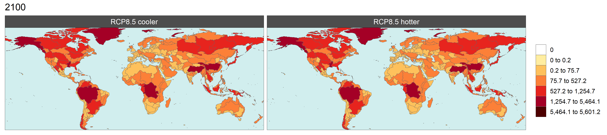
```


```{r, echo=FALSE, out.width="100%", fig.align='center', fig.cap="**Absolute difference of global water runoff in 2100 (km3) under RCP8.5 hotter and RCP8.5 cooler**"}
knitr::include_graphics("images/map_param_2100_KMEANS_DiffAbs.png")
```

```{r, echo=FALSE, out.width="100%", fig.align='center', fig.cap="**Relative difference of global water runoff in 2100 (km3) under RCP8.5 hotter and RCP8.5 cooler**"}
knitr::include_graphics("images/map_param_2100_KMEANS_DiffPrcnt.png")
```


### GCAM rcp85hotter_ssp3_runoff {.tabset .tabset-pills}

#### Summary

<br>

```{r, echo=FALSE, out.width="150%", fig.align='center', fig.cap="**Comparison of GCAM outputs global runoff for 5 GCMS **"}
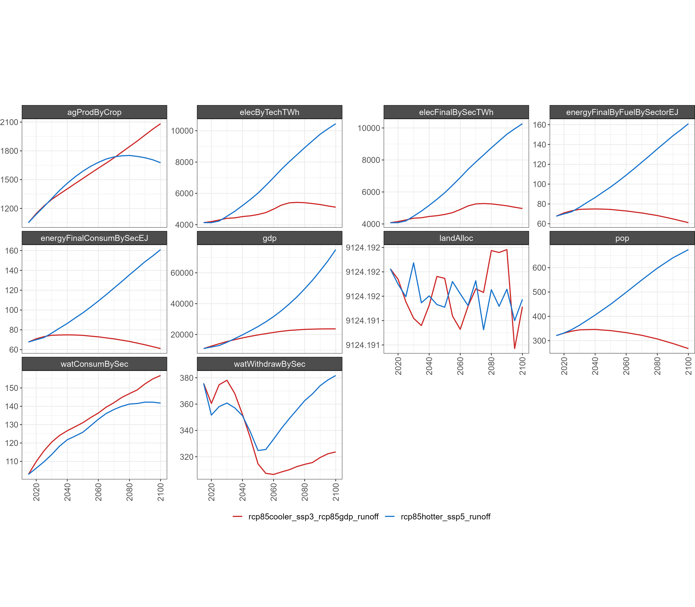
```
<!--updated on 4/12/2022-->


#### Socioeconomics

<br>

```{r, echo=FALSE, out.width="100%", fig.align='center', fig.cap="**Comparison of GCAM socioeconomic outputs**"}
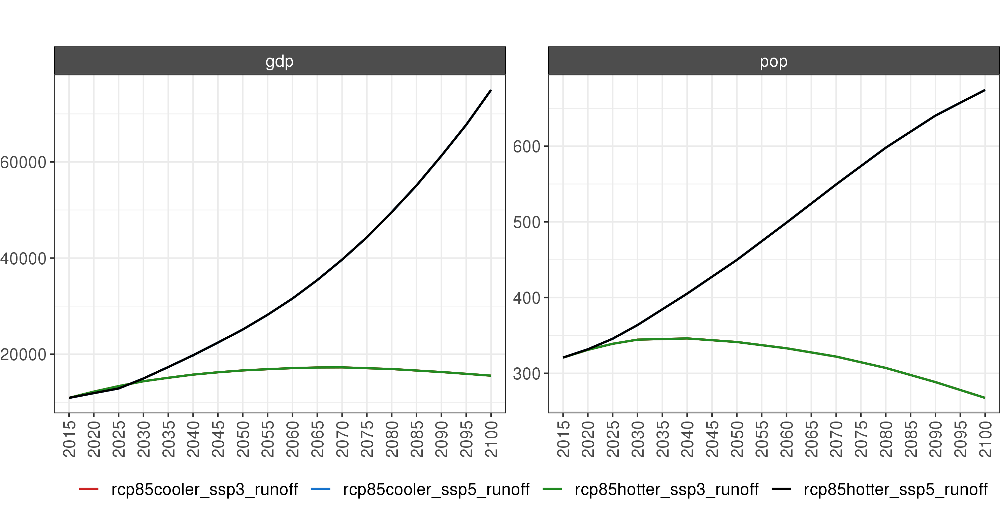
```
<!--updated on 4/12/2022-->


<br>

```{r, echo=FALSE, out.width="100%", fig.align='center', fig.cap="**Comparison of GCAM socioeconomic outputs % Diff**"}
knitr::include_graphics("images/chart_param_diff_percent_socioecon_im3_runoff.png")
```

<br>

#### Water

<br>

```{r, echo=FALSE, out.width="200%", fig.align='center', fig.cap="**Comparison of GCAM water outputs**"}
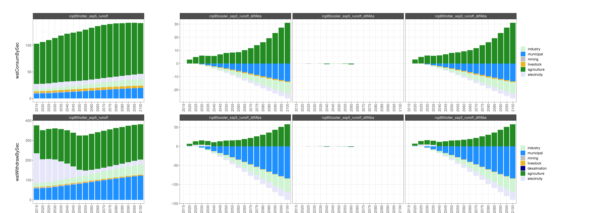
```

<br>

```{r, echo=FALSE, out.width="200%", fig.align='center', fig.cap="**Comparison of GCAM water outputs % Diff **"}
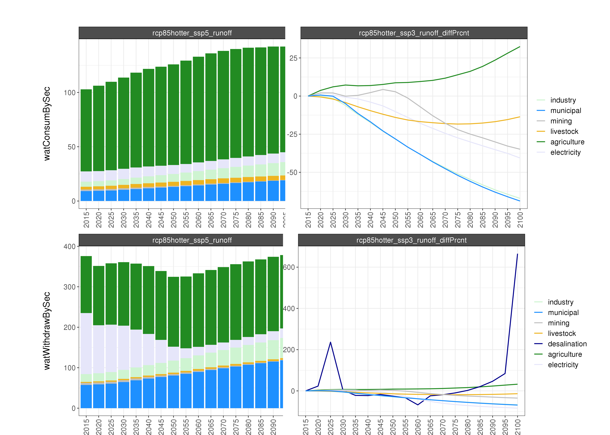
```

<br>

#### Energy

<br>

```{r, echo=FALSE, out.width="200%", fig.align='center', fig.cap="**Comparison of GCAM electricity outputs**"}
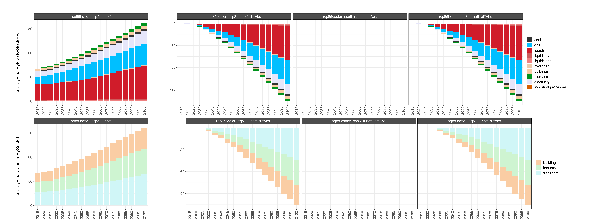
```

<br>

```{r, echo=FALSE, out.width="200%", fig.align='center', fig.cap="**Comparison of GCAM electricity outputs % Diff**"}
knitr::include_graphics("images/chart_class_diff_percent_energy_im3_runoff.png")
```

<br>

#### Electricity

<br>

```{r, echo=FALSE, out.width="200%", fig.align='center', fig.cap="**Comparison of GCAM electricity outputs**"}
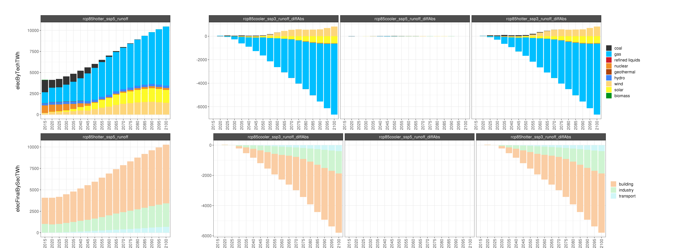
```

<br>

```{r, echo=FALSE, out.width="200%", fig.align='center', fig.cap="**Comparison of GCAM electricity outputs % Diff**"}
knitr::include_graphics("images/chart_class_diff_percent_electricity_im3_runoff.png")
```

<br>

#### AGLU

<br>

```{r, echo=FALSE, out.width="200%", fig.align='center', fig.cap="**Comparison of GCAM AGLU outputs for 5 GCMS **"}
knitr::include_graphics("images/chart_class_diff_absolute_aglu_im3_runoff.png")
```

<br>

<div class="img_large">
```{r, echo=FALSE, out.width="200%", fig.align='center', fig.cap="**Comparison of GCAM AGLU outputs**"}
knitr::include_graphics("images/chart_class_diff_percent_aglu_im3_runoff.png")
```
</div>

<br>

#### Emissions

<br>

```{r, echo=FALSE, out.width="100%", fig.align='center', fig.cap="**Cumulative global carbon emission pathways under different combinations of SSP3/SSP5 and RCP4.5/RCP8.5 **"}
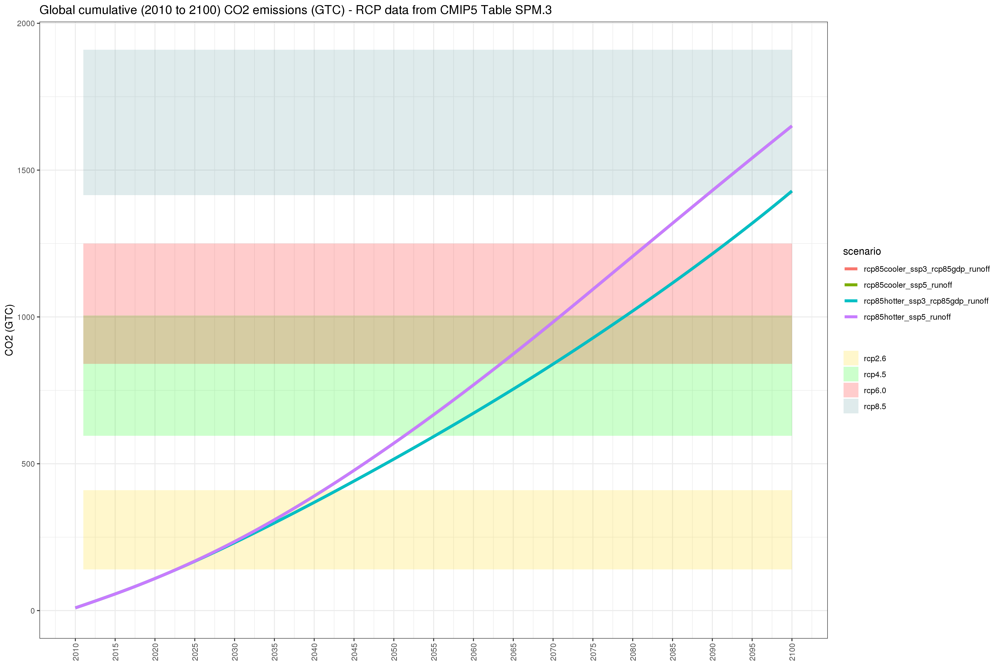
```
<!-- updated on 4/12/22 -->

<br>

```{r, echo=FALSE, out.width="100%", fig.align='center', fig.cap="**Annual US carbon emissions under different combinations of SSP3/SSP5 and RCP4.5/RCP8.5 **"}
knitr::include_graphics("images/compareCO2USA_im3_runoff.png")
```

<br>

```{r, echo=FALSE, out.width="100%", fig.align='center', fig.cap="**Annual global non-CO~2~ emissions under different combinations of SSP3/SSP5 and RCP4.5/RCP8.5 **"}
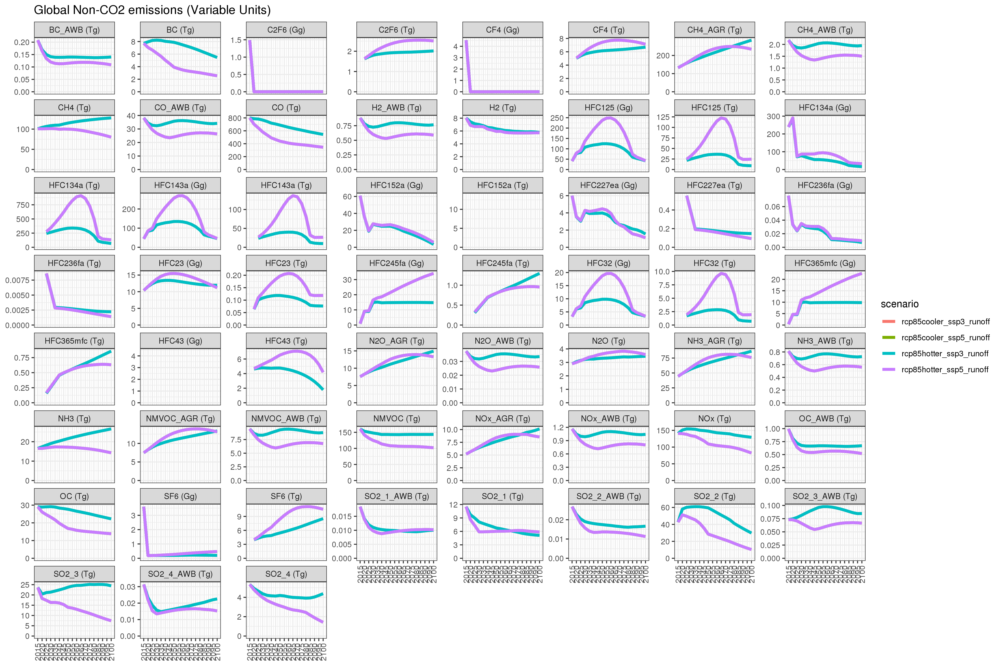
```

<br>


```{r, echo=FALSE, out.width="100%", fig.align='center', fig.cap="**Annual US non-CO~2~ emissions under different combinations of SSP3/SSP5 and RCP4.5/RCP8.5 **"}
knitr::include_graphics("images/compareNonCO2USA_im3_runoff.png")
```


<!-------------------------->
<!-------------------------->
# Workflow 2 - HDDCDD
<!-------------------------->
<!-------------------------->
<p align="center"></p>

<br>

```{r, echo=FALSE, out.width="100%", fig.align='center', fig.cap="**Workflow 2: Climate impacts on heating and cooling degrees.**"}
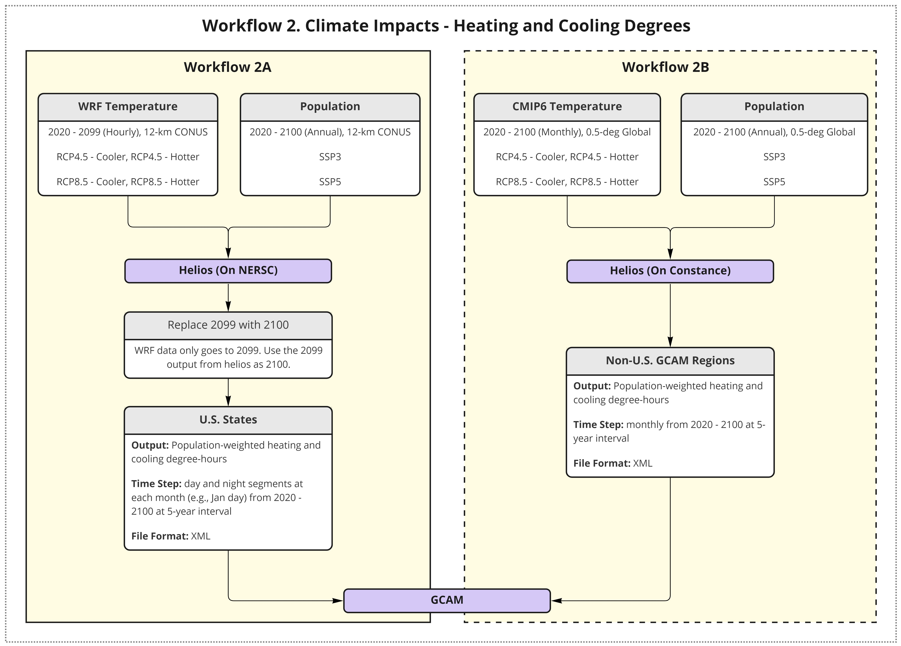
```

<br>

## Workflow 2A US States {.tabset}

<br>

Workflow 2A results in WRF outputs being processed and run through `helios` to produce total heating and cooling degree-hours at day and night segment for each month for commercial and residential buildings.


<br>

### Table Workflow 2A

<br>

```{r, results = 'show', eval=TRUE, echo=FALSE, warning=FALSE, error = FALSE, message = FALSE}
library(pander)
mytable = data.frame(
    Step     = c("WRF Outputs Raw", 
                 "HDCD",
                 "Create HDCD XML",
                 "Run GCAM",
                 "HDCD Sensitivity Analysis"),
    Description = c("* RCP 4.5, 8.5, hot and cool\
                    \n * hourly, 2019_01 to 2099_12\
                    \n * 12km x 12km resolution\
                    \n * Temperature (K)\
                    \n * Minimum temperature (K)\
                    \n * Wind speed (m/s)\
                    \n * Relative humidity (%)\
                    \n * GLW (W/m2)\
                    \n * SWDOWN (W/m2)",
                    
                    "* parallel_subprocess_rcp85cooler_ssp3.sh\
                    \n* parallel_subprocess_rcp85cooler_ssp5.sh\
                    \n* parallel_subprocess_rcp85hotter_ssp3.sh\
                    \n* parallel_subprocess_rcp85hotter_ssp5.sh",
                    
                    "* combine_hddcdd_scenarios.sh",
                    
                    "* configuration_rcp85cooler_ssp3_rcp85gdp_hdcd.xml\
                    \n * configuration_rcp85hotter_ssp3_rcp85gdp_hdcd.xml\
                    \n * configuration_rcp85cooler_ssp5_hdcd.xml\
                    \n * configuration_rcp85hotter_ssp5_hdcd.xml\
                    \n * gcam_parallel_im3.sh",
                    
                    "* gcamDiagnostics_im3_hdcd_ssp3.sh\
                    \n * gcamDiagnostics_im3_hdcd_ssp5.sh"),
    Location     = c("(NERSC) /global/cfs/cdirs/m2702/gsharing",
                     "(NERSC) /global/cfs/cdirs/m2702/gcamusa/hddcdd",
                     "(NERSC) /global/cfs/cdirs/m2702/gcamusa/hddcdd",
                     "(PIC) /pic/projects/im3/gcamusa/gcam-usa-im3/exe",
                     "(PIC) /pic/projects/im3/gcamusa/diagnostics")
    )

pander::pander(mytable, keep.line.breaks = TRUE, style = 'grid', justify = 'left', split.tables=Inf)
```

<br>

### Raw Data

<br>

```{r, echo=FALSE, out.width="100%", fig.align='center', fig.cap="**WRF hourly temperature (Dec 24 - 31) in 2020, 2030, ..., 2090, and 2099 for each grid within selected states.**"}
knitr::include_graphics("images/wrf_raw_data_10states.png")
```

<br>

### Monthly HDCD Diagnostic {.tabset .tabset-pills}


#### RCP8.5 Cooler - SSP3

<br>

```{r, echo=FALSE, out.width="100%", fig.align='center', fig.cap="**Monthly heating and cooling degree-days calculated from helios versus NOAA 2021 Observations (dashed black lines).**"}
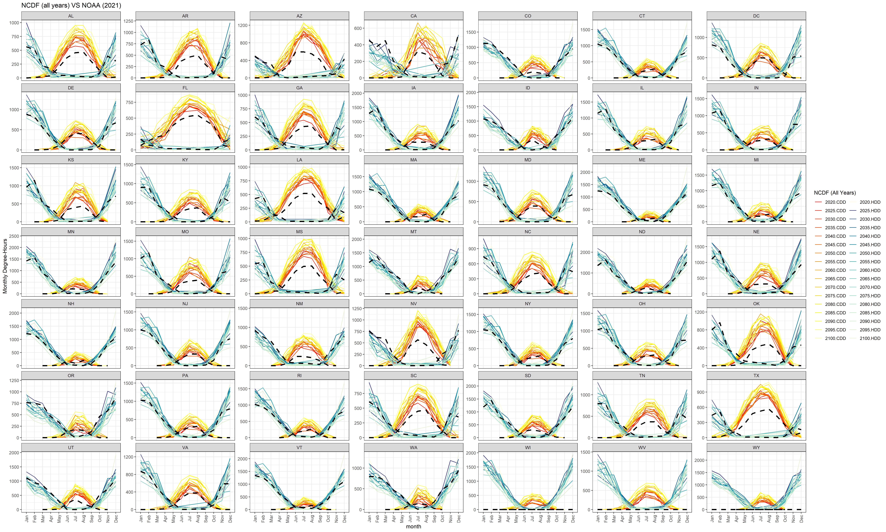
```

<br>

#### RCP8.5 Cooler - SSP5

<br>

```{r, echo=FALSE, out.width="100%", fig.align='center', fig.cap="**Monthly heating and cooling degree-days calculated from helios versus NOAA 2021 Observations (dashed black lines).**"}
knitr::include_graphics("images/ncdf_allyears_vs_noaa_2021_rcp85cooler_ssp5.png")
```

<br>

#### RCP8.5 Hotter - SSP3

<br>

```{r, echo=FALSE, out.width="100%", fig.align='center', fig.cap="**Monthly heating and cooling degree-days calculated from helios versus NOAA 2021 Observations (dashed black lines).**"}
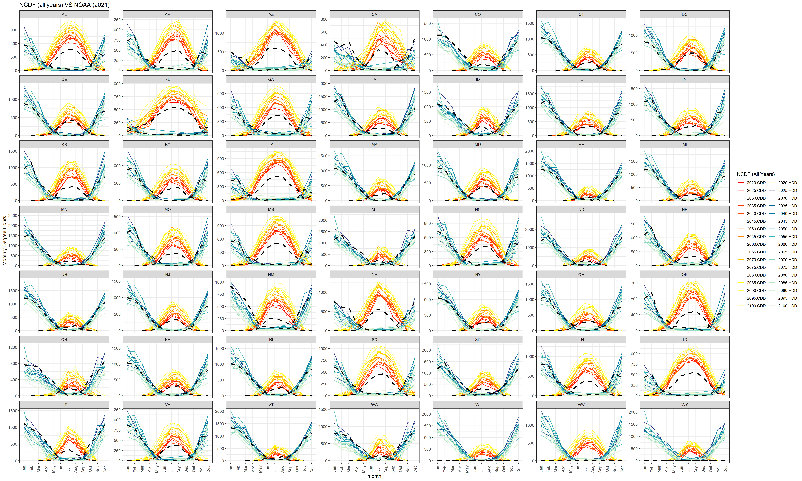
```

<br>

#### RCP8.5 Hotter - SSP5

<br>

```{r, echo=FALSE, out.width="100%", fig.align='center', fig.cap="**Monthly heating and cooling degree-days calculated from helios versus NOAA 2021 Observations (dashed black lines).**"}
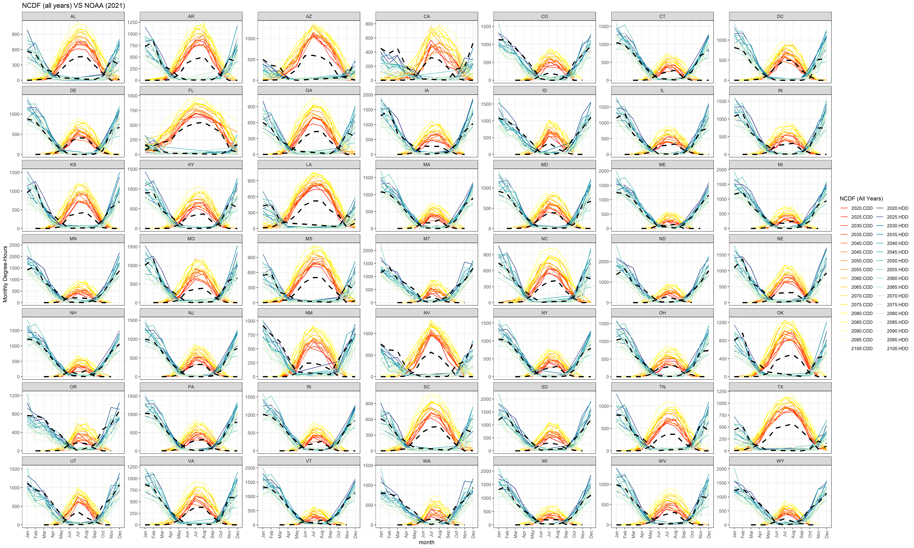
```

<br>

### Segment HDCD Diagnostic {.tabset .tabset-pills}


#### RCP8.5 Cooler - SSP3

<br>

```{r, echo=FALSE, out.width="100%", fig.align='center', fig.cap="**Heating and cooling degree-hours by GCAM-USA segments from 2020 - 2100 at 5-year interval.**"}
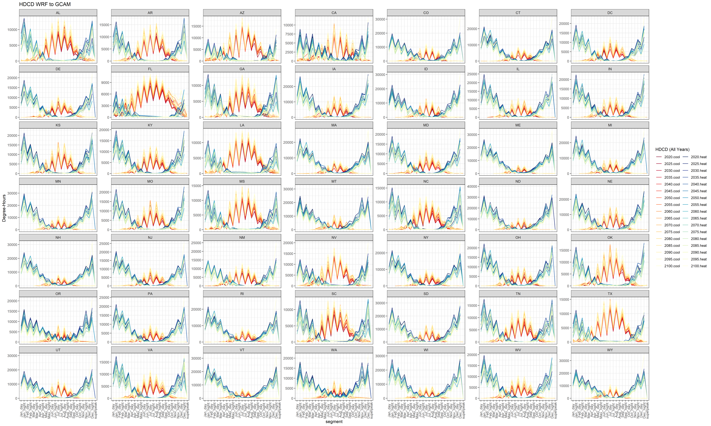
```

<br>

#### RCP8.5 Cooler - SSP5

<br>

```{r, echo=FALSE, out.width="100%", fig.align='center', fig.cap="**Heating and cooling degree-hours by GCAM-USA segments from 2020 - 2100 at 5-year interval.**"}
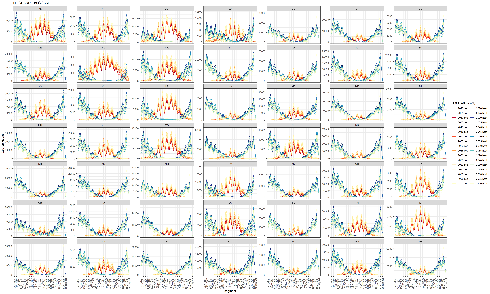
```

<br>

#### RCP8.5 Hotter - SSP3

<br>

```{r, echo=FALSE, out.width="100%", fig.align='center', fig.cap="**Heating and cooling degree-hours by GCAM-USA segments from 2020 - 2100 at 5-year interval.**"}
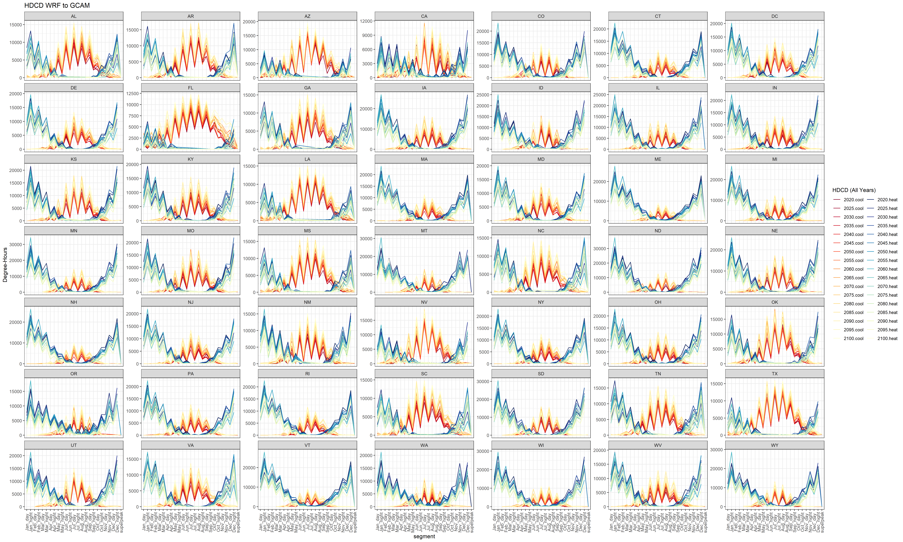
```

<br>

#### RCP8.5 Hotter - SSP5

<br>

```{r, echo=FALSE, out.width="100%", fig.align='center', fig.cap="**Heating and cooling degree-hours by GCAM-USA segments from 2020 - 2100 at 5-year interval.**"}
knitr::include_graphics("images/hdcd_diagnostic_allYears_gradient_freeScale_rcp85hotter_ssp5.png")
```

<br>

### GCAM SSP3 {.tabset .tabset-pills}

#### Summary

<br>

```{r, echo=FALSE, out.width="100%", fig.align='center', fig.cap="**Comparison of GCAM outputs under 3 scenarios: (1) reference SSP3, (2) SSP3 with RCP8.5 Hotter, and (3) SSP3 with RCP8.5 Cooler.**"}
knitr::include_graphics("images/chart_param_all_summary_im3_hdcd_ssp3.png")
```

<br>

#### Water

<br>

```{r, echo=FALSE, out.width="100%", fig.align='center', fig.cap="**Comparison of GCAM water outputs (absolute difference).**"}
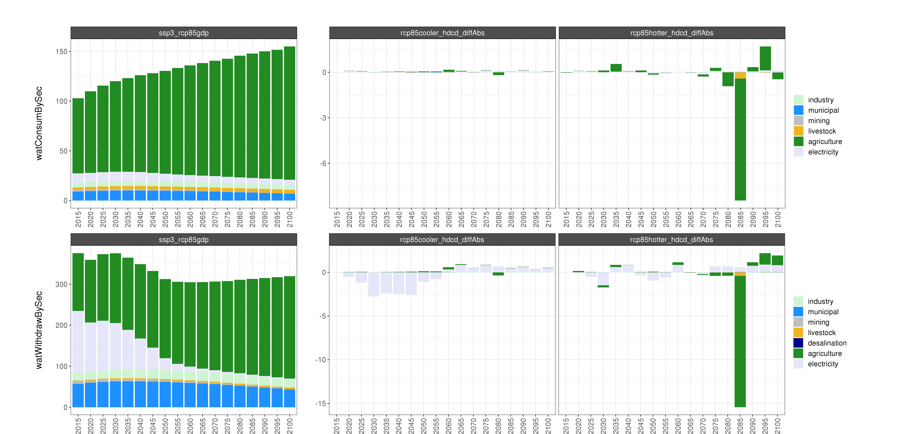
```

<br>


```{r, echo=FALSE, out.width="100%", fig.align='center', fig.cap="**Comparison of GCAM water outputs (percent difference).**"}
knitr::include_graphics("images/chart_class_diff_percent_water_im3_hdcd_ssp3.png")
```

<br>

#### Energy

<br>

```{r, echo=FALSE, out.width="100%", fig.align='center', fig.cap="**Comparison of GCAM energy outputs (absolute difference).**"}
knitr::include_graphics("images/chart_class_diff_absolute_energy_im3_hdcd_ssp3.png")
```

<br>


```{r, echo=FALSE, out.width="100%", fig.align='center', fig.cap="**Comparison of GCAM energy outputs (percent difference).**"}
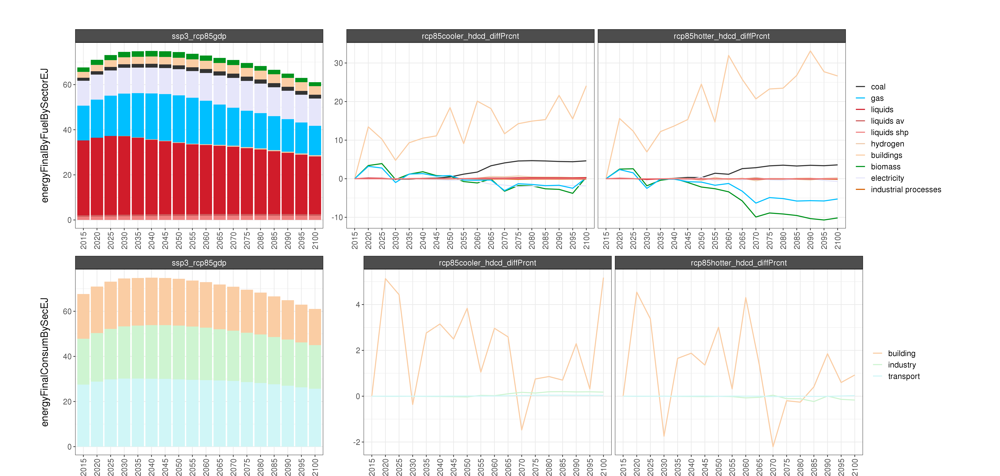
```

<br>

#### Electricity

<br>

```{r, echo=FALSE, out.width="100%", fig.align='center', fig.cap="**Comparison of GCAM electricity outputs (absolute difference).**"}
knitr::include_graphics("images/chart_class_diff_absolute_electricity_im3_hdcd_ssp3.png")
```

<br>


```{r, echo=FALSE, out.width="100%", fig.align='center', fig.cap="**Comparison of GCAM energy outputs (percent difference).**"}
knitr::include_graphics("images/chart_class_diff_percent_electricity_im3_hdcd_ssp3.png")
```

<br>

#### AGLU

<br>

```{r, echo=FALSE, out.width="100%", fig.align='center', fig.cap="**Comparison of GCAM AGLU outputs (absolute difference).**"}
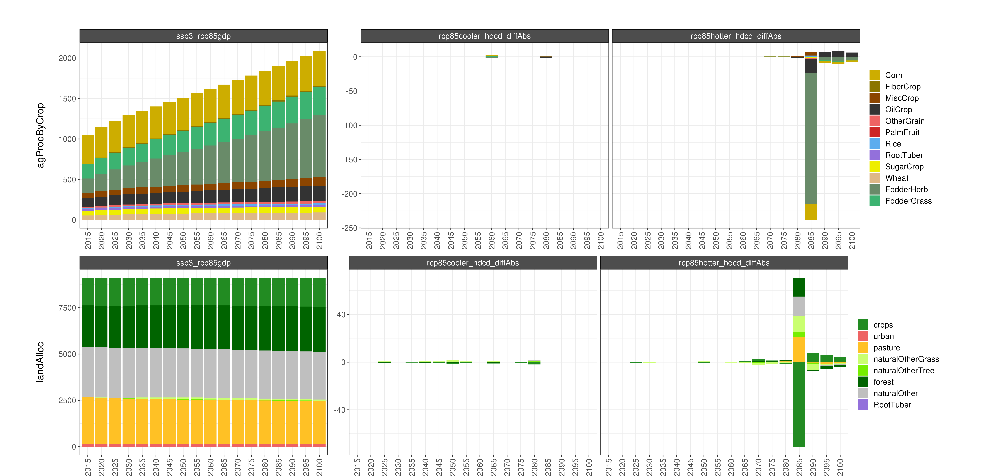
```

<br>


```{r, echo=FALSE, out.width="100%", fig.align='center', fig.cap="**Comparison of GCAM AGLU outputs (percent difference).**"}
knitr::include_graphics("images/chart_class_diff_percent_aglu_im3_hdcd_ssp3.png")
```

<br>


### GCAM SSP5 {.tabset .tabset-pills}

#### Summary

<br>

```{r, echo=FALSE, out.width="100%", fig.align='center', fig.cap="**Comparison of GCAM outputs under 3 scenarios: (1) reference SSP5, (2) SSP5 with RCP8.5 Hotter, and (3) SSP5 with RCP8.5 Cooler.**"}
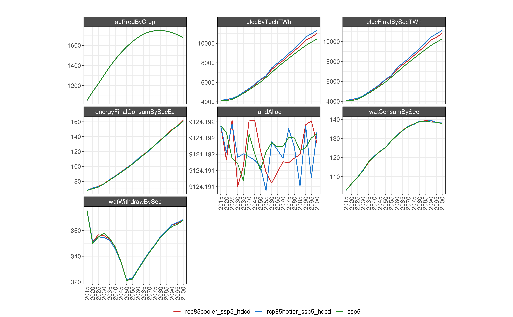
```

<br>

#### Water

<br>

```{r, echo=FALSE, out.width="100%", fig.align='center', fig.cap="**Comparison of GCAM water outputs (absolute difference).**"}
knitr::include_graphics("images/chart_class_diff_absolute_water_im3_hdcd_ssp5.png")
```

<br>


```{r, echo=FALSE, out.width="100%", fig.align='center', fig.cap="**Comparison of GCAM water outputs (percent difference).**"}
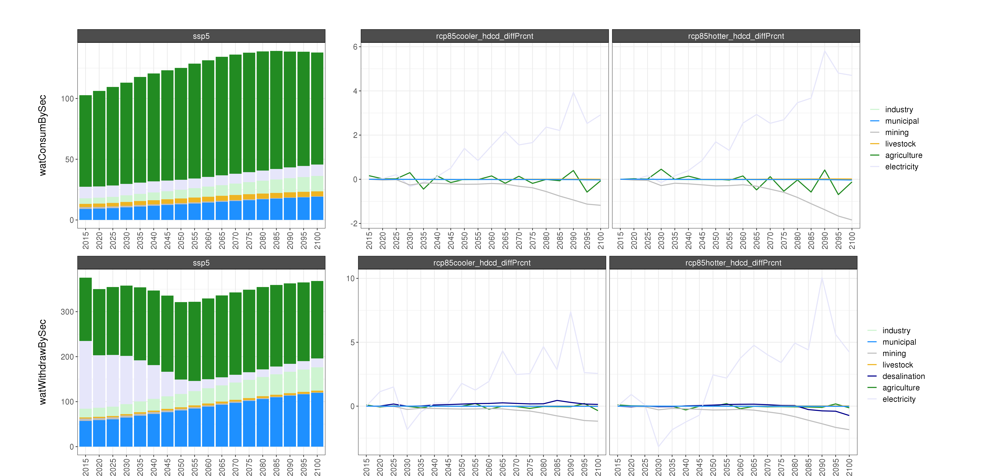
```

<br>

#### Energy

<br>

```{r, echo=FALSE, out.width="100%", fig.align='center', fig.cap="**Comparison of GCAM energy outputs (absolute difference).**"}
knitr::include_graphics("images/chart_class_diff_absolute_energy_im3_hdcd_ssp5.png")
```

<br>


```{r, echo=FALSE, out.width="100%", fig.align='center', fig.cap="**Comparison of GCAM energy outputs (percent difference).**"}
knitr::include_graphics("images/chart_class_diff_percent_energy_im3_hdcd_ssp5.png")
```

<br>

#### Electricity

<br>

```{r, echo=FALSE, out.width="100%", fig.align='center', fig.cap="**Comparison of GCAM electricity outputs (absolute difference).**"}
knitr::include_graphics("images/chart_class_diff_absolute_electricity_im3_hdcd_ssp5.png")
```

<br>


```{r, echo=FALSE, out.width="100%", fig.align='center', fig.cap="**Comparison of GCAM energy outputs (percent difference).**"}
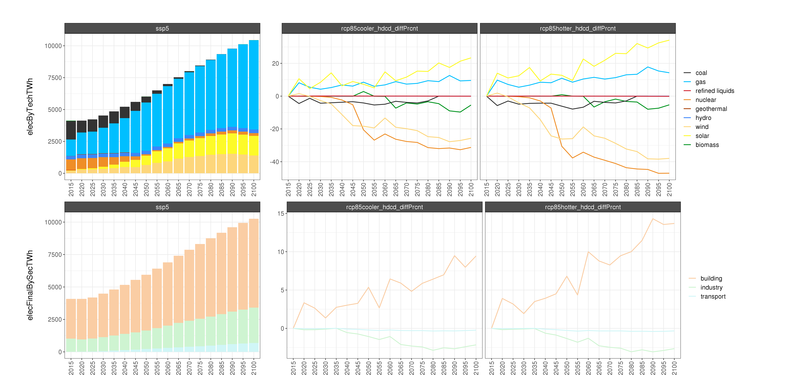
```

<br>

#### AGLU

<br>

```{r, echo=FALSE, out.width="100%", fig.align='center', fig.cap="**Comparison of GCAM AGLU outputs (absolute difference).**"}
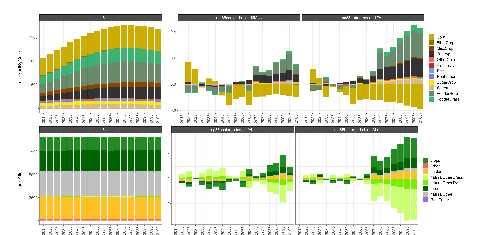
```

<br>


```{r, echo=FALSE, out.width="100%", fig.align='center', fig.cap="**Comparison of GCAM AGLU outputs (percent difference).**"}
knitr::include_graphics("images/chart_class_diff_percent_aglu_im3_hdcd_ssp5.png")
```

<br>


<!-------------------------->
<!-------------------------->
# Workflow 3 - Ag Yields
<!-------------------------->
<!-------------------------->
<p align="center"></p>

<br>

Details of Ag Yield workflow to go here.

<br>

<!-------------------------->
<!-------------------------->
# Workflow 4 - SSP3
<!-------------------------->
<!-------------------------->
<p align="center"></p>

<br>

Details of SSP3 workflows to go here.


<br>

<!-------------------------->
<!-------------------------->
# Workflow 5 - SSP5
<!-------------------------->
<!-------------------------->
<p align="center"></p>

<br>

Details of SSP5 workflows to go here.

<br>

<!-------------------------->
<!-------------------------->
# Workflow 6 - Final Scenarios
<!-------------------------->
<!-------------------------->
<p align="center"></p>

<br>

Details of Final Scenario workflows to go here.

