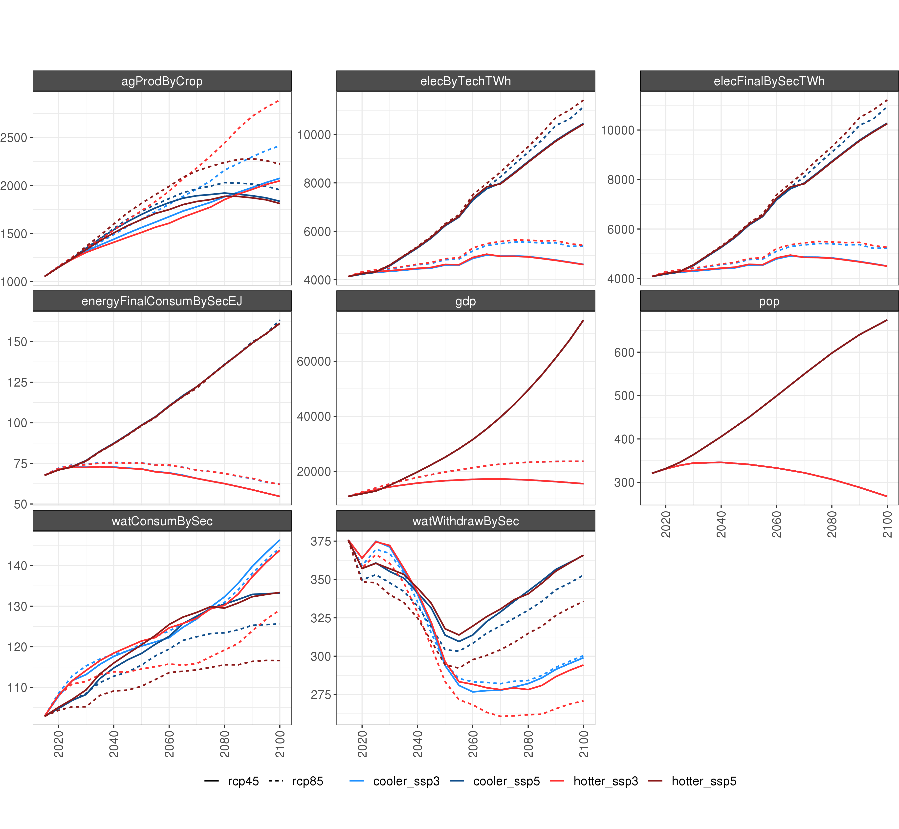
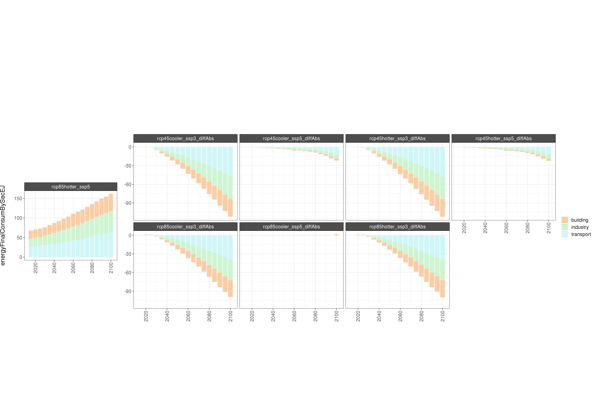
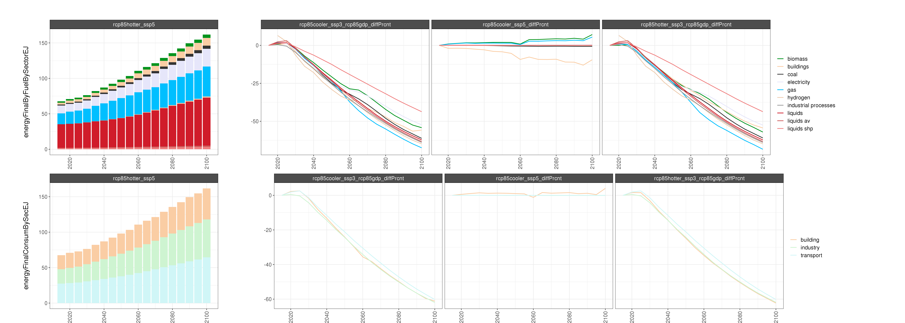
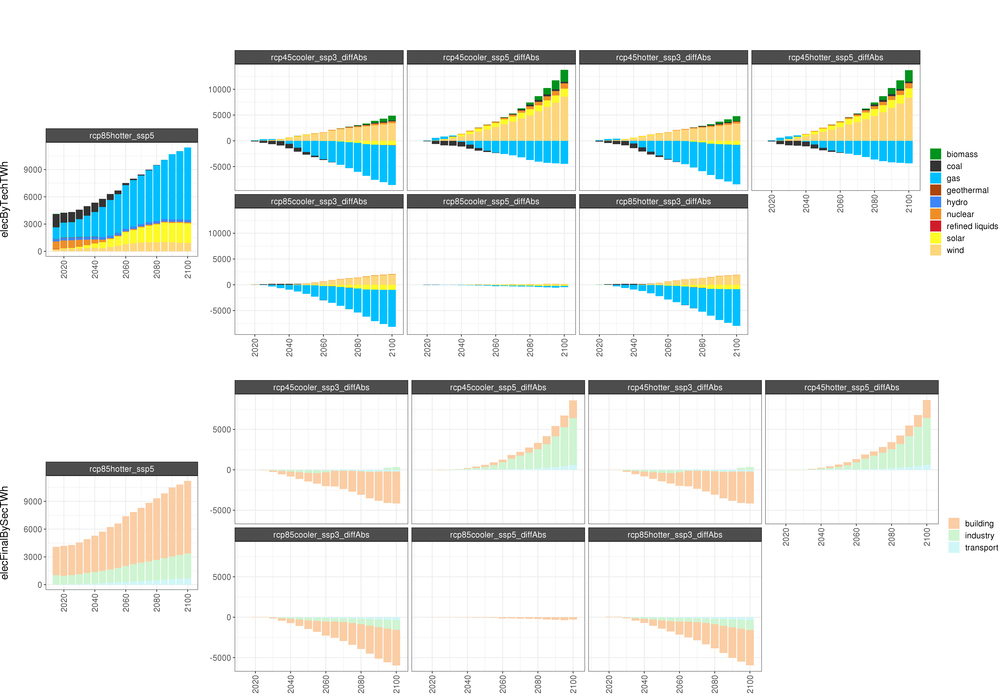
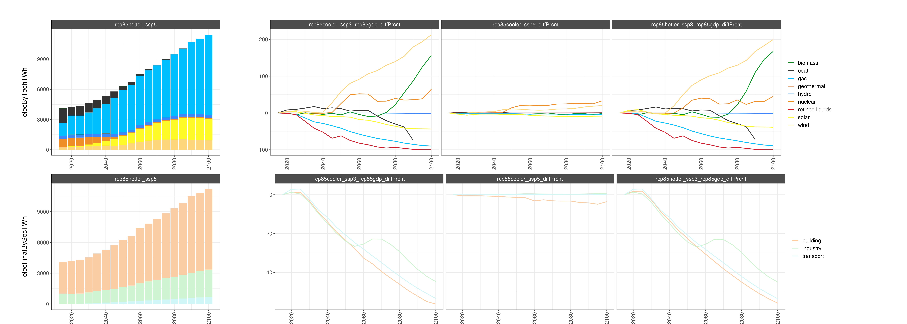
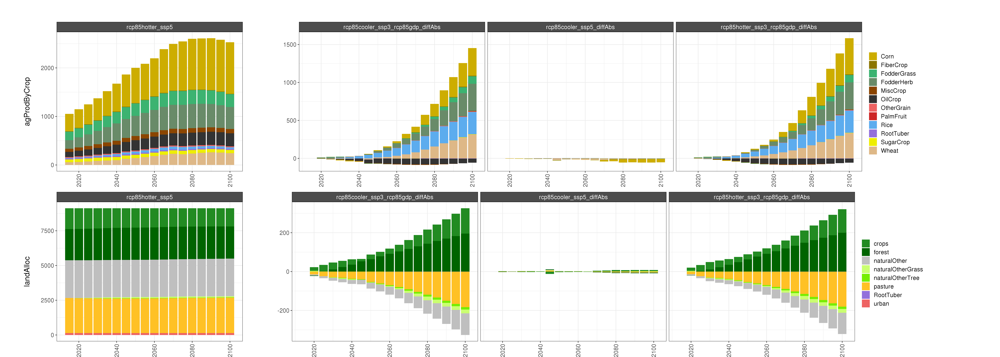
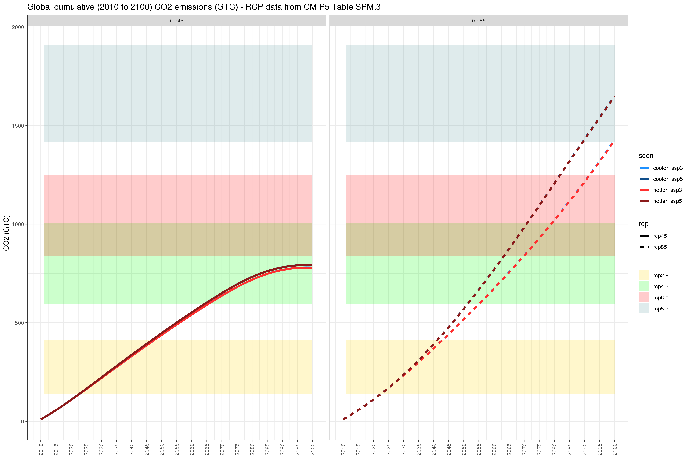
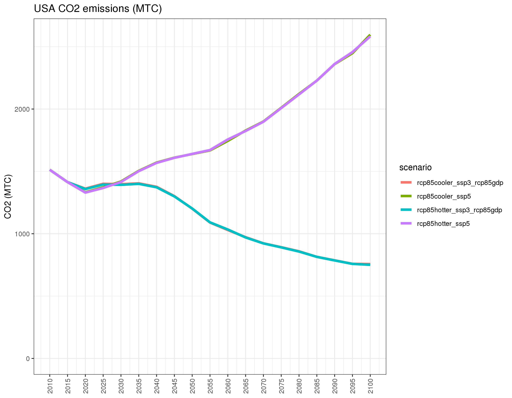
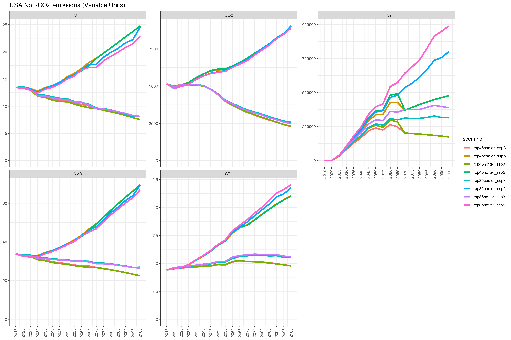

```{r child = 'header.rmd'}
```

<!-------------------------->
<!-------------------------->
# Data
<!-------------------------->
<!-------------------------->
<p align="center"></p>

<br>

## Final Outputs

```{r, results = 'show', eval=TRUE, echo=FALSE, warning=FALSE, error = FALSE, message = FALSE}
library(kableExtra)
data.frame(
    Model     = c("gcam_v5p3_im3",
                  "gcam_v5p3_im3",
                  "gcam_v5p3_im3",
                  "gcam_v5p3_im3",
                 "gcamextractor"),
    Scenario = c("rcp85cooler_ssp3",
                 "rcp85cooler_ssp5",
                 "rcp85hotter_ssp3",
                 "rcp85hotter_ssp5",
                 "all"),
    `Used by` = c("gcamextractor",
                  "gcamextractor",
                  "gcamextractor",
                  "gcamextractor",
                  "n/a"),
    Location = c("/pic/projects/im3/gcamusa/gcam-usa-im3/output/database_rcp85cooler_ssp3_rcp85gdp",
                 "/pic/projects/im3/gcamusa/gcam-usa-im3/output/database_rcp85cooler_ssp5",
                 "/pic/projects/im3/gcamusa/gcam-usa-im3/output/database_rcp85hotter_ssp3_rcp85gdp",
                 "/pic/projects/im3/gcamusa/gcam-usa-im3/output/database_rcp85hotter_ssp5",
                 "(In-Progress) /pic/projects/im3/gcamusa/diagnostics/outputs_im3")
    ) %>% 
  kbl() %>%
  kable_styling(bootstrap_options = c("bordered","striped", "hover", "condensed", "responsive")) %>%
  row_spec(0, background = "#2A2A2A", color = "white")

```


## Intermediate Data

```{r, results = 'show', eval=TRUE, echo=FALSE, warning=FALSE, error = FALSE, message = FALSE}
library(kableExtra)
data.frame(
    Model     = c("WRF",
                 "Xanthos",
                 "Helios",
                 "Osiris",
                 "Population US States",
                 "Population Gridded"),
     Type = c("Outputs",
              "Outputs",
              "Outputs",
              "Outputs",
              "Raw Data",
              "Raw Data"),
    `Used by` = c("Xanthos, Helios, Osiris",
                  "GCAM",
                  "GCAM",
                  "GCAM",
                  "GCAM",
                  "GCAM"),
    Location = c("(NERSC) /global/cfs/cdirs/m2702/gsharing",
                 "zenodo link",
                  "zenodo link",
                  "zenodo link",
                  "zenodo link",
                  "zenodo link")
    ) %>% 
  kbl() %>%
  kable_styling(bootstrap_options = c("bordered","striped", "hover", "condensed", "responsive")) %>%
  row_spec(0, background = "#2A2A2A", color = "white")

```


<br>


<!-------------------------->
<!-------------------------->
# Models Used
<!-------------------------->
<!-------------------------->
<p align="center"></p>

<br>


```{r, results = 'show', eval=TRUE, echo=FALSE, warning=FALSE, error = FALSE, message = FALSE}
library(kableExtra)
data.frame(
    Model     = c("WRF",
                  "GCAM",
                  "Xanthos",
                  "Helios",
                  "Osiris",
                  "rpackageutils",
                  "im3components",
                  "gcamextractor"),
    Version = c("-",
                "gcam v5.3 (branch gcam-usa-im3)",
                "xanthos v2.4.1",
                "helios v1.0.0",
                "osiris v1.0.0",
                "rpackageutils v1.0.0",
                "im3components v1.0.0",
                "gcamextractor"),
    Description = c("Climate simulation model",
                    "Global Change Analysis Model. Human-earth systems dynamic model.",
                    "Water runoff emulator at 0.5 degree grids and monthly timesteps.",
                    "Gridded Heating and cooling degree day calculator at multiple spatial and temporal resolution.",
                    "Emulators to model agricultural yield impacts in response to climate",
                    "Utility functions to process, aggregate and reformat data.",
                    "Functions to process data between different IM3 models.",
                    "Model to extract and process data from GCAM output databases."),
    Language = c("-",
                  "C++/R",
                  "Python",
                  "R",
                  "?",
                  "R",
                  "R/Python",
                  "R"),
    Link = c("https://www.mmm.ucar.edu/weather-research-and-forecasting-model",
             "https://stash.pnnl.gov/projects/JGCRI/repos/gcam-core/browse?at=refs%2Fheads%2Fzk%2Ffeature%2Fgcam-usa-im3",
            "https://github.com/JGCRI/xanthos",
            "https://github.com/JGCRI/helios",
            "https://github.com/JGCRI/osiris",
            "https://github.com/JGCRI/rpackageutils",
            "https://github.com/IMMM-SFA/im3components",
            "https://github.com/JGCRI/gcamextractor")
    ) %>% 
  kbl() %>%
  kable_styling(bootstrap_options = c("bordered","striped", "hover", "condensed", "responsive")) %>%
  row_spec(0, background = "#2A2A2A", color = "white")

```

<br>


<!-------------------------->
<!-------------------------->
# Workflow
<!-------------------------->
<!-------------------------->
<p align="center"></p>

<br>

```{r, echo=FALSE, out.width="100%", fig.align='center', fig.cap="**Summary of experiment workflows.**"}
knitr::include_graphics("images/im3_gcamusa_workflow_summary.jpg")
```

<br>

<!-------------------------->
<!-------------------------->
# Results {.tabset}
<!-------------------------->
<!-------------------------->
<p align="center"></p>

<br>

Please click on image to enlarge.

## Summary 

<br>

```{r, echo=FALSE, out.width="150%", fig.align='center', fig.cap="**Comparison of GCAM outputs for 4 climate and socioeconomic scenarios. **"}

```

<br>

## Water

<br>

```{r, echo=FALSE, out.width="200%", fig.align='center', fig.cap="**Comparison of GCAM water outputs for 4 climate and socioeconomic scenarios (absolute difference). **"}
knitr::include_graphics("images/chart_class_diff_absolute_water_im3.png")
```

<br>

```{r, echo=FALSE, out.width="200%", fig.align='center', fig.cap="**Comparison of GCAM water outputs for 4 climate and socioeconomic scenarios (percent difference). **"}
knitr::include_graphics("images/chart_class_diff_percent_water_im3.png")
```

<br>

## Energy

<br>

```{r, echo=FALSE, out.width="200%", fig.align='center', fig.cap="**Comparison of GCAM energy outputs for 4 climate and socioeconomic scenarios (absolute difference). **"}

```

<br>

```{r, echo=FALSE, out.width="200%", fig.align='center', fig.cap="**Comparison of GCAM energy outputs for 4 climate and socioeconomic scenarios (percent difference). **"}

```

<br>

## Electricity

<br>

```{r, echo=FALSE, out.width="200%", fig.align='center', fig.cap="**Comparison of GCAM electricity outputs for 4 climate and socioeconomic scenarios (absolute difference). **"}

```

<br>

```{r, echo=FALSE, out.width="200%", fig.align='center', fig.cap="**Comparison of GCAM electricity outputs for 4 climate and socioeconomic scenarios (percent difference). **"}

```

<br>

## AGLU

<br>

```{r, echo=FALSE, out.width="200%", fig.align='center', fig.cap="**Comparison of GCAM AGLU outputs for 4 climate and socioeconomic scenarios (absolute difference). **"}

```

<br>

```{r, echo=FALSE, out.width="200%", fig.align='center', fig.cap="**Comparison of GCAM AGLU outputs for 4 climate and socioeconomic scenarios (percent difference). **"}
knitr::include_graphics("images/chart_class_diff_percent_aglu_im3.png")
```

<br>

## Emissions

<br>

```{r, echo=FALSE, out.width="200%", fig.align='center', fig.cap="**Comparison of global cumulative CO2 emissions for 4 climate and socioeconomic scenarios. **"}

```

<br>

```{r, echo=FALSE, out.width="200%", fig.align='center', fig.cap="**Comparison of USA CO2 emissions for 4 climate and socioeconomic scenarios. **"}

```

<br>

```{r, echo=FALSE, out.width="200%", fig.align='center', fig.cap="**Comparison of global non-CO2 emissions for 4 climate and socioeconomic scenarios. **"}

```

<br>

```{r, echo=FALSE, out.width="200%", fig.align='center', fig.cap="**Comparison of USA non-CO2 emissions for 4 climate and socioeconomic scenarios. **"}

```

<br>
